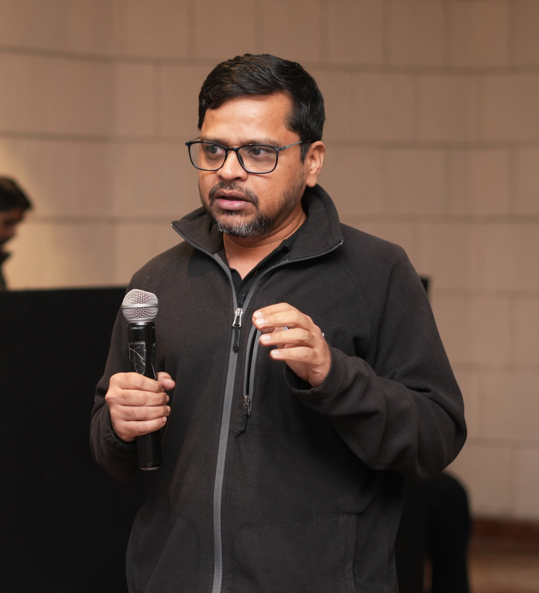

:::: {.intro-card}

::: {.intro-text}

**AI Researcher · Systems Architect · Educator · Technologist**

*Adjunct Faculty, IIT Jammu* · *Founder & CTO, VitalTicks*

Two decades across machine learning, Bayesian statistics, signal processing,
and large-scale AI systems. Current focus: frontier model development, deep
learning theory, and scalable AI infrastructure for GPT-scale models, with
applications across agriculture, healthcare, education, and computational
biology.

:::

::: {.intro-photo}
{.profile-pic fig-alt="Soma S Dhavala"}
:::

::::

:::: {.quick-stats}

::: {.stat}
**20+ years**
across ML, AI, and signal processing
:::

::: {.stat}
**Ph.D. Statistics**
Texas A&M University
:::

::: {.stat}
**Cross-disciplinary**
EE · Math · Stats · CS
:::

::::

:::: {.cta-row}
[CV (PDF)](files/Soma_Dhavala_CV.pdf){.cta-link}
[About / Bio](about/){.cta-link}
[Recent papers](research/publications.html){.cta-link}
[Email](mailto:soma.dhavala@gmail.com){.cta-link}
::::
