# Generalized Digital Modulation and IF Modulation

## Abstract

**Objective:** Propose a framework for generating various digital modulation techniques. This generalized modulation scheme should be useful in deriving new modulation schemes. We study, in brief, a particular modulation scheme based on "instantaneous frequency".

**Approach/Outline:** While developing new digital modulation schemes, one aims at developing new waveforms that can be used to represent a message meeting certain criteria. In all the existing schemes, orthogonal or biorthogonal waveforms were used. By relaxing the orthogonality, we try to span the spectrum with more waveforms (redundant representations). However, while doing so, we have to ensure that these waveforms are decodable at the receiver.

In particular, we will be interested in the signals of the form:

$$
g_{t_c,f_c,\beta,\alpha}(t) = \left(\frac{\alpha}{\pi}\right)^{\frac{1}{4}} e^{-\frac{\alpha(t-t_c)^2}{2}} e^{\,j\beta(t-t_c)^2/2 + j\omega_c(t-t_c) + j\phi}
$$

where the parameters $t_c, f_c, \beta, \alpha$ represent, respectively, the location in time, the location in frequency, the chirp rate and the amplitude modulation parameter and $\phi$ represents the phase off-set; and $g$ is defined such that

$$
\left\| g_{t_c,f_c,\beta,\alpha} \right\|^2 = \int \left| g(t; t_c, f_c, \beta, \alpha) \right|^2 dt = 1 .
$$

We can use $\mathrm{Re}\{A_m g(t)\}$ for modulating any message signal. Here, $A_m$ is a real number. We can map a symbol to many waveforms that can be obtained by a different parameter set. For example, we obtain FSK at $\beta = 0$ with different $f_c$s and PSK by choosing different $\phi$s for each of the symbols. The introduction of $\beta$ makes these waveforms lose orthogonality and this is what we want to exploit. If we were able to detect non-orthogonal waveforms at the receiver, why not use them! We can obtain different pulse shapes by varying the parameter $\alpha$. The above waveforms are known as "chirplets".

We will discuss how various modulation schemes can be realized within the framework suggested above. In particular, we will use "instantaneous frequency (IF)" as the message carrier. We obtain, though with less rigorous simulations, the $P_e$ vs BER curves in this case.

## Introduction

The objective of a digital modulation technique is to allow reliable and efficient transmission of information under the given constraints. "Reliability" refers to how well the information can be recovered to the one that is transmitted when the information being transmitted is corrupted in some manner. Probability of error is such a measure of reliability. Efficiency does not have a strict definition as it is entirely dependent on the circumstances in which it is being considered. In other words, it is application specific. Nevertheless, power required to transmit a message, required bandwidth to accomplish the task of transmission, susceptibility to channel-induced errors and other distortions and even complexity of the transmitter/receiver can together contribute the factors describing the efficiency. In an ideal situation, we wish to have a scheme that requires minimum power, utilizes minimum bandwidth and achieves the lowest possible probability of error and of course all this at cheap computational complexity. As one can feel, such a system is not possible and often, as in most engineering applications, we trade off one quantity for the other. This leads to choosing different modulation schemes that have different characteristics like "power-efficient schemes" and "bandwidth-efficient schemes". It is therefore, in this interest, that we study different modulation schemes.

There exist many modulation schemes like Pulse-Amplitude Modulation (PAM), Pulse Position Modulation (PPM), Phase-Shift Keying (PSK), Frequency-Shift Keying (FSK), Quadrature-Amplitude Modulation (QAM), Pulse-Width Modulation (PWM) etc. However, their study is often dealt with in isolation and there is no general framework in studying their behavior. In this report, we present a viewpoint that can be considered as a unified representation of the above mentioned modulation schemes. It is also possible to include a new class of modulation based on "instantaneous frequency (IF)". We present this viewpoint with illustrations and deal with the special case of modulation involving IF. We present the idea of modulating an information sequence with IF modulation, then demodulation and detection of the transmitted information sequence. However, the spectral properties, which are essential for complete analysis of any modulation scheme, are not studied due to cumbersome simulations as we don't have a signal-space concept yet.

## Chirplets

Chirplets are a class of non-stationary signals defined in a six-parameter space. A Gaussian chirplet is given by

$$
g_{t_c,f_c,\beta,\alpha}(t) = A_m \left(\frac{\alpha_m}{\pi}\right)^{\frac{1}{4}} e^{-\frac{\alpha_m(t-t_m^c)^2}{2}} e^{\,j\beta_m(t-t_m^c)^2/2 + j\omega_m^c(t-t_m^c) + j\phi_m} .
$$

The parameters represent:

- $A_m$: Amplitude
- $\alpha_m$: Spread of the envelope
- $t_m^c$: Time-center
- $\omega_m^c$: Frequency center
- $\beta_m$: Instantaneous frequency law (chirp-rate) and
- $\phi_m$: Phase.

Some remarkable properties of the waveform described by the above parameters are that these chirplets

(a) are covariant to

  - Scale ($\alpha_m$)
  - Chirp ($\beta_m$)
  - Time ($t_m^c$)
  - Frequency ($\omega_m^c$)

  (a very desirable property in the detection framework)

(b) can model a variety of signals

(c) are the only signals which can satisfy the uncertainty principle with equality

(d) have a non-negative Wigner distribution (attains optimum resolution in both time and frequency)

(e) can be estimated using many techniques e.g. Atomic decomposition, Chirp-hunting, Mixture modeling etc. However, they are not real-time algorithms.

## Unified Modulation Techniques with Illustrations

In this section, we will give some examples of the chirplets with different parameters.

### Time-center (location) $t_m^c$

On the left is a chirplet centered around $N/4$ and on the right is the one centered around $3N/4$ (Wigner distributions, with $a=1$, $f_c=0.25$, $\mathrm{IF}=0^\circ$, spread $=0.012272$).

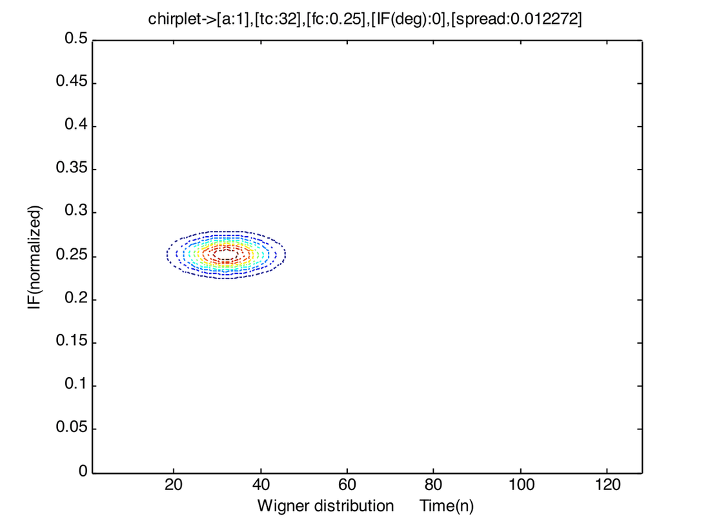

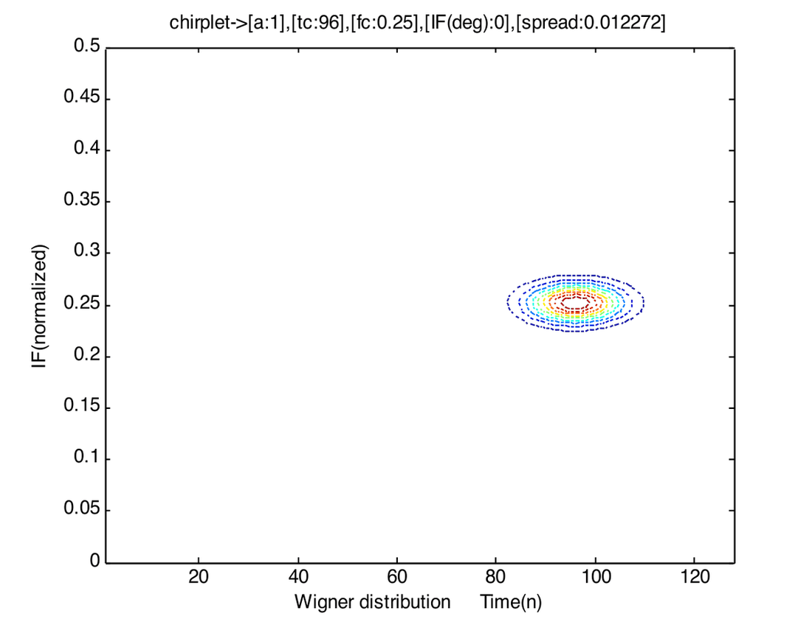

This parameter can be used for PPM.

### Frequency centers ($\omega_m^c$)

On the left is a chirplet centered around $0.125$ and on the right is the one centered around $0.375$ (Wigner distributions, with $a=1$, $t_c=64$, spread $=0.012272$).

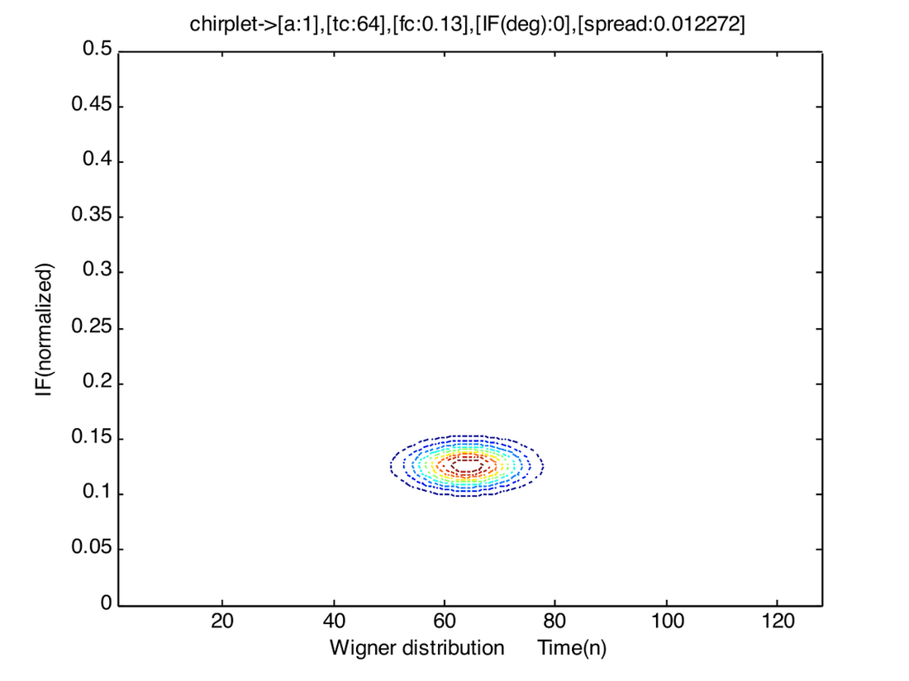

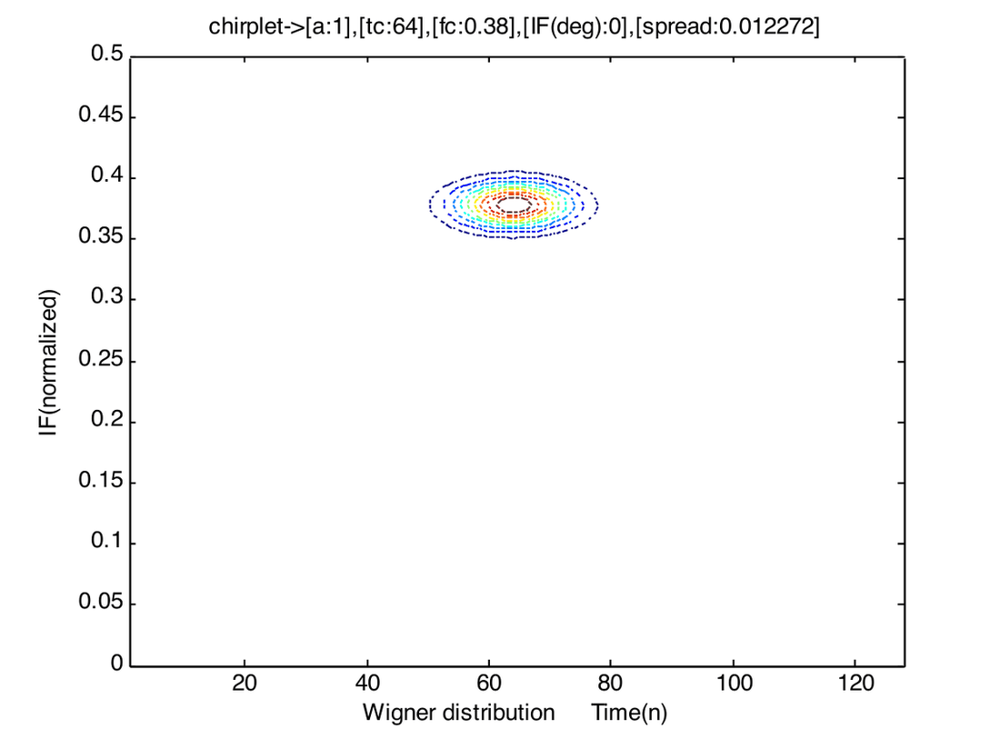

This parameter can be used for FSK.

### Spread of the envelope / scale ($\alpha_m$)

On the left is a chirplet that has a spread around $0.0245$ and on the right is the one having a spread around $7.6699 \times 10^{-4}$ (Wigner distributions, with $a=1$, $t_c=64$, $f_c=0.38$).

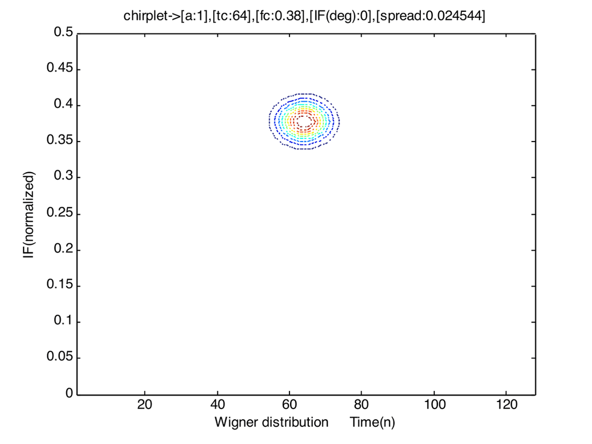

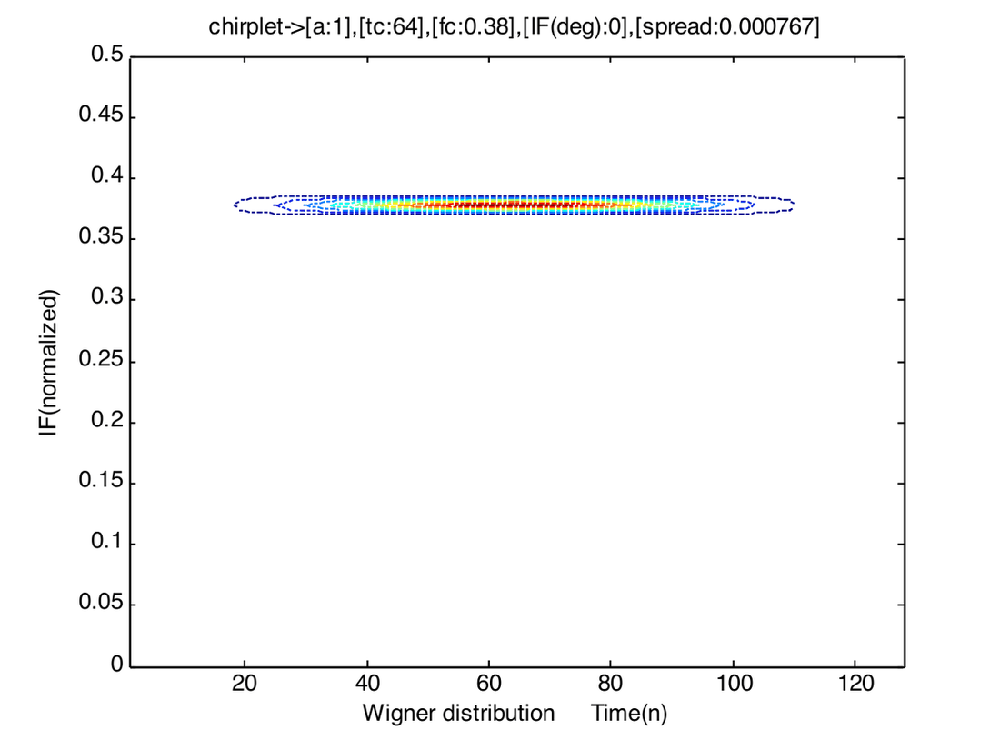

This parameter can be used for PWM.

### Chirp-rate / linear-IF ($\beta_m$)

On the left is a chirplet having $\mathrm{IF}=450$ (slope $=1$) and on the right is the one having an IF of $150$ (slope $=0.269$) (Wigner distributions, with $a=1$, $t_c=64$, $f_c=0.25$, spread $=0.000767$).

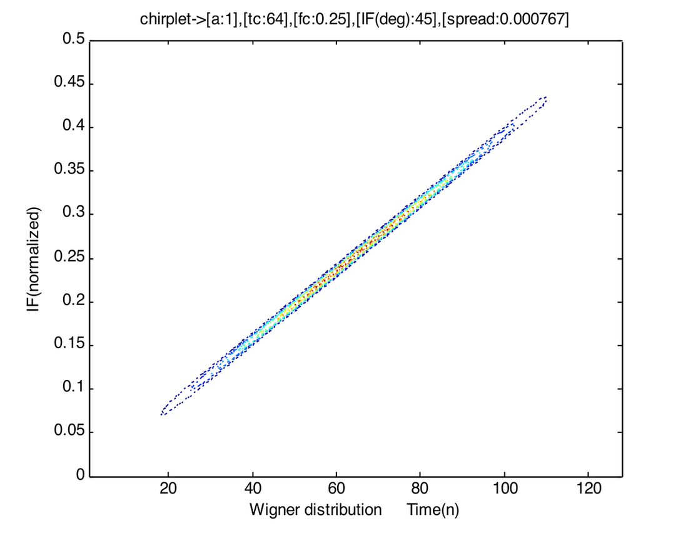

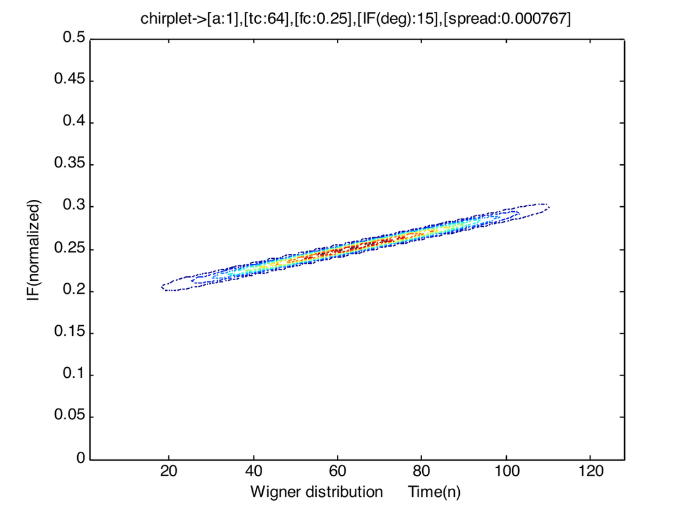

This parameter can be used for Instantaneous Frequency Modulation, which we will explore.

### How they look?

Below, we show the real part of the chirplets shown above along with their envelopes. This gives us an idea for the instantaneous frequency. As we observe from the figures, the frequency is linearly increasing with time. However, this rate of increase is much slower in the chirplet shown on the right side.

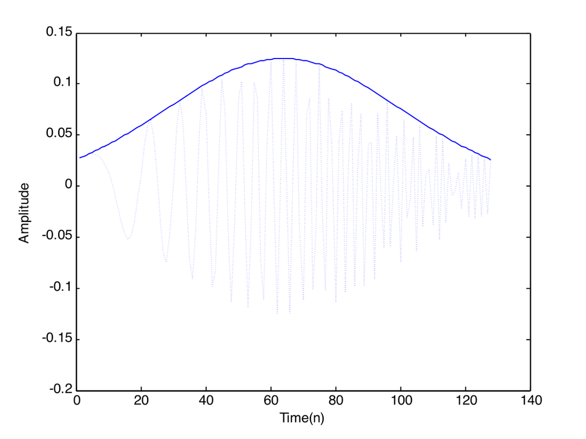

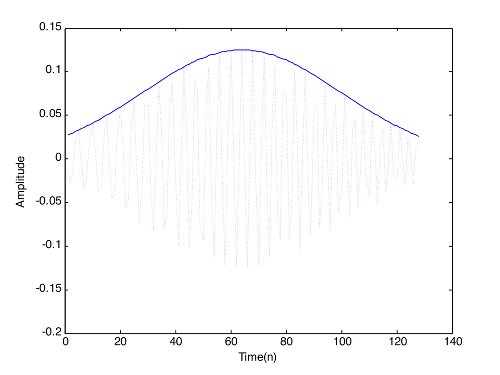

With the above illustrations, it is clear that "chirplets" are capable of producing any desired modulation scheme. As there exist various methods to estimate the parameters of these chirplets, it should be possible to employ them as digital modulating waveforms.

## IF Modulation

We know that in the FSK case, we have a finite number of waveforms to choose from, given the bandwidth. This is particularly true because we are dealing with orthogonal waveforms. What happens if we relax the orthogonality for the sake of effective bandwidth? Chirplets having the same frequency center, time center and spread but different chirp-rates are not orthogonal, but they have quite a different signature in the time-frequency plane. So, if we define a time-dependent orthogonality, then these chirplets are not orthogonal only at their time-centers and their instantaneous frequencies do not cross at any other time. Hence, though they are not strictly orthogonal, we can still safely detect them by looking at their time-frequency overlappings. This has led us to consider IF as a modulation parameter.

We can vary the IF anywhere from $[-0.5, 0)$ and $(0, 0.5]$ or $[-450, 0)$, $(0, 450]$. We do not want to consider IFs in the range because the scale parameter has to be appropriately chosen in order to be within the spectrum (i.e., not exceed $F_i$ and $F_f$).

The following figure illustrates IF as the modulation parameter (M-ary IF modulation, M-even; IF map).

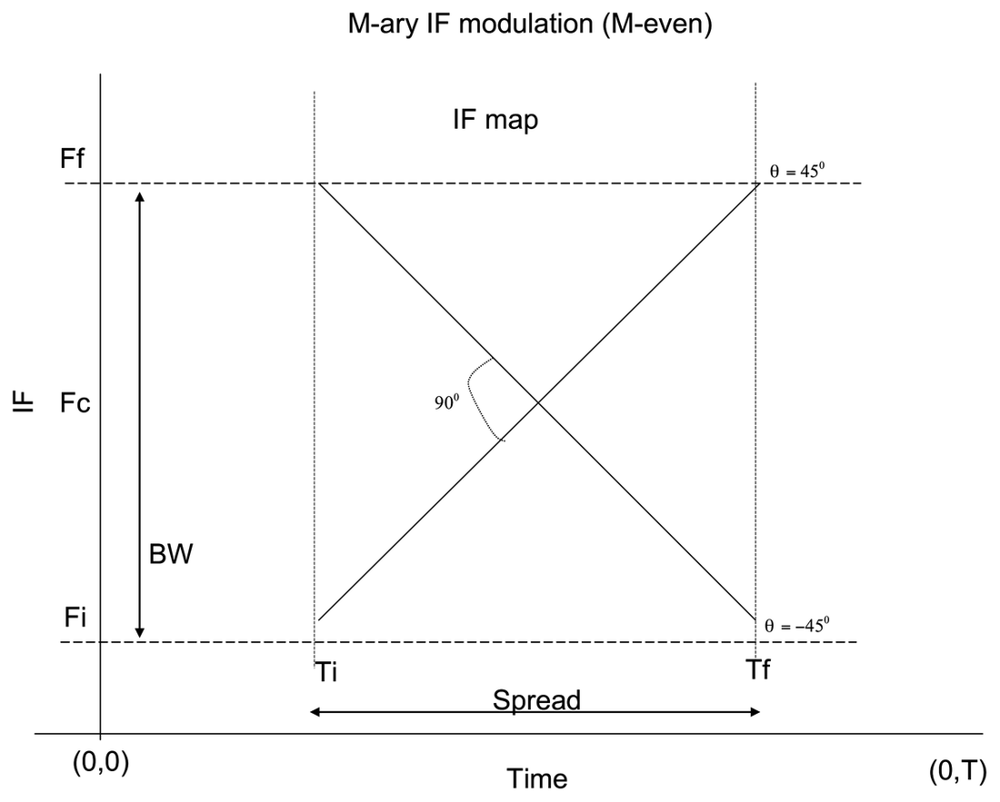

In the above figure, $F_f$ and $F_i$ define the support in the frequency domain, $T$ is the symbol duration. The IF can be varied anywhere from $-450$ to $450$ excluding zero. This is the reason why we forced $M$ to be even. The reason for not including $0^\circ$ is that we wanted to exclusively study the IF modulation. At $0^\circ$, we obtain frequency modulation i.e. we could have chirplets with different frequency centers ranging from $F_i$ to $F_f$. Moreover, we wanted to have slopes with positive and negative magnitudes as well. This makes the total number of waveforms even and zero cannot be associated with either of them.

The following figure illustrates mapping symbols to waveforms with different IFs (M-ary IF modulation, M-even).

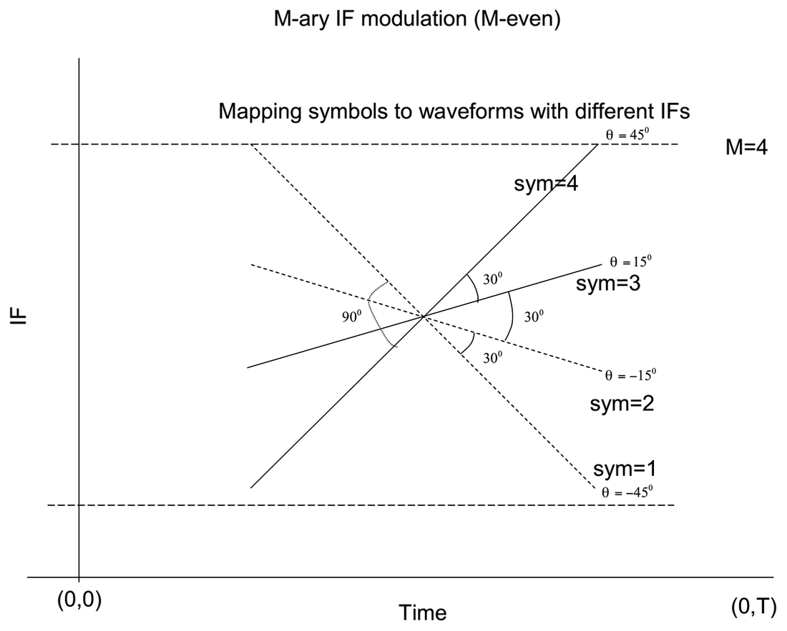

We can interpret the IF in terms of degrees as follows. IF is nothing but the slope of the lines seen in the above figure and $slope = \tan(\theta)$. We also know that

$$
\mathrm{IF} = (slope \cdot t) + f_c
$$

where $f_c$ is the $y$-intercept of the IF line. So we can conveniently represent the IF in terms of $\theta$. For example, as shown in the above figure, $\theta = 45^\circ$ corresponds to an IF of $(0, 0.5]$ with full spread and $t_c$ and $f_c$ at $N/2$ and $0.25$ respectively.

Effectively, we have to divide the region $[-450, 450]$ into $M-1$ regions.

Thus, a symbol $m$ ($m = 1, 2, \dots, M$; $M$ even) can be assigned an angle as:

$$
\theta_m = \frac{360}{2\pi} \frac{\pi}{2} \frac{1}{M-1} (2m - M - 1)
$$

which gets translated to

$$
\beta_m = \frac{2\pi}{N} \tan\!\left(\frac{\theta_m \, 2\pi}{360}\right)
$$

where $N$ is the number of time-domain samples.

Now, we give the detection regions corresponding to different $\beta_m$s. In the following figure, we present the detection regions for the $M=4$ case.

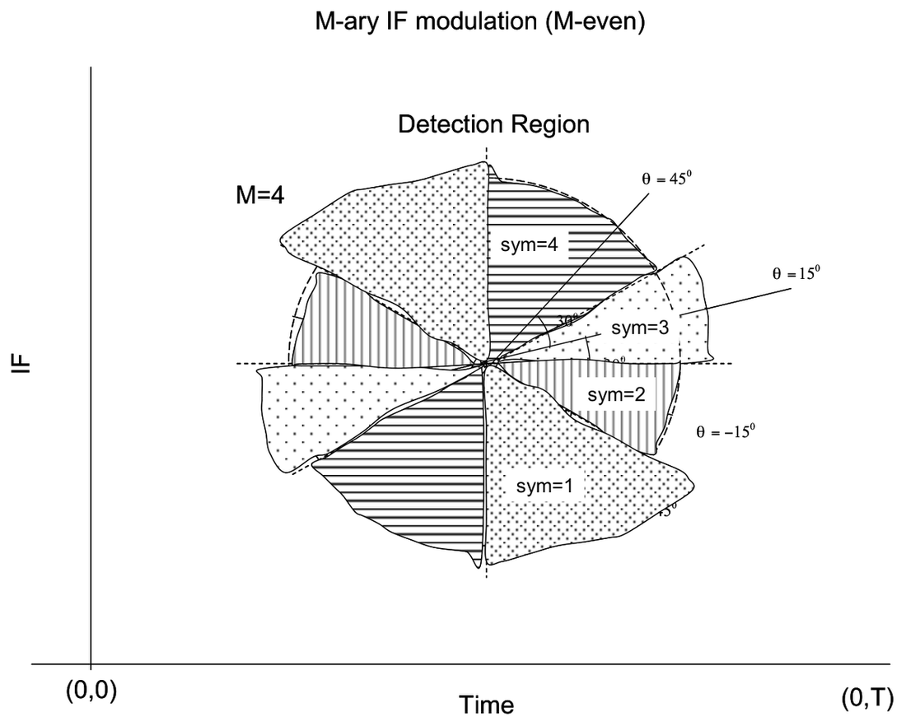

Thus a symbol can be recovered with the following decision statistic:

If $\theta_{estimates} \geq \dfrac{\pi}{4}$,

`sym = M;`

else if $\theta_{estimates} \leq -\dfrac{\pi}{4}$,

`sym = 1;`

else

$$
\mathrm{sym} = \left\lfloor \frac{\left(\dfrac{\pi}{4} + \theta_{estimates}\right)}{\theta} \right\rfloor + 1
$$

where $\theta = \dfrac{\pi}{2(M-1)}$ and $\theta_{estimates}$ is the estimated IF in terms of degrees.

## Simulation

We have simulated the above algorithm in MATLAB. We have to sequentially process the samples i.e., we have to generate a symbol, map the symbol to a chirplet with the appropriate IF parameter, add noise, estimate the IF parameter in the presence of noise, then inverse-map the estimated IF parameter back to a symbol based on a decision statistic. This is inevitable because we don't have a signal-space concept yet. Hence the brute-force approach.

The chirp rate (IF parameter) is estimated based on a search over the time-frequency plane followed by quasi-Newton optimization techniques (downloadable code available).

In order to obtain the performance characteristics, we have to generate at least $3 \times 10^5$ symbols and obtain the $P_e$ at different SNRs. A rough estimate of the computational complexity shows that it may take around 16 days to obtain $P_{err}$ for $3 \times 10^5$ realizations at the different SNRs.

I tried compiling the MATLAB code (`mcc`) but the systems in ALC don't have a C-compiler and also the systems are quite slow. So I ran the code only for $3 \times 10^3$ realizations at 11 different SNRs ($-1$ dB to $5$ dB) for $M = 4$. I got no errors in detected symbols. I believe I should analyze this at low SNRs for a large number of realizations. I attached MATLAB code for the same.

## References

1. *Chirp hunting*, O'Neill, J.C.; Flandrin, P.; Proceedings of the IEEE-SP International Symposium on Time-Frequency and Time-Scale Analysis, 6-9 Oct. 1998, pp. 425-428.
2. Akan, A.; Yalcin, M.; Chaparro, L.F., "An iterative method for instantaneous frequency estimation," Electronics, Circuits and Systems, 2001. ICECS 2001, Malta, Vol. 3, pp. 1335-1338.
3. *A four-parameter atomic decomposition of chirplets*, Bultan, A.; IEEE Transactions on Signal Processing, Volume 47, Issue 3, March 1999, pp. 731-745.

## Software

1. Time-frequency tool box: <http://www-dsp.rice.edu/software/>
2. Chirplet parameter estimation: <http://www.mathtools.net/MATLAB/Signal_processing/index.html>

## Appendix: MATLAB Code for IF Modulation Simulation

```matlab
% parameters are the following
% GO soma... Go...
%addpath 'u:\soma\tfrbox';

nN = 3e3;
N = 128;  % signal length. For simplicity it is chosen so!
snr = 0;
M = 4;
theta = 90/(M-1)
a = 1;
tc = N/2;
fc = 0.25;
alp = 2*pi/N/64;
th = 0;
t = tc;
f = fc*2*pi;
d = sqrt(0.5/alp);
cr = angle2cr(th,N,2*pi);
P = [a,t,f,cr,d];
%bet = 0.25; %cr = bet*2*pi/N; if beta is specified in terms of slope and not
%angle -pi/4 to pi/4
% bet (slope) = tan (angle);
sym = randint(1,nN,M)+1;
%sym = 3*ones(1,nN);
%sym(1)=2;
th = 45*((2*sym)-M-1)/(M-1);
cr = angle2cr(th,N,2*pi);
clear th;

% do sequential processing.
% map the symbol to the constellation just chirp-rate is the parameter to
% be used
for p = 1:7
    snr = p-2;  % -1dB to 5dB;
    an = sqrt( 10^(-0.1*snr));
    time_start = cputime;
    for q = 1:nN

        % map these parameters to jeffs parameters!
        P(4) = cr(q);
        x = chirplets(N,P);
        n = randn(128,1)+j*rand(128,1); n = n/sqrt(n'*n);
        r = x+an*n;
        ecr = est_c(r,t,f,128);
        eP = best_chirplet(r,0,128,0,ecr,d,t,f);
        rth = cr2angle(eP(4),N,2*pi);
        % Now do the detection. Extreme boundaries;
        if(abs(rth)>=45)
            if(rth>0)
                rsym = M;
            else
                rsym = 1;
            end
        else
            r_abs_sym = fix(abs(rth)/theta)+1;  % 0-theta is symbol 1.
            if(rth>=0)
                rsym = r_abs_sym+(M/2);
            else
                rsym = (M/2)-r_abs_sym+1;
            end
        end
        esym(q) = rsym;
    end
    time_end = cputime;
    Perr(p) = length(find((sym-esym)))/nN;
end
(time_end-time_start)
```
