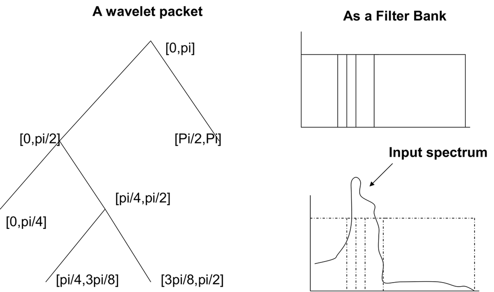
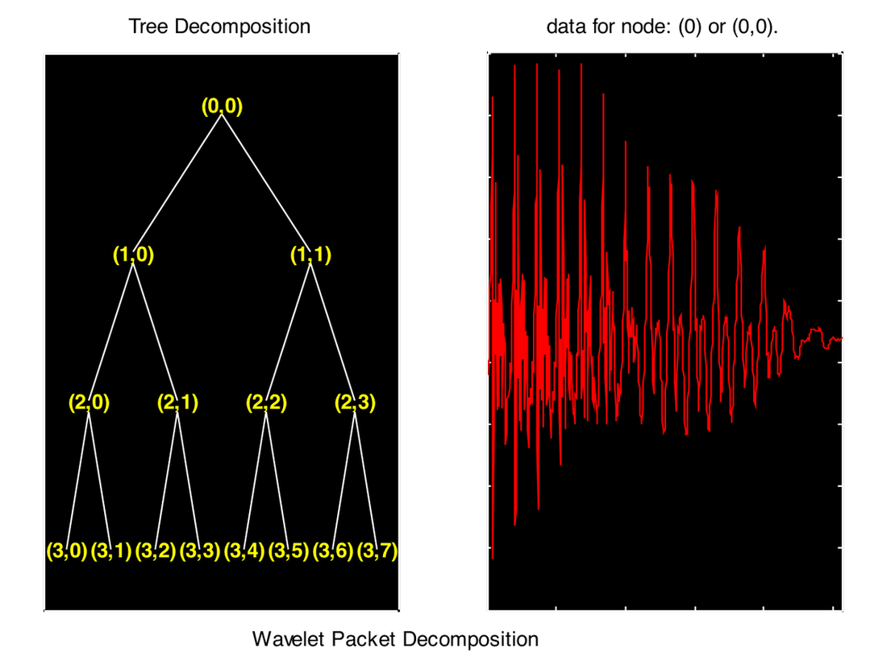
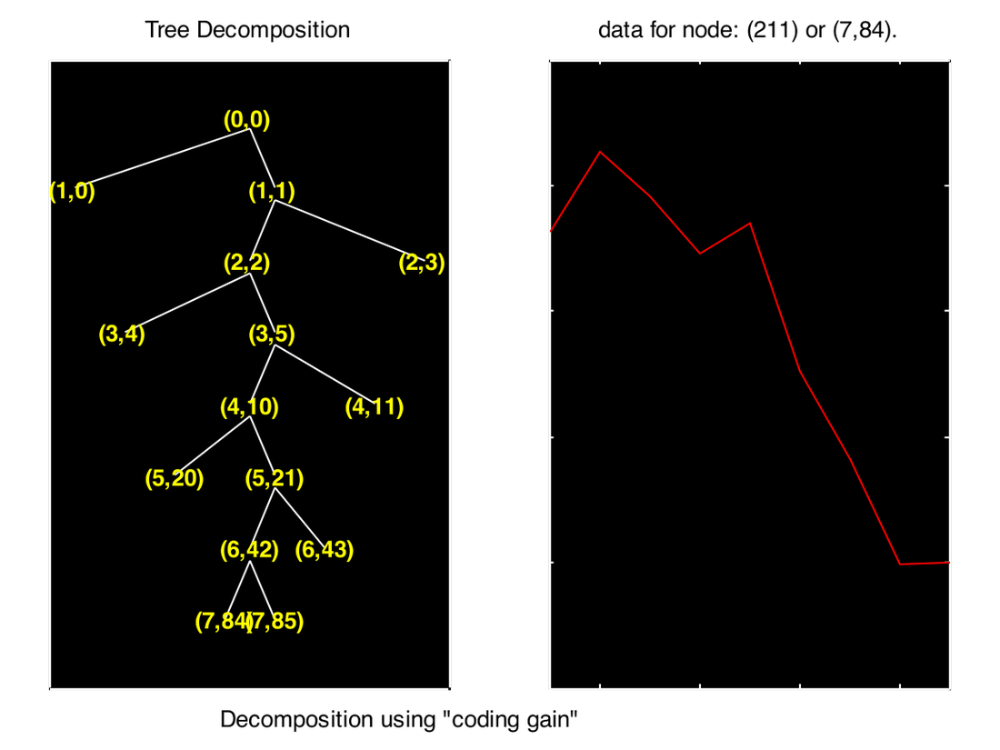
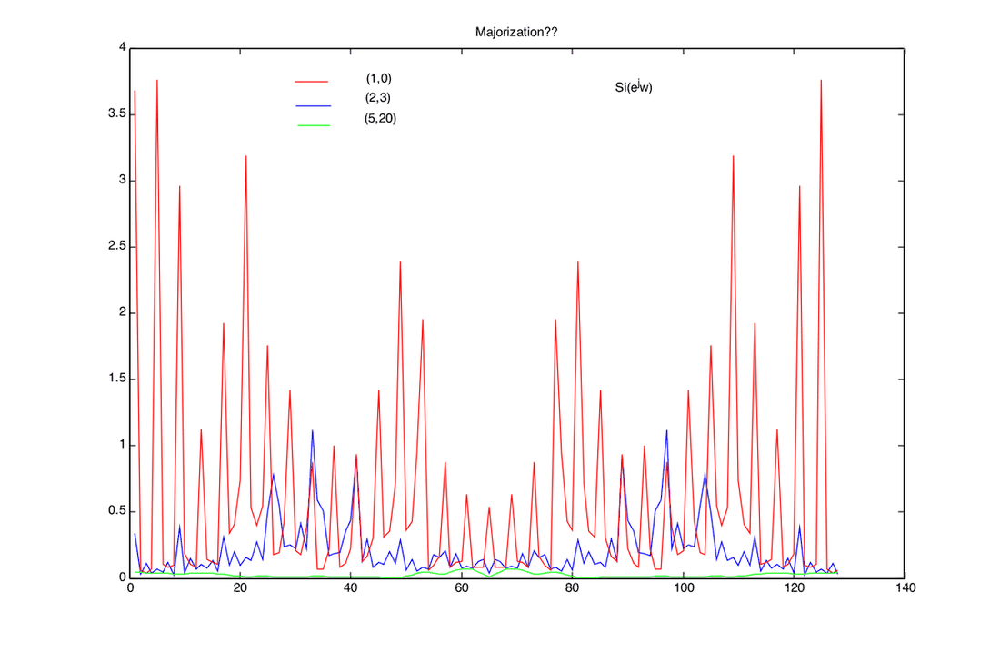
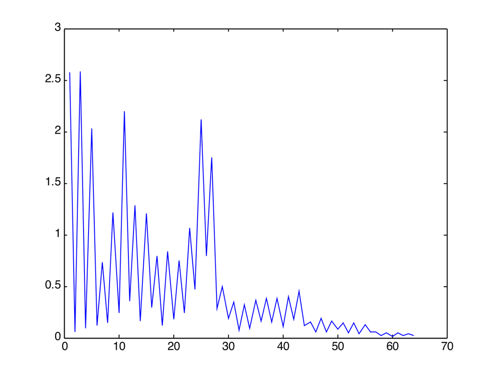
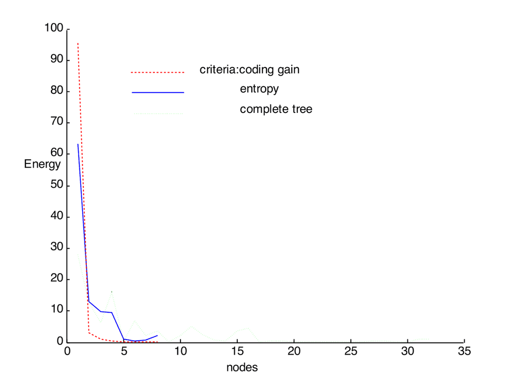
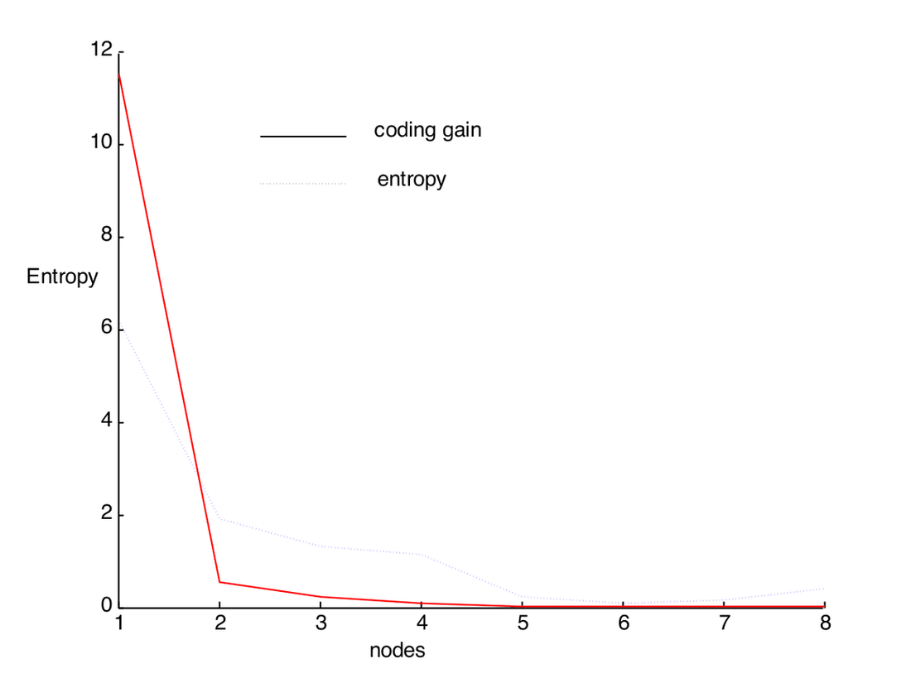

# Wavelet Packets and Signal-Adapted Filter Banks

## Objective

Investigate the methods for designing signal-adapted bases from filter banks, in particular, principal component filter banks, FIR compaction filters and wavelet packets. Study the performance of these methods in the context of discrete multitone modulation and/or subband coding.

Signal-adapted filter banks, when viewed as a form of designing the best basis, find many applications in communication, source coding, feature detection, etc. There exist many ways of designing these filter banks which arise mainly due to various properties that can be attributed to these filters, like finite length, number of channels, smoothness, regularity, compactness, existence in all practical cases, etc. Quite naturally, choosing a design mechanism is not a simple task. In this project, we will study the design methods for adapting the filter banks and carry out an objective analysis of performance in the context of DMT modulation and/or subband coding.

In particular, we will study principal component filter banks (PCFBs), FIR compaction filters (FIR-CFs) and wavelet packets (WPs) and the interplay among them. PCFBs are optimal in the sense of coding gain but may not exist always. On the other hand, FIR compaction filters are particularly suitable for implementation but are sub-optimal. Again, based on the number of channels and filter length, the possibilities vary and we try to understand their implication in each setting. As an alternative to designing filter banks for optimal energy compaction, one can consider wavelet packets. A fully grown wavelet tree is nothing but a uniform filter bank, the bandwidth of each band proportional to the depth of the tree. Pruning this fully blown tree can lead to a non-uniform filter bank or can lead to any structure as driven by the design criteria. Thus, WPs can be considered as an alternative to PCFBs and FIR-CFs.

Recently, PCFBs have been applied in DMT and it is very well known that WPs are used in subband coding. Hence, we can take any of the applications and carry out an application-specific performance study.

## Introduction

Signal-adapted filter banks find numerous applications in signal representation, data compression, noise suppression, and progressive transmission. These filters are designed based on the input power spectral density subject to certain constraints on the number of channels, order of the filter lengths, bandwidth of the filters, etc. There exist numerous procedures to derive and design filters. Some of them include principal component filter banks and compaction filters [1-3].

Based on the design criteria and input spectral density, the nature of these filters varies. For example, it turns out that an optimal transform coder is an optimal subband coder with a constant polyphase matrix.

Due to the presence of many constraints in the design stage, one should be very careful in designing appropriate filters. For example, if the number of channels is more than two and the filter length is constrained, then PCFBs may not exist. These difficulties pose significant challenges to the designer.

In this report, we will compare the alternatives to these signal-adapted filter banks and try to implement a class of filter banks derived from wavelet packets.

## Filter Bank

A filter bank essentially decomposes the input spectrum into a certain number of sub-bands where the subbands may or may not overlap. The advantage of dividing the spectrum into smaller bands is that most of the energy might be present in only a few of the subbands while the remaining bands may not have any energy in them. This helps us in processing only the subband corresponding to the maximum energy. Applications of such a principle can be found in data compression and progressive transmission.

A subband coder is optimal if it follows the following two properties (a necessary and sufficient condition for optimality). The coding gain is maximized if:

a) Total decorrelation (the subbands are decorrelated one from the other)

b) The subbands majorize the spectrum

where the coding gain is defined as:

$$
G_{SBC} = \frac{\frac{1}{N}\sum_{i=0}^{N-1} \sigma_i^2}{\left(\prod_{i=0}^{N-1} \sigma_i^2\right)^{1/N}}
$$

Here $\sigma_i^2$ is the variance of the $i$th subband and $\sigma_x^2$ is the variance of the input.

## Principal Component Filter Banks (PCFBs)

**Definition:** Let $C$ be a class of FBs (like the transform coder class, the class of filters of infinite order, etc.), then for a given input spectral density, a PCFB is the FB whose variance vector majorizes all vectors in the subbands belonging to the class $C$.

PCFBs are optimal in the sense that they maximize the coding gain ($G_{SBC}$). PCFBs have a strong connection with transform coders (in the case of FBs belonging to the class $C$), with Wiener filters (when the objective is to estimate the signal in the presence of noise), and are also the filters which minimize the transmit power in discrete multi-tone modulation. In particular, when the filter order is less than the number of channels, the KLT maximizes the coding gain which in this case is the PCFB.

Despite their many desirable properties, their existence is not always guaranteed. At least in the case of DFT filter banks and cosine-modulated filter banks, PCFBs cease to exist. However, in the two-channel case, FBs with unconstrained order, and in the transform coder case, they always exist. In other situations, one has to analyze case by case. This makes them less interesting despite their many desirable attributes.

In the case when we don't have PCFBs, we design compaction filters. An FIR compaction filter is said to be the one that compacts most of the energy into only one band. Then the remaining $N-1$ filters are completed by considering the complement of the power spectral density. A compaction filter is necessarily a Nyquist($M$) filter, i.e., $h(Mn) = \delta(n)$, and the compaction gain is defined as:

$$
G_{comp} = \frac{1}{2\pi}\int_{-\pi}^{\pi} |H(e^{j\omega})|^2 S_{xx}(e^{j\omega})\, d\omega
$$

The method of designing compaction filters consists of designing a filter which maximizes the compaction gain subject to the constraints. Several methods were proposed for designing such filters in [4]. In the present context, we motivate ourselves to consider the following.

We want to design filters that are easily computable and share the elegance of PCFBs. That is, we want to retain the existence of FIR compaction filters and yet try to maximize the coding gain. We try to solve this by resorting to wavelet packets.

## Wavelet Packets

A wavelet packet is a completely grown wavelet tree. That is, in the dyadic wavelet transform, we only further filter the approximation coefficients and leave the detail coefficients unattended. If we think of the first analysis filter as an approximate low-pass filter, then we repeatedly filter this low-pass filtered signal. Thus, after $M$ levels of decomposition, we would have one approximate coefficient band and $M-1$ detail coefficient bands. We keep splitting the low-pass band repeatedly. In wavelet packets, we can process any of these low-pass or high-pass bands. If we selectively perform this operation of splitting, we can obtain a non-uniform filter bank. A fully grown wavelet packet up to $M$ levels would have $M$ bands each of width $2\pi/M$. This is the central idea behind using WPs as signal-adapted FBs.

## Wavelet Packets as Signal-Adapted FBs

We achieve this by pruning the WP tree based on a certain criterion. It is suggested that certain entropy-based techniques can be used to prune the tree. This problem was considered in the context of best-basis selection. Indeed, WPs offer a wide variety of bases over which the signal can be projected. Thus, it is very suitable for processing a large class of signals. As we increase the number of bands, or in other words if we increase the depth of the decomposition, we search for an even larger number of bases that can best approximate the signal under consideration.

In the figure below are shown a wavelet packet and its equivalent subband decomposition:



The definition of the best tree (i.e., the best way to prune the tree) very much depends on the objective function being used. In the context of best-basis selection, [5] used entropy as the criterion. Those nodes are pruned which minimize the cost function specified in terms of entropy. For example, when "pruning" corresponds to merging, i.e., we first grow the wavelet tree to its fullest depth possible, then we try to merge those two nodes which result in minimum increase in the entropy. We repeat this process until a stopping criterion is met. This stopping criterion can be a given computational complexity or number of bands needed. On the other hand, it is also possible to prune the tree by merging. In this case, we start with an initial tree and try to find that node which results in maximum reduction in entropy. Like the earlier case, here also the stopping criterion can be the desired number of subbands or desired SNR. The entropy function used in this operation is:

$$
E = -\sum x^2 \ln(x^2)
$$

And this function is an additive function. However, as mentioned earlier, we want to prune the WP tree such that the coding gain is maximized. For simplicity in implementation, we start with just two bands in the tree and try to split the bands which result in maximum increase in coding gain.

## Results

**Data:** A speech signal resampled at 8 kHz was considered. A total of 1024 samples were taken. A WP of depth 4 was created using the "db1" wavelet. The pruned tree using the "entropy" criterion is shown below:



The pruned tree using "coding gain" is shown below:



The PSD of the different subbands is shown in the figure below:



We can observe from the figure that, roughly, the subband having higher variance has a PSD greater than the others, i.e.,

$$
S_{(1,0)}(e^{j\omega}) \geq S_{(2,3)}(e^{j\omega}) \geq S_{(5,20)}(e^{j\omega})
$$

which is nothing but the majorization theorem.

In the frequency domain, the filter bank splits the bands as shown in the figure below:



The energy and entropy of the subbands in both cases are shown in the following figures, respectively.





As expected, the energy of the subband (corresponding to higher energy within the tree) has more energy compared to the subband in the tree pruned based on entropy. Also, the entropy of the former is less than the latter's.

## Conclusions

- The results are not very interesting; rather, they produce obvious bands.
- The criteria for pruning the tree play an important role in determining the structure.
- Wavelet packets are practically feasible; we note alternate criteria for speeding up the pruning.
- The entropy used in the current pruning is additive but not directly related to information.

## MATLAB Code

```matlab
%load sig.mat %loads data x (size 128);
load x.mat;
x = x(1025:1025+1024);
M = log2(length(x)); % max. of levels of decomposition
N = 8;
%x=ones(128,1);
t = wpdec(x,1,'db1');
cN = 2;% current no of nodes
node = zeros(cN,3);
code_gain = ones(cN,1);
for p = 1:cN
    node(p,1) = var(wpcoef(t,[1,p-1]));
    node(p,2) = 1;
    node(p,3) = p-1;
end

code_gain_a(2) = mean(node(:,1));
code_gain_b(2) = prod(node(:,1))^(1/cN); % this is coding gain at Mth level with N bins
code_gain(2) = code_gain_a(2)/code_gain_b(2);

% try_splitting here...N greater than 2
dN = cN;
for q = 2:N-1
    gain_table = zeros(dN,1);% inefficient usage of previously computed gains
    for p = 1:dN
        % check whether the node can be split for this db1 wavelet
        if(node(p,1)==M)
            % stop splitting this node. it can not be split anymore
            gain_table(p) = -1; % set this to a value that can be detected easily;
        else
            mt = wpsplt(t,[node(p,2),node(p,3)]);
            tx_a = wpcoef(mt,[node(p,2)+1,2*node(p,3)+0]);
            tx_b = wpcoef(mt,[node(p,2)+1,2*node(p,3)+1]);
            var_a = var(tx_a);
            var_b = var(tx_b);
            gain_table_a(p) = ((code_gain_a(q)*dN)-node(p,1)+var_a+var_b)/(dN+1);
            gain_table_b(p) = (code_gain_b(q))^(dN/(dN+1))*(var_a*var_b/node(p,1))^(1/(dN+1));
            gain_table(p) = gain_table_a(p)/gain_table_b(p);
        end
    end
    %pick-up the maximum
    [val,ind] = max(gain_table);
    if(val<0)
        q = q-1;
        % this should not go infinite loop as long as N<2^M;
    else
        % split the node with index "ind";
        dN = dN+1;
        new_node = zeros(dN,3);
        new_node(1:ind-1,:) = node(1:ind-1,:);
        new_node(ind+2:dN,:) = node(ind+1:dN-1,:);
        % repeat the step..update the table;
        p = ind;
        t = wpsplt(t,[node(p,2),node(p,3)]);
        tx_a = wpcoef(t,[node(p,2)+1,2*node(p,3)+0]);
        tx_b = wpcoef(t,[node(p,2)+1,2*node(p,3)+1]);
        new_node(p,1) = var(tx_a);
        new_node(p,2) = node(p,2)+1;
        new_node(p,3) = 2*node(p,3)+0;
        new_node(p+1,1) = var(tx_b);
        new_node(p+1,2) = node(p,2)+1;
        new_node(p+1,3) = 2*node(p,3)+1;
        code_gain_a(q+1) = ((code_gain_a(q)*dN)-node(p,1)+new_node(p,1)+new_node(p+1,1))/(dN+1);
        code_gain_b(q+1) = (code_gain_b(q))^(dN/(dN+1))*(new_node(p,1)*new_node(p+1,1)/node(p,1))^(1/(dN+1));
        code_gain(q+1) = code_gain_a(q)/code_gain_b(q);
        clear node;
        node = new_node;
        clear new_node;
    end
end
```

## References

1. Sony Akkarakaran, P. P. Vaidyanathan, "Principal component filter banks — Existence issues and applications to modulated filter banks," IEEE ISCAS, May 2000, pp. I-523-526.
2. P. P. Vaidyanathan, "Theory of optimal subband coders," IEEE Trans. on Sig. Proc., Vol. 46, No. 6, June 1998.
3. P. P. Vaidyanathan, "The best basis problem, compaction filters and PCFB design problems," IEEE ISCAS, Orlando, Florida, June 1999.
4. A. Kirac, P. P. Vaidyanathan, "Efficient methods of optimal FIR compaction filters for M-channel FIR subband coders," Proc. of 30th Asilomar Conf. on Signals, Systems and Computers, 1996.
5. Ronald R. Coifman, M. V. Wickerhauser, "Entropy-based algorithms for best basis selection," IEEE Trans. on Info. Th., Vol. 38, No. 2, March 1992, pp. 713-718.
