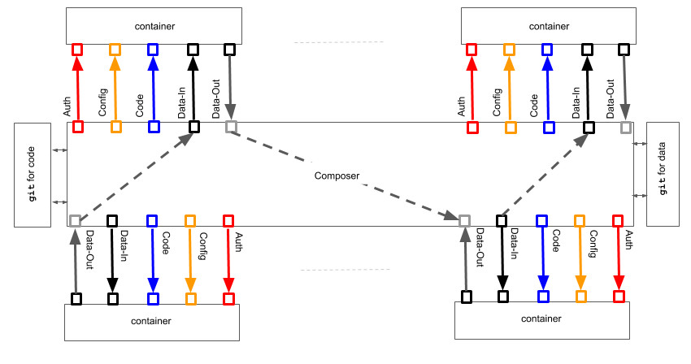

{fig-alt="Axiomatic framework diagram for machine learning applications"}

Building machine learning applications is unlike building physical products such as refrigerators. Once delivered, a refrigerator rarely changes because of the environment in which it operates. Its operating conditions are relatively deterministic.

An ML app is different. Data characteristics can drift. Model assumptions can become invalid. Business conditions may change. Startups, in particular, often face unavoidable shifts in data, usage, and product direction. ML apps are also unfinished by design: they can be tuned, improved, replaced, or reconfigured almost at will.

That raises a basic question:

> What can a manufacturer meaningfully guarantee for an ML app?

For a physical product, a manufacturer may provide installation instructions, operating instructions, warranties, insurance, and customer support. For an ML app or data product, we need a different set of guarantees.

## Goals for a Durable ML App

The following goals are not always directly measurable, but they can be supported through engineering proxies and architectural discipline.

1. **Repeatable:** identical data and identical configuration should produce identical outcomes. This is primarily an engineering requirement.
2. **Auditable:** data trails, model versions, code versions, and transformations should be trackable and traceable.
3. **Recoverable:** the app should recover from computational failures and resume from a known state.
4. **Scalable:** the app should scale up or down as load changes.
5. **Deliverable at speed:** the path from idea to insight should be short enough to support rapid delivery.
6. **Reconfigurable:** the production floor should support derivative apps, much as a manufacturing floor can produce related product variants.
7. **Testable:** multiple app versions should be deployable, comparable, and measurable against business metrics.
8. **Technology-agnostic:** each functional job should use the best environment and toolset, without forcing all work into one monolithic bench.
9. **Vendor-agnostic:** the app should avoid unnecessary lock-in to a single infrastructure provider.
10. **Secure:** data is an asset and must be protected through access control, authentication, and governance.
11. **Privacy-preserving:** stakeholder rights and data privacy must be respected.
12. **Reproducible:** similar data should lead to similar outcomes when the underlying assumptions hold. This is more of a scientific requirement than a pure engineering one.
13. **Diagnosable:** the app should detect and report assumption violations, data-quality issues, and abnormal deployment conditions.
14. **Responsive:** the app should react to changing stimuli and adapt when appropriate.
15. **Representable:** the app should describe itself in a machine-readable form so that other agents can inspect, tune, compose, or patch it.

The first seven goals are mostly addressable with tools from machine learning infrastructure and software engineering. Goals 8 through 15 require deeper statistical, modeling, governance, and scientific knowledge. They are harder to democratize, but they are essential if ML apps are to become durable products.

## Why a Framework Is Needed

Without a principled architecture, these goals remain pleasant slogans. We need a framework that brings several solution spaces together: data versioning, code versioning, model execution, workflow orchestration, monitoring, testing, and deployment.

The analogy is manufacturing. The automobile industry did not begin with modern standardization. It took time for parts, processes, patterns, and production systems to mature. ML app development is still closer to the early industrial stage than to the current state of manufacturing.

In [part 2](../2017-10-24-axiomatic-framework-ml-apps-2/), I propose axioms and a reference architecture for moving toward that maturity.
