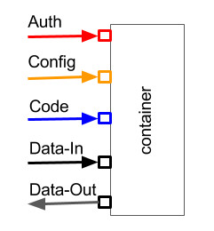

{fig-alt="USB connector metaphor for machine learning applications"}

In earlier posts on composing meaningful ML apps, I used USB as a metaphor for standardizing interfaces between moving parts of a machine learning application.

A USB port changed how everyday devices connect to computers. It reduced the need for many cable types, made peripherals plug-and-play, and hid most driver and protocol complexity from users. Keyboards, mice, printers, webcams, storage devices, and many other peripherals could all connect through one familiar interface.

Can ML apps use a similar idea? Can we plug an "ML device" into a compute host, process data, and return results through a standard interface?

Conceptually, yes.

## The Four Pins

A USB-for-ML connector would have four pins:

- **Data pin:** carries data, such as a file path, cloud location, table reference, or DataFrame.
- **Code pin:** carries algorithm code and data adapters, for example a GitHub repository.
- **Config pin:** carries runtime behavior, such as parameters, environment variables, and execution options.
- **Auth pin:** carries authentication and access information, such as keys or credentials.

The **host** is the compute environment: a laptop, desktop, cloud instance, cluster, or container.

The **device** is the intent: the code and configuration that express what we want to do with the data.

Together, host and device form an executable step: a **micro ML app**. A full ML app is then a composition of many micro apps.

## Workflow

A USB-for-ML execution flow might look like this:

1. The device, or intent, is plugged into the host.
2. Authentication details are read from the auth pin.
3. The host checks whether data, code, config, and environment are compatible.
4. Dependencies are downloaded or installed if needed.
5. The code repository is pulled and prepared for execution.
6. Runtime behavior is set from the config.
7. The executable reads data, processes it, and writes results back to the data port.
8. The host terminates cleanly and reports status.

This assumes that all pins are mutually compatible. In practice, data may come from one system while intent comes from another. If the data syntax or semantics do not fit the intent, the host should refuse execution and fail clearly.

## Why the Metaphor Matters

A standardized interface lets developers structure algorithms so they can run in environments not originally envisioned. It separates concerns:

- data is not hidden inside code;
- code is not tied to a single runtime;
- runtime behavior is configurable; and
- authentication is explicit rather than implicit.

This is only a metaphor, but it is a useful design constraint. It forces ML apps to declare their dependencies, inputs, outputs, and execution contracts. The [DataFrame-as-interface](../2017-10-27-dataframe-new-json-machine-learning/) post expands the data-pin side of this idea.
