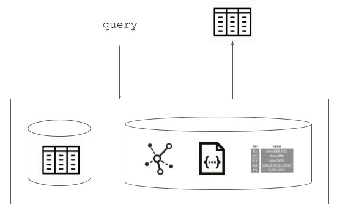

{fig-alt="DataFrame and USB metaphor for machine learning data exchange"}

NoSQL is popular for a good reason. In web applications, enforcing a rigid schema is difficult and often unrealistic. Even when a high-level schema exists, incoming information can be partial, sparse, and sporadic.

SQL-spirited systems that demand structure upfront can struggle with volume and variety. NoSQL systems fit many of those workloads, and they come in several forms: document stores, key-value stores, graph databases, and column-oriented databases.

Machine learning systems, however, have a harder time with near-schema-less data. They need stronger structure for at least four reasons:

- **Algorithms need data structures.** There are no exceptions in machine learning.
- **Efficient computation needs efficient representation.** Algorithmic complexity depends on data structures and the randomness in the data.
- **Machines do not understand raw text.** Text must eventually be mapped into numerical representations; that is where NLP enters.
- **ML apps need interoperability.** As argued in the USB-for-ML post, a standard container type is necessary if ML apps are to compose with one another.

## Query Responses Should Be Structured

The deeper problem is not that incoming data lacks structure. The problem is assuming that the response to a query should remain unstructured.

If a human or an agent asks a query and cannot elicit a structured response, perhaps the query itself is poorly designed. It is good engineering practice to coerce structure at the response boundary. The question is whether we can return structured data even from NoSQL sources.

We can. The practical structure is the **DataFrame**.

## Why DataFrame?

A DataFrame is essentially a table, but it is more flexible than that simple description suggests. Several useful representations can be reduced to tabular form:

- graphs with binary relations, weighted or unweighted, with or without attributes;
- time-series data;
- normalized documents, treated as ordered sequences of tokens;
- flattened JSON objects with missing values; and
- many structured responses derived from otherwise unstructured sources.

If an unstructured source can be transformed into a structured source, a query response can be structured as well.

DataFrames also have strong ecosystem support:

- Many R packages are built around `data.frame`.
- MATLAB is built around matrices; a matrix is a special DataFrame where columns share a data type.
- TensorFlow is built around tensors; a matrix is a two-dimensional tensor.
- DataFrame-based ETL operations form a large part of data science grammar, much like `fork`, `commit`, `push`, and `pull` form part of Git grammar.

## What We Need Next

A few directions follow naturally:

- We need a **TensorFrame**: a generalization of the DataFrame to n-dimensional data.
- SQL and NoSQL vendors should support returning query results as TensorFrames, or at least as DataFrames with schema.
- ML app interfaces should treat the DataFrame as the default **data pin**.

MongoDB's Spark connector already provides a DataFrame interface. That is a useful move.

Beyond that, we keep hearing why NoSQL is the next best thing. For machine learning, the more important question is: can the data source return something structured enough for algorithms to consume?
