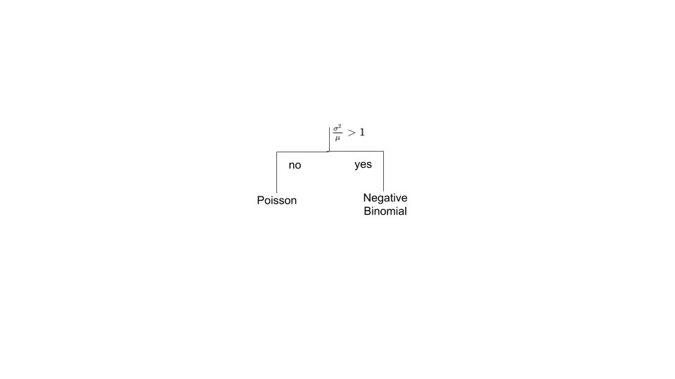

{fig-alt="Automation illustration for data science workflows"}

Machines should be able to decide which algorithm or model to apply without constant intervention from a data scientist or statistician. That is an ambitious goal. Can it be achieved?

We already see partial versions of this idea: parameter search, Bayesian optimization, and other model-selection workflows. But these are usually offline activities, guided by experts. Adaptive and sequential modeling techniques also exist, but many are either specialized or online counterparts of traditional offline methods.

The deeper issue is that model selection is often treated as an estimation problem. We define a class of candidate models and estimate each one. But fundamentally, model selection is a **decision problem**: given a set of possible modeling actions, which one should we choose?

## Model Selection as Classification

For simple models, we can compute test statistics and perform hypothesis tests. For more complex models, useful test statistics are harder to derive. That raises a practical question: can we score a dataset itself and infer which model class is appropriate?

At KDD 2014, I heard Christian Robert discuss model selection as a classification problem in the context of Approximate Bayesian Computation. He and his coauthors used a random forest classifier to choose among models based on features computed from the data. Around the same time, my collaborators at the Texas Transportation Institute and I were working on a related problem.

The motivating question was practical:

> For a road-safety practitioner, can we recommend model-selection rules of thumb, such as "if the data has these characteristics, use this model"?

Using an Approximate Bayesian Computation framework, we developed a way to design such heuristics and applied it to practitioner guidelines.

## A Concrete Example

For univariate count data, we built a decision tree that recommends whether to use a Poisson distribution or a negative binomial distribution. The tree does this without fitting both distributions. It simply computes the mean-to-variance ratio, compares it with a threshold, and decides.

In that case, the learned decision statistic is strongly correlated with the likelihood-ratio test statistic. The decision tree becomes a computational, non-analytical way to approximate a hypothesis test.

This idea has real value for data science automation, especially with large datasets:

- Compute a small set of descriptive statistics.
- Use learned decision rules to choose the downstream modeling path.
- Avoid fitting every candidate model just to decide what to try next.
- Let a machine learning system reconfigure itself based on data characteristics.

## What Remains

This is only a baby step toward data science automation. Larger and more complex settings need much more study.

The bigger gap is representational: knowledge about models, assumptions, and applicability conditions must be available in a machine-usable form. Until the ML community solves that, full data science automation will remain a goal rather than a routine capability.
