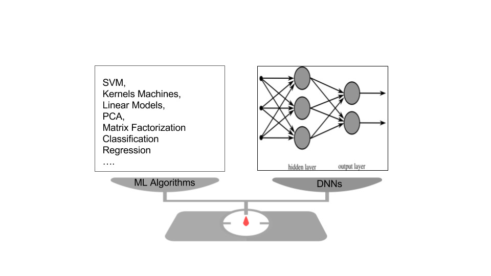

{fig-alt="XML document icon representing model interchange"}

In [part 1](../2018-01-09-ml-app-interoperability-deep-learning-frameworks-1/), I discussed why machine learning model interoperability matters, what PMML tries to offer, and where that approach struggles. In this second part, I argue that **deep learning frameworks** such as TensorFlow, Keras, and PyTorch offer a more practical default for model exchange.

Before choosing a solution, the goals should be explicit. A useful model-interchange layer should provide:

- separation between **data**, **data flow**, and **model specification**;
- human-readable model structure;
- scalability across compute environments;
- a low barrier to translation between tools; and
- a low barrier to adoption by the larger community.

The problem is not only technological. Schema design, file formats, readers, writers, and languages matter. But the mathematical landscape and market incentives matter as well. Three questions frame the search:

1. Is there a universal algorithm that subsumes all other useful algorithms?
2. Is there an engineering framework that can realize such a broad model class?
3. Is there enough business interest to make the framework commercially viable?

The strict answer to the first question is no. But the question still points us toward a larger class of models and a practical approximation. **Deep learning is a strong contender.**

## Why Deep Learning Helps

Deep learning has unusual expressive power because it is built from reusable blocks: layers, activations, losses, regularizers, initializers, optimizers, and graph compositions. Modeling becomes less of a monolithic algorithm choice and more of an assembly of reusable components.

Many model families can be represented, exactly or approximately, within deep neural network frameworks:

- regression and classification models, with appropriate loss functions;
- SVMs and kernel machines, through activations, frozen layers, and losses;
- matrix factorization and bilinear models, through graph composition and merge operations;
- nonlinear state-space models, through recurrent networks;
- graphical models such as restricted Boltzmann machines;
- dimensionality reduction through autoencoders;
- variational Bayes and deep generative models; and
- many other hybrids.

The same framework can also handle a wide range of data shapes:

- multiple inputs and multiple outputs;
- variable input and output sizes; and
- tensors, text, speech, images, video, and combinations of these.

This does not mean every algorithm has a clean DNN representation. My working bet is more modest: a large fraction of useful model space can be addressed through one DNN framework. Another common misconception is that DNNs always require large data. They can be useful in both small-data and big-data settings, although more work is needed to formalize those cases.

## Engineering Reality

Deep learning frameworks are not just mathematical abstractions. They are engineering realities. Google released TensorFlow, Facebook released PyTorch, and other groups have released Theano, MXNet, Caffe, and related tools. That ecosystem gives deep learning a chance to be commoditized sooner rather than later.

Using Keras with a TensorFlow backend as a reference point, the interoperability goals become more concrete:

- **Adoption is easier.** Keras abstracts over lower-level tensor computation and supports rapid experimentation. Its ecosystem and backing lowered the barrier for practitioners.
- **Model structure can be serialized.** Keras models can be saved in formats such as JSON or YAML. That makes structure readable by both humans and machines.
- **Form and content are separated.** Model architecture and model weights can be stored separately. I prefer to inspect structure first and investigate parameters later. Tools such as TensorBoard also help in that direction.
- **Models are graphs.** DNNs are computational graphs. That means model syntax can be checked through graph properties, such as whether the graph is a DAG.
- **Execution can scale.** TensorFlow can run on CPUs, GPUs, clusters, and embedded systems. The basic promise is: write the model once, scale execution across environments.
- **Translation is more tractable.** Translating between DNN frameworks is often easier than translating between arbitrary algorithm implementations. ONNX is one effort in this direction.
- **The market has incentives.** Organizations want to ride the AI wave. NVIDIA, IBM, Google, cloud vendors, and MOOC providers all have commercial reasons to train people and expand the ecosystem.

## The Practical Default

Deep learning frameworks do not eliminate the need for other interoperable algorithms. But they can become a **default substrate**: expressive enough for many models, standardized enough for tooling, and commercially important enough to attract sustained support.

Overall, deep learning frameworks have the potential to commoditize and democratize machine learning applications. Interoperability is only one part of that story, but it is an important one.
