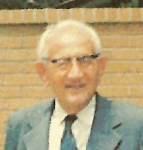
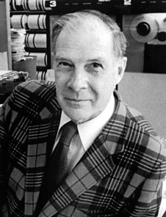
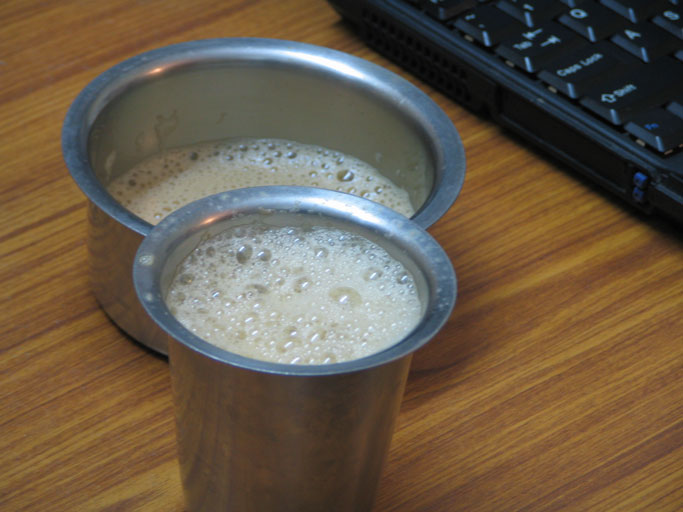
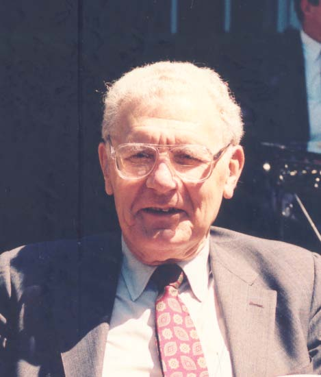
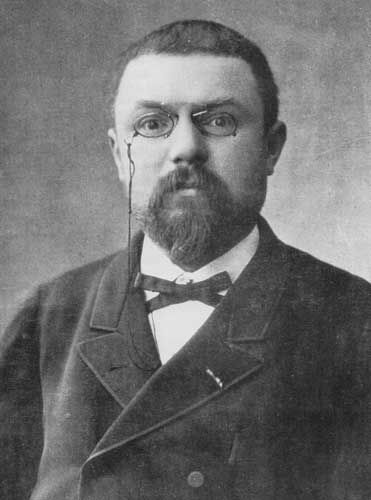

Artificial intelligence is changing what it means to learn, solve problems and do research. A machine can now search a literature, explain an unfamiliar method, write code, test an argument and produce a plausible answer in minutes. Work that once demanded scarce knowledge, specialist access or weeks of calculation is becoming available to almost anyone.

This does not make important questions disappear. It shifts more of the work upstream: What is the problem? What belongs inside its boundary? What would count as a good solution? Which apparently different ideas share a structure? AI can help us work through a question, but deciding which question deserves attention, and judging the answer, remain our responsibility.

> This essay grew from a lecture for undergraduates at IIT Jammu. You can [view the standalone presentation](deck.html) alongside the essay.

## TL;DR

AI has reduced the cost of searching for information, learning an unfamiliar method, writing code and exploring possible solutions. It can extend what one person is able to attempt, but it does not decide which problems are worth solving or whether an answer should be trusted.

- **Research as inquiry** turns an unclear situation into a precise question that evidence can test.
- **Systems thinking as opportunity** directs attention to interactions, competing objectives and assumptions at the boundaries between fields—places where useful problems are often overlooked.
- **Mathematics as foundation** identifies shared structures, allowing an idea or method developed in one setting to be used in another.

What remains distinctly human is the value judgment involved in choosing a problem, defining what *better* means and recognizing a promising connection. This judgment—often called taste—is cultivated through curiosity, depth of knowledge, scientific temperament, debate with oneself and others, and a willingness to revise one's position when the evidence changes.

This essay examines the relationship between research, systems and mathematics in the age of AI. Research turns an unclear situation into a question worth answering. Systems thinking reveals interactions that disappear when components are examined separately. Mathematics identifies structures that recur across those boundaries under different names.

I have been doing research for more than twenty five years. During that time, many parts of searching, calculating, coding and testing have become much cheaper. Deciding what to investigate, how to frame it and whether to trust the result has not changed in the same way. This matters both to students learning to solve problems and to researchers trying to identify worthwhile ones.

> A good problem needs a conflict; conflicts sit at the boundaries between systems; and mathematics is how you cross a boundary.

The argument begins with a cup of tea. The cup distinguishes solving a problem from framing one. The equation that describes its cooling will later reappear in several apparently unrelated settings.

## A cup of tea, going cold

Consider the cup as it cools. There are three different questions you can ask about it, and telling them apart is most of what follows.

- **How long until it reaches 40&nbsp;°C?** This is an exam question. It has one answer and a known method.
- **Why does the office coffee machine produce undrinkable tea at 3pm?** This is a system question. The answer may involve the machine, the queue, the milk and its maintenance.
- **Can we design a better cup?** This is a research question, but it is not yet well posed.

The trouble is the word *better*.

Keeping the tea hot for longer may leave it undrinkable when served; cooling it quickly may leave it cold by the third sip. The cup therefore has to cool quickly at first and slowly later.

The apparent contradiction is the research problem: the cup must behave differently in two temperature ranges. Stating the conflict this way makes it possible to investigate.

## The heat equation

$$\frac{\partial u}{\partial t} = \alpha \nabla^2 u$$

The equation says that heat flows from regions of higher temperature to regions of lower temperature, at a rate determined by the spatial variation in temperature. [Fourier](https://archive.org/details/thorieanalytiqu00fourgoog) published it in 1822 to describe heat in a solid.

We will meet it again in a city, in an argument about the age of the Earth, and in a photograph. Each return will widen the boundary around what first looked like a simple cooling cup.

## Access to research

Richard Hamming worked at Bell Labs among mathematicians, physicists, chemists and engineers. He described changing lunch tables so that he could ask people in different fields about their important problems. Proximity gave him access not only to published knowledge but also to the questions, judgments and unfinished ideas of other specialists.

Twenty years ago, access to books, papers and specialists was limited.

Books cost money and arrived slowly. Papers sat behind subscriptions an institution might not hold. Specialists were often reachable only through proximity or an introduction.

Books and papers are now much easier to find. AI systems also provide limited access to explanations and methods that once required direct contact with a specialist.

Compute, instruments, laboratories, mentorship and the time to use them remain unequal and expensive. Access to knowledge has widened more rapidly than access to the means of acting on it.

That asymmetry matters for everything that follows: much of the working out has become cheaper; choosing what to work out, and judging the result, has not.

---

# Part one · Research as inquiry

::: {.essay-portrait-quote}
{.essay-portrait}

> It is foolish to answer a question that you do not understand.
>
> — [George Pólya](https://mathshistory.st-andrews.ac.uk/Biographies/Polya/) (1887–1985), *How to Solve It* (1945)
:::

Pólya's line and the cup are the same observation. Before you can answer *can we design a better cup*, you have to know what *better* means, and finding that out is not the same activity as answering.

## What makes a problem good

Richard Hamming gave a talk at Bellcore on 7 March 1986 called ["You and Your Research"](https://pages.cs.wisc.edu/~markhill/hamming_86_03_07.pdf), later reprinted in *The Art of Doing Science and Engineering* (1997). One line from it does more work than the rest:

::: {.essay-portrait-quote}
{.essay-portrait}

> It's not the consequence that makes a problem important, it is that you have a reasonable attack.
>
> — [Richard Hamming](https://www.computerhistory.org/fellowawards/hall/richard-hamming/) (1915–1998), *You and Your Research* (1986)
:::

On this account, importance does not come from the size of the possible payoff alone. A workable problem must also offer a way in. Time travel would have enormous consequences, but it does not presently offer a reasonable line of attack.

Hamming, however, worked at Bell Labs, with a computer, a machine shop, a budget and Shannon nearby. A reasonable attack depends on the resources available. A company may approach reusable rockets by building them; a student needs a question that can be advanced with a laptop, a supervisor and the facilities at hand.

The test is therefore relative to the researcher. A suitable problem lies in the overlap between what matters and what the researcher can investigate.

## What shape a problem takes

A research problem often begins with a tension made precise enough to investigate. Three tests are useful:

1. **It has a conflict** — one thing pulled two ways, each side with a reason.
2. **It has a reasonable attack surface** — a way in, at *your* reach.
3. **It has a consequence** — somebody is different if you turn out to be right.

This is an order of inquiry, not of importance. Consequences are considered last because they are often hardest to judge in advance. Hamming's error-correcting codes, for example, began with the practical problem of a machine dropping his weekend jobs.

The first test is often easiest to satisfy at a boundary, where two legitimate objectives or methods meet. Their interaction may belong fully to neither field. This does not guarantee a good problem, but it is a productive place to look.

Inquiry applies all three tests. What is in conflict? Can I investigate it with the resources available to me? What would change if the claim were true?

You do not find a good problem first and then start asking. The asking is what turns a topic into a problem.

## One of my own

An example from my own work shows how this process can change the original question.

Some years ago I came across a four-page paper in a Russian journal: Freimer and Mudholkar, ["An analogue of the Chernoff–Borovkov–Utev inequality and related characterization"](https://epubs.siam.org/doi/10.1137/1136069) (*Teoriya Veroyatnostei i ee Primeneniya* 36(3), 1991; English translation, *Theory of Probability & Its Applications* 36(3), 1992, 589–592).

.](images/freimer-mudholkar-paper.png){.essay-paper-scan}

I encountered it outside the subject I was then working on, without a prior question about quantiles.

The paper belongs to a line of characterization results. [Chernoff (1981)](https://doi.org/10.1214/aop/1176994428) proved an inequality bounding the variance of a function of a normal random variable. [Borovkov and Utev](https://epubs.siam.org/doi/10.1137/1128019) showed that the inequality characterizes normality: it holds for all smooth functions if and only if the underlying variable is normal. Freimer and Mudholkar gave an analogue for mean deviation from the median and showed that it characterizes the Laplace distribution.

Their result concerns the median, which is one quantile among many. In quantile methods, absolute distance is replaced by the asymmetric pinball loss. I conjectured that replacing the median by an arbitrary quantile and absolute distance by pinball loss would similarly replace the Laplace distribution by the asymmetric Laplace distribution.

The question arose from reading outside my immediate work. Such encounters are one reason to preserve some room for exploration rather than searching only for what a current task requires.

I could establish the forward inequality, but not the converse needed for a characterization. The problem remained open in my notes for years.

I discussed it with the few relevant people I knew, but did not have access to the wider community working on characterization theorems. Later, I used large language models to explore possible arguments. This required many iterations: proposing a step, checking it, finding a failure and revising the approach. Some suggestions were incorrect, so the mathematical judgment could not be delegated.

This process eventually produced a counterexample to the conjecture as I had stated it. Checking the counterexample showed that I had misread an important step in the original proof. A corrected version is now under revision, while the route used by Freimer and Mudholkar remains to be examined in the general case.

AI made the search through possible arguments faster and reduced my dependence on knowing the right specialist in advance. It did not decide whether the counterexample was valid or what should be asked next. The useful outcome was a better question, not a proof of the original claim. Because the conjecture was stated precisely, evidence could show where it failed.

## The inquiry loop

```{=html}
<figure>
<svg viewBox="0 0 820 210" role="img" aria-label="hypothesise, experiment, observe, deduce, loop" style="width:100%;height:auto">
<style>
.nn{fill:#eaf3ff;stroke:#003f87;stroke-width:2}
.tt{font:500 20px Roboto,system-ui,sans-serif;fill:#002d63}
.ee{stroke:#0056b8;stroke-width:2.5;fill:none;marker-end:url(#aa)}
.mm{font:16px ui-monospace,Menlo,monospace;fill:#5f6b78}
</style>
<defs><marker id="aa" markerWidth="9" markerHeight="9" refX="8" refY="4.5" orient="auto"><path d="M0,0 L9,4.5 L0,9 z" fill="#0056b8"/></marker></defs>
<rect class="nn" x="14" y="52" width="152" height="50" rx="3"/><text class="tt" x="90" y="83" text-anchor="middle">hypothesise</text>
<rect class="nn" x="210" y="52" width="152" height="50" rx="3"/><text class="tt" x="286" y="83" text-anchor="middle">experiment</text>
<rect class="nn" x="406" y="52" width="152" height="50" rx="3"/><text class="tt" x="482" y="83" text-anchor="middle">observe</text>
<rect class="nn" x="602" y="52" width="152" height="50" rx="3"/><text class="tt" x="678" y="83" text-anchor="middle">deduce</text>
<path class="ee" d="M166,77 L202,77"/><path class="ee" d="M362,77 L398,77"/><path class="ee" d="M558,77 L594,77"/>
<path class="ee" d="M678,104 C678,168 90,168 90,104"/>
<text class="mm" x="384" y="196" text-anchor="middle">loop — and the size of the error is the direction you move</text>
</svg>
<figcaption>Repeated prediction, testing and correction develop intuition.</figcaption>
</figure>
```

Intuition develops through repeated prediction and correction. [Leon Cohen](https://www.gc.cuny.edu/people/leon-cohen) describes the role of unexpected results in *Time-Frequency Analysis* (Prentice Hall, 1995):

::: {.essay-portrait-quote}
{.essay-portrait}

> Of course, it is the paradoxes and unusual results that lead to abandonment of ideas, adjustment of our intuition or the discovery of new ideas.
>
> — [Leon Cohen](https://www.gc.cuny.edu/people/leon-cohen) (1940–), *Time-Frequency Analysis* (1995)
:::

## Back to the cup

The cup must cool quickly from 90&nbsp;°C to a drinkable temperature, then cool slowly enough to remain drinkable. This is the conflict identified at the start.

One possible design places a phase-change material in the wall that melts at about 60&nbsp;°C. Above that temperature it absorbs heat, so the tea cools quickly. As the tea cools further, the material releases stored heat and slows the decline.

The design became possible after the objective changed from *retain heat* to *cool quickly above one temperature and slowly below another*. The revised formulation exposed a solution that the original objective concealed.

---

# Part two · Systems as the opportunity gap

Part one gave us a way to recognize a problem: find the tension, ask whether you have a way in, and identify what changes if you are right. Boundaries are useful because tensions collect there—in the interactions that disappear when each component is examined alone. Three examples make that visible.

## Two cups, two definitions of better

Begin with the same cup and put two designs side by side.

Kumbakonam coffee is served in a davara and tumbler: two thin metal vessels between which the coffee can be poured. [Paras Chopra](https://github.com/paraschopra) began with the different objective of losing as little heat as possible. He specified the physics and constraints on capacity and mouth width, then used a program to search over shapes. The code is [on GitHub](https://github.com/paraschopra/diff-cup).

::: {.essay-visual-pair}
::: {.essay-visual-card}


Davara and tumbler
:::

::: {.essay-visual-card}
```{=html}
<svg viewBox="0 0 360 270" role="img" aria-label="Schematic silhouette of a cooling tower">
  <rect width="360" height="270" fill="#f7fafe"/>
  <path d="M87 30 Q151 119 124 157 Q96 196 105 237 L255 237 Q264 196 236 157 Q209 119 273 30 Z" fill="#e7eef7" stroke="#003f87" stroke-width="5"/>
  <rect x="96" y="237" width="168" height="12" fill="#e7eef7" stroke="#003f87" stroke-width="5"/>
</svg>
```

Cooling-tower form produced by a heat-retention objective
:::
:::

| | Davara and tumbler | Paras Chopra's optimized vessel |
|---|---|---|
| **Definition of better** | Cool very hot coffee quickly and aerate it | Retain as much heat as possible |
| **Result** | Thin metal and pouring between vessels | A tall, narrow-waisted shape resembling a cooling tower |

Judge the davara by heat retention and it is poor. Judge the optimized vessel by the experience of drinking from it and its strange shape becomes a problem. Each design follows its measure; changing the measure changes what *better* produces.

The program answered the question it was given. If the objective does not represent how the vessel will be used, inspecting the implementation will not reveal the error; the problem lies in the formulation.

Russell Ackoff put it as sharply as anyone, in ["The Art and Science of Mess Management"](https://doi.org/10.1287/inte.11.1.20) (*Interfaces* 11(1), 1981, 20–26):

::: {.essay-portrait-quote}
{.essay-portrait}

> We fail more often because we solve the wrong problem than because we get the wrong solution to the right problem.
>
> — [Russell Ackoff](https://www.informs.org/Explore/History-of-O.R.-Excellence/Biographical-Profiles/Ackoff-Russell-L) (1919–2009), “The Art and Science of Mess Management” (1981)
:::

Optimisation addresses the solution of a stated problem, not whether the problem is the right one. A stronger solver can therefore produce a more accurate answer to a poorly chosen objective.

## Two air conditioners

Put two rooms side by side, each with its own air conditioner, and arrange them so that each unit's hot exhaust blows into the other unit's intake. Nothing about either machine is faulty. Each one is doing exactly what it was designed to do: move heat out of its room.

But the temperature its compressor has to work against is no longer the outdoor temperature — it is the other machine's exhaust. So each unit works harder, which makes its exhaust hotter, which raises the other unit's working temperature, which makes *that* unit work harder.

```{=html}
<figure>
<svg viewBox="0 0 760 250" role="img" aria-label="two air conditioners feeding each other's exhaust" style="width:100%;height:auto">
<style>
.rm{fill:#eaf3ff;stroke:#003f87;stroke-width:2.5}
.lb{font:500 19px Roboto,system-ui,sans-serif;fill:#002d63}
.sm{font:15px Roboto,system-ui,sans-serif;fill:#5f6b78}
.hot{stroke:#c0392b;stroke-width:3.5;fill:none;marker-end:url(#hh)}
</style>
<defs><marker id="hh" markerWidth="9" markerHeight="9" refX="8" refY="4.5" orient="auto"><path d="M0,0 L9,4.5 L0,9 z" fill="#c0392b"/></marker></defs>
<rect class="rm" x="40" y="70" width="240" height="110" rx="4"/>
<text class="lb" x="160" y="118" text-anchor="middle">Room A</text>
<text class="sm" x="160" y="146" text-anchor="middle">its AC dumps heat out</text>
<rect class="rm" x="480" y="70" width="240" height="110" rx="4"/>
<text class="lb" x="600" y="118" text-anchor="middle">Room B</text>
<text class="sm" x="600" y="146" text-anchor="middle">its AC dumps heat out</text>
<path class="hot" d="M282,100 C380,60 400,60 476,100"/>
<path class="hot" d="M478,152 C400,192 380,192 284,152"/>
<text class="sm" x="380" y="52" text-anchor="middle">A's exhaust → B's intake</text>
<text class="sm" x="380" y="216" text-anchor="middle">B's exhaust → A's intake</text>
</svg>
<figcaption>Neither machine is faulty. The failure is in the arrangement, and it lives in the arrows.</figcaption>
</figure>
```

Power use rises and the cooling performance of both rooms declines. The problem lies in the interaction between the units, a relationship absent from either unit's specification.

At city scale, outdoor units discharge heat into air used by other units. Studies of [urban waste heat from air conditioning](https://journals.ametsoc.org/view/journals/apme/46/1/jam2441.1.xml) show that it can raise local air temperature and, in turn, cooling demand. The system involves the same underlying heat transfer as the cup, but now coupled to airflow, buildings and the arrangement of many machines.

## Kelvin's estimate of the Earth's age

In the 1860s, [William Thomson—Lord Kelvin](https://mathshistory.st-andrews.ac.uk/Biographies/Thomson/) calculated the age of the Earth. He treated the planet as a body that started molten and has been cooling by conduction ever since, applied Fourier's equation, and got an answer: something in the range of twenty to a hundred million years.

The calculation followed from the model, but the estimate was far too small. Kelvin's model did not include radioactive heating, which had not been discovered, and assumed that heat moved through the Earth only by conduction although the mantle also convects.

What makes this a *systems* story rather than a cautionary tale about missing data is what happened next. In 1895 the engineer [John Perry](https://makingscience.royalsociety.org/people/na5509/john-perry) published two notes in *Nature* ([51:341–342](https://www.nature.com/articles/051341c0) and 51:582–585) objecting precisely on the convection point, and showing that a partly fluid interior could stretch Kelvin's estimate by an order of magnitude or more. He reached across from engineering into geophysics, and he was substantially right.

Perry's objection did not substantially change the contemporary debate. A [modern reassessment](https://www.geosociety.org/gsatoday/archive/17/1/article/i1052-5173-17-1-4.htm) shows that identifying a correction across disciplinary boundaries is not enough; the correction must also be understood and taken up.

## What those three had in common

In each case, the main difficulty concerned the boundary of the problem rather than a single piece of physics:

| The failure | What it sat between |
|---|---|
| **The cup** | thermodynamics + what a person is willing to hold |
| **The street** | heat transfer + how a city is built + what electricity costs |
| **Kelvin** | conduction + geology + a phenomenon not yet discovered |

A component problem can often be posed within one field. A system problem forms between fields, where objectives and assumptions meet. Such problems are easy to neglect because no single field owns the interaction, and relevant work may not travel between communities.

## A connection I missed

Years ago I built a method for compressing images. It worked, I published it, and I moved on.

Five years later somebody showed me the CART algorithm—classification and regression trees, from Breiman, Friedman, Olshen and Stone (*Classification and Regression Trees*, Wadsworth, 1984). I then recognized that pruning a decision tree and designing my compressor were instances of the same optimization problem.

The connection was not obscure. Chou, Lookabaugh and Gray, ["Optimal pruning with applications to tree-structured source coding and modeling"](https://doi.org/10.1109/18.32124) (*IEEE Transactions on Information Theory* 35(2), 1989, 299–315), had already shown that pruning a classification tree and designing a tree-structured compressor are the same problem.

The result was in the literature before I began, but I knew only one of the two fields. It took five years and an accidental encounter to find the connection.

## Why boundaries matter

- First-pass access to expertise within a field is much cheaper, so many component-level questions are easier to enter and more crowded.
- One person can now make a serious first attempt at reaching across several fields, although judgment, mentorship and infrastructure still constrain how far that attempt can go.
- Problems at the joins remain comparatively easy to miss, because no single field owns the interaction or is required to draw the boundary around it.

As specialist explanation becomes easier to obtain, more of the opportunity moves from improving isolated components to understanding how components interact. The system is not the only frontier, but it is a frontier that has become easier for one researcher to approach.

A mature component may be a reason to widen the frame. Further progress within it may be difficult, while its interactions with other components have received less attention. The air conditioner may be well understood even when the street full of air conditioners is not.

But easier access can only bring the other field within reach. It does not tell you that a problem on this side and one on that side share a structure—and until you suspect that connection, you may not know what to ask.

Recognizing such a connection requires a language for shared structure.

---

# Part three · Maths as foundation

::: {.essay-portrait-quote}
{.essay-portrait}

> Mathematics is the art of giving the same name to different things.
>
> — [Henri Poincaré](https://mathshistory.st-andrews.ac.uk/Biographies/Poincare/) (1854–1912), *Science et méthode* (1908); *Science and Method*, trans. Francis Maitland (1914)
:::

Mathematics helps cross a boundary by showing that problems described in different terms can have the same structure.

Here mathematics means more than computation. Three habits are particularly useful: abstraction, generalization and structural recognition. AI can retrieve connections that have already been named, but it cannot guarantee that we will notice an unnamed equivalence between two problems.

## Abstraction — throw away everything that does not matter

How do you find a word in a dictionary?

You do not start at page one. You open somewhere near the middle, look at the word at the top, and decide: earlier or later. Then you do it again in the half you kept.

Remove the incidental details—words, pages, paper and language—and what remains is an ordered collection, a way to halve it and a comparison. The same procedure finds a value in a sorted array, locates a root of a monotone function and answers questions that can be phrased as “where does this predicate change from false to true?”

Sortedness is the discrete analogue of the intermediate value theorem, and bisection is what both of them license.

The abstraction does not remove the need for careful implementation. The binary search shipped in the Java standard library was broken for nine years. Computing the midpoint as `(low + high) / 2` can overflow a 32-bit integer for a sufficiently large array, producing a negative index. Joshua Bloch [wrote about the error in 2006](https://research.google/blog/extra-extra-read-all-about-it-nearly-all-binary-searches-and-mergesorts-are-broken/); the same version had appeared in Jon Bentley's *Programming Pearls*.

## Generalization — solve the whole family, not the one case

In 1781, [Gaspard Monge](https://mathshistory.st-andrews.ac.uk/Biographies/Monge/) asked a question about moving earth: given a pile of soil here and a hole to fill there, what is the cheapest way to move it, if moving a unit of earth a certain distance costs a certain amount?

The title of his paper translates as “Memoir on the theory of cuttings and embankments.” A general solution remained unavailable until [Leonid Kantorovich](https://www.nobelprize.org/prizes/economic-sciences/1975/kantorovich/biographical/) changed the formulation in 1942. Monge required a map in which each unit of material has one destination. Kantorovich allowed a transport plan that could split material across destinations, turning the problem into a linear programme with a dual. He later shared the [1975 Nobel Memorial Prize in Economics](https://www.nobelprize.org/prizes/economic-sciences/1975/press-release/) with Tjalling Koopmans for the theory of optimum allocation of resources.

```{=html}
<figure>
<svg viewBox="0 0 900 400" role="img" aria-label="A transport plan connecting available material to required destinations" style="width:100%;height:auto">
<style>
.ot-heading{font:600 20px Roboto,system-ui,sans-serif;fill:#002d63}
.ot-edge{stroke:#cfdcec;stroke-width:1.5}
.ot-plan{stroke:#c0392b;stroke-width:4;opacity:.85}
.ot-node{fill:#003f87}
.ot-supply{fill:#8db7df}
.ot-demand{fill:#b7d1ea}
.ot-note{font:15px Roboto,system-ui,sans-serif;fill:#5f6b78}
.ot-cost{font:14px Roboto,system-ui,sans-serif;fill:#7a8794}
</style>
<text class="ot-heading" x="120" y="36">available material</text>
<text class="ot-heading" x="604" y="36">required at destination</text>
<line class="ot-edge" x1="300" y1="78" x2="604" y2="78"/><line class="ot-edge" x1="300" y1="78" x2="604" y2="156"/><line class="ot-edge" x1="300" y1="78" x2="604" y2="234"/><line class="ot-edge" x1="300" y1="78" x2="604" y2="312"/>
<line class="ot-edge" x1="300" y1="156" x2="604" y2="78"/><line class="ot-edge" x1="300" y1="156" x2="604" y2="156"/><line class="ot-edge" x1="300" y1="156" x2="604" y2="234"/><line class="ot-edge" x1="300" y1="156" x2="604" y2="312"/>
<line class="ot-edge" x1="300" y1="234" x2="604" y2="78"/><line class="ot-edge" x1="300" y1="234" x2="604" y2="156"/><line class="ot-edge" x1="300" y1="234" x2="604" y2="234"/><line class="ot-edge" x1="300" y1="234" x2="604" y2="312"/>
<line class="ot-edge" x1="300" y1="312" x2="604" y2="78"/><line class="ot-edge" x1="300" y1="312" x2="604" y2="156"/><line class="ot-edge" x1="300" y1="312" x2="604" y2="234"/><line class="ot-edge" x1="300" y1="312" x2="604" y2="312"/>
<line class="ot-plan" x1="300" y1="78" x2="604" y2="78"/><line class="ot-plan" x1="300" y1="156" x2="604" y2="156"/><line class="ot-plan" x1="300" y1="234" x2="604" y2="156"/><line class="ot-plan" x1="300" y1="234" x2="604" y2="234"/><line class="ot-plan" x1="300" y1="312" x2="604" y2="312"/>
<rect class="ot-supply" x="182" y="61" width="118" height="34"/><rect class="ot-supply" x="226" y="139" width="74" height="34"/><rect class="ot-supply" x="166" y="217" width="134" height="34"/><rect class="ot-supply" x="242" y="295" width="58" height="34"/>
<rect class="ot-demand" x="604" y="61" width="88" height="34"/><rect class="ot-demand" x="604" y="139" width="126" height="34"/><rect class="ot-demand" x="604" y="217" width="62" height="34"/><rect class="ot-demand" x="604" y="295" width="104" height="34"/>
<circle class="ot-node" cx="300" cy="78" r="7"/><circle class="ot-node" cx="300" cy="156" r="7"/><circle class="ot-node" cx="300" cy="234" r="7"/><circle class="ot-node" cx="300" cy="312" r="7"/>
<circle class="ot-node" cx="604" cy="78" r="7"/><circle class="ot-node" cx="604" cy="156" r="7"/><circle class="ot-node" cx="604" cy="234" r="7"/><circle class="ot-node" cx="604" cy="312" r="7"/>
<text class="ot-cost" x="452" y="112" text-anchor="middle">cost</text><text class="ot-cost" x="452" y="212" text-anchor="middle">cost</text><text class="ot-cost" x="452" y="300" text-anchor="middle">cost</text>
<text class="ot-note" x="120" y="368">bar length = amount available</text><text class="ot-note" x="604" y="368">bar length = amount required</text>
</svg>
<figcaption>Every possible source–destination pair has a cost. A transport plan selects how much material to send along each connection.</figcaption>
</figure>
```

The same structure then appeared again under new names:

- **1998–2000** — Rubner, Tomasi and Guibas introduce the *Earth Mover's Distance* for comparing images ([ICCV 1998](https://doi.org/10.1109/ICCV.1998.710701); [IJCV 40(2), 2000, 99–121](https://doi.org/10.1023/A:1026543900054)). Two colour histograms; what does it cost to turn one into the other?
- **2015** — Kusner, Sun, Kolkin and Weinberger introduce the *Word Mover's Distance* for comparing documents ([ICML 2015](https://proceedings.mlr.press/v37/kusnerb15.html)). Two bags of word vectors; same question.
- **2017** — Arjovsky, Chintala and Bottou build the *Wasserstein GAN* ([arXiv:1701.07875](https://arxiv.org/abs/1701.07875)). Two probability distributions, one real and one generated; same question again.

These applications concern images, text and generative models rather than soil, but they retain the transport structure of Monge's problem.

This suggests a useful rule: when a solution can be expressed in a compact structural form, search for other places where that structure appears. Such a search is much cheaper than it once was. Independent rediscovery is also useful, but finding the prior formulation can reveal methods and limitations that would otherwise be missed.

## Structural recognition

Two examples from my own work illustrate structural recognition. In signal processing, certain non-negative time-frequency representations describe how energy is distributed across time and frequency. In statistics, a probability density describes how mass is distributed over outcomes. I saw that estimating these objects under marginal constraints could be treated as a related fitting problem. That observation drew me towards statistics. Leon Cohen's *Time-Frequency Analysis* (1995) provides the signal-processing background.

```{=html}
<figure>
<svg viewBox="0 0 900 350" role="img" aria-label="A time-frequency distribution and a two-dimensional probability density shown side by side" style="width:100%;height:auto">
<style>
.tf-title{font:600 20px Roboto,system-ui,sans-serif;fill:#002d63}
.tf-box{fill:#f7fafe;stroke:#8eabc8;stroke-width:2}
.tf-outer{fill:#d8e7f7;stroke:#0056b8;stroke-width:2}
.tf-middle{fill:#a9caeb;stroke:#0056b8;stroke-width:2}
.tf-inner{fill:#5796d2;stroke:#003f87;stroke-width:2}
.tf-margin{fill:none;stroke:#c0392b;stroke-width:3}
.tf-axis{font:15px Roboto,system-ui,sans-serif;fill:#5f6b78}
</style>
<text class="tf-title" x="60" y="26">time–frequency representation</text>
<rect class="tf-box" x="86" y="44" width="300" height="212"/>
<g transform="rotate(-36 236 150)">
  <ellipse class="tf-outer" cx="236" cy="150" rx="132" ry="46"/>
  <ellipse class="tf-middle" cx="236" cy="150" rx="98" ry="30"/>
  <ellipse class="tf-inner" cx="236" cy="150" rx="58" ry="16"/>
</g>
<path class="tf-margin" d="M86,296 C150,296 168,268 200,262 C240,254 268,282 300,290 C330,296 360,296 386,296"/>
<path class="tf-margin" d="M64,256 C64,208 40,196 36,164 C32,128 58,104 62,72 C64,54 64,48 64,44"/>
<text class="tf-axis" x="86" y="322">time</text><text class="tf-axis" x="14" y="160" transform="rotate(-90 14 160)">frequency</text>
<line x1="430" y1="30" x2="430" y2="320" stroke="#dfe6ef" stroke-width="2" stroke-dasharray="7 6"/>
<text class="tf-title" x="514" y="26">two-dimensional probability density</text>
<rect class="tf-box" x="514" y="44" width="300" height="212"/>
<ellipse class="tf-outer" cx="664" cy="150" rx="118" ry="80" transform="rotate(-22 664 150)"/>
<ellipse class="tf-middle" cx="664" cy="150" rx="84" ry="56" transform="rotate(-22 664 150)"/>
<ellipse class="tf-inner" cx="664" cy="150" rx="46" ry="30" transform="rotate(-22 664 150)"/>
<path class="tf-margin" d="M514,296 C580,296 604,258 664,258 C724,258 748,296 814,296"/>
<path class="tf-margin" d="M492,256 C492,196 458,180 458,150 C458,120 492,104 492,44"/>
<text class="tf-axis" x="514" y="322">x</text><text class="tf-axis" x="442" y="160" transform="rotate(-90 442 160)">y</text>
</svg>
<figcaption>Different objects can lead to related fitting problems once their common structure is made explicit.</figcaption>
</figure>
```

The second example is the connection between my compression method and CART described above. In both cases, a method developed in one vocabulary already existed in another. Once the shared structure is identified, techniques may transfer, provided their assumptions are checked.

Structural recognition is a habit that can be developed.

## Practising structural recognition

One method is to study extreme cases. When a general object is difficult to understand, reduce it to the smallest or simplest case that retains the relevant structure. The reduced case makes it easier to form and test a conjecture.

For example, the universal approximation theorem says that a neural network with one hidden layer can approximate a broad class of functions to arbitrary accuracy ([Cybenko, 1989](https://doi.org/10.1007/BF02551274); [Hornik, 1991](https://doi.org/10.1016/0893-6080(91)90009-T)). The continuous statement can initially be difficult to interpret.

In a discrete version, both inputs and outputs are bits. Every Boolean function from *M* input bits to one output bit can be written in disjunctive normal form: an OR over the input patterns for which the function is true, with each pattern represented by an AND. This corresponds to one hidden unit for each satisfying pattern and an output unit that combines them.

The construction may require up to $2^M$ hidden units. The example therefore makes both the guarantee and its limitation visible: representation is possible, but it may be inefficient.

A second method is to search deliberately for counterexamples. The comparison between the davara and the optimized cup tests the chosen definition of better; the counterexample to my conjecture tests a mathematical claim. In either case, looking for failure is part of developing the idea, not merely checking it at the end.

Discussion with others and deliberate self-criticism serve the same purpose. Exploration also matters because a narrowly specified search retrieves only connections one already knows how to name.

## From diffusion to generation

Consider three distinct images—stripes, checks and specks—and let each blur under a diffusion process.

```{=html}
<figure>
<svg viewBox="0 0 760 200" role="img" aria-label="three patterns blurring toward the same grey" style="width:100%;height:auto">
<defs>
  <filter id="b1"><feGaussianBlur stdDeviation="1.2"/></filter>
  <filter id="b2"><feGaussianBlur stdDeviation="5"/></filter>
  <filter id="b3"><feGaussianBlur stdDeviation="14"/></filter>
  <pattern id="stripes" width="16" height="16" patternUnits="userSpaceOnUse">
    <rect width="16" height="16" fill="#fff"/><rect width="8" height="16" fill="#123"/></pattern>
  <pattern id="checks" width="20" height="20" patternUnits="userSpaceOnUse">
    <rect width="20" height="20" fill="#fff"/><rect width="10" height="10" fill="#123"/><rect x="10" y="10" width="10" height="10" fill="#123"/></pattern>
  <pattern id="specks" width="12" height="12" patternUnits="userSpaceOnUse">
    <rect width="12" height="12" fill="#fff"/><circle cx="3" cy="3" r="3.4" fill="#123"/><circle cx="9" cy="9" r="3.4" fill="#123"/></pattern>
  <clipPath id="cp"><rect x="0" y="0" width="170" height="130"/></clipPath>
</defs>
<style>.cap{font:15px Roboto,system-ui,sans-serif;fill:#5f6b78}</style>
<g transform="translate(10,14)"><g clip-path="url(#cp)"><rect width="170" height="130" fill="url(#stripes)" filter="url(#b1)"/></g>
  <rect width="170" height="130" fill="none" stroke="#cfdcec"/><text class="cap" x="85" y="152" text-anchor="middle">stripes</text></g>
<g transform="translate(200,14)"><g clip-path="url(#cp)"><rect width="170" height="130" fill="url(#checks)" filter="url(#b1)"/></g>
  <rect width="170" height="130" fill="none" stroke="#cfdcec"/><text class="cap" x="85" y="152" text-anchor="middle">checks</text></g>
<g transform="translate(390,14)"><g clip-path="url(#cp)"><rect width="170" height="130" fill="url(#specks)" filter="url(#b2)"/></g>
  <rect width="170" height="130" fill="none" stroke="#cfdcec"/><text class="cap" x="85" y="152" text-anchor="middle">specks, spreading</text></g>
<g transform="translate(580,14)"><g clip-path="url(#cp)"><rect width="170" height="130" fill="url(#checks)" filter="url(#b3)"/></g>
  <rect width="170" height="130" fill="none" stroke="#cfdcec"/><text class="cap" x="85" y="152" text-anchor="middle">after further diffusion</text></g>
</svg>
<figcaption>As diffusion proceeds, the original patterns become difficult to distinguish.</figcaption>
</figure>
```

From the final grey square alone, it is difficult to determine which image was the source.

In an ideal mathematical description, an exact inverse may exist. In practice, recovering the original would require unattainable measurement accuracy, and small amounts of noise can make several sources consistent with the observation. The information has become inaccessible below the noise level. This is an example of the distinction Hadamard drew in 1902 between well-posed and ill-posed problems.

Diffusion models use a related reformulation. A forward process adds small random perturbations until the data approach a simple noise distribution. Direct inversion is unstable, so the model instead learns, from many examples, how to reverse each small step statistically. The question changes from exact inversion of one corrupted observation to learning a reverse process from data.

This is the basis of a diffusion model: a specified process adds noise, and a learned process removes it. The approach was developed by [Sohl-Dickstein, Weiss, Maheswaranathan and Ganguli (2015)](https://arxiv.org/abs/1503.03585) and made practical at image scale by [Ho, Jain and Abbeel (2020)](https://arxiv.org/abs/2006.11239).

As with the cup and Kantorovich's transport plan, progress came from replacing an unsuitable question with one that could be answered.

## One equation

$$\frac{\partial u}{\partial t} = \alpha \nabla^2 u$$

It described the cooling tea and formed part of Kelvin's model of the Earth. Related diffusion equations describe the smoothing of images, while stochastic diffusion processes underlie generative models. The air-conditioner example uses the same principles of heat transfer within a larger system that also includes airflow and machine operation.

The recurrence of this mathematical structure is the kind of connection that abstraction and generalization make visible.

## What remains to be learned

AI has reduced the cost of finding papers, obtaining explanations, writing code and exploring possible arguments. It can retrieve connections that have already been named and help test a clearly stated claim. It does not guarantee that the objective is appropriate, that the system boundary is well chosen or that two differently named problems share a structure.

Several practices follow from these limitations.

- **Cultivate curiosity.** Read beyond the immediate task and leave some room for questions whose relevance is not yet clear. My conjecture began with a paper outside the subject I was working on.
- **Develop depth in one field.** Structural connections are easier to judge when at least one side is understood well. Breadth without such depth can produce superficial analogies.
- **Explore the boundaries of that field.** Ask what its usual models leave out, which assumptions come from neighbouring fields and what changes when components interact.
- **Practise self-debate.** State a position, construct the strongest objection to it and discuss it with people who can disagree. AI can participate in this process, but it should not be allowed to settle the argument.
- **Use iterative error correction.** Formulate a claim precisely, test it, look for counterexamples and revise it when the evidence changes. The aim is not to avoid being wrong, but to make errors informative.

Mathematics supports these practices by providing abstractions that can move between fields. Systems thinking helps determine where to look, and research turns what is found there into a question that can be investigated.

Choose a question. Draw its boundary. Then ask what the boundary leaves out.

---

## References

- Ackoff, R. L. (1981). "The Art and Science of Mess Management." *Interfaces* 11(1), 20–26. [doi:10.1287/inte.11.1.20](https://doi.org/10.1287/inte.11.1.20)
- Arjovsky, M., Chintala, S., & Bottou, L. (2017). "Wasserstein GAN." [arXiv:1701.07875](https://arxiv.org/abs/1701.07875)
- Bloch, J. (2006). ["Nearly All Binary Searches and Mergesorts are Broken."](https://research.google/blog/extra-extra-read-all-about-it-nearly-all-binary-searches-and-mergesorts-are-broken/) Google Research Blog.
- Borovkov, A. A., & Utev, S. A. (1984). "On an inequality and a related characterization of the normal distribution." *Theory of Probability & Its Applications* 28, 219–228. (Russian original 1983.)
- Breiman, L., Friedman, J., Olshen, R., & Stone, C. (1984). *Classification and Regression Trees.* Wadsworth.
- Chernoff, H. (1981). "A note on an inequality involving the normal distribution." *Annals of Probability* 9, 533–535. [doi:10.1214/aop/1176994428](https://doi.org/10.1214/aop/1176994428)
- Chou, P. A., Lookabaugh, T., & Gray, R. M. (1989). "Optimal pruning with applications to tree-structured source coding and modeling." *IEEE Transactions on Information Theory* 35(2), 299–315. [doi:10.1109/18.32124](https://doi.org/10.1109/18.32124)
- Cohen, L. (1995). *Time-Frequency Analysis.* Prentice Hall.
- Cybenko, G. (1989). "Approximation by superpositions of a sigmoidal function." *Mathematics of Control, Signals and Systems* 2, 303–314. [doi:10.1007/BF02551274](https://doi.org/10.1007/BF02551274)
- Fourier, J. (1822). *Théorie analytique de la chaleur.*
- Freimer, M., & Mudholkar, G. S. (1992). "An analogue of the Chernoff–Borovkov–Utev inequality and related characterization." *Theory of Probability & Its Applications* 36(3), 589–592. (Russian original 1991.)
- Hadamard, J. (1902). "Sur les problèmes aux dérivées partielles et leur signification physique." *Princeton University Bulletin* 13, 49–52.
- Hamming, R. W. (1986). ["You and Your Research."](https://pages.cs.wisc.edu/~markhill/hamming_86_03_07.pdf) Bellcore colloquium, 7 March 1986; reprinted in *The Art of Doing Science and Engineering* (1997).
- Ho, J., Jain, A., & Abbeel, P. (2020). "Denoising Diffusion Probabilistic Models." [arXiv:2006.11239](https://arxiv.org/abs/2006.11239)
- Hornik, K. (1991). "Approximation capabilities of multilayer feedforward networks." *Neural Networks* 4, 251–257. [doi:10.1016/0893-6080(91)90009-T](https://doi.org/10.1016/0893-6080(91)90009-T)
- Kantorovich, L. V. (1942). "On the translocation of masses." *Doklady Akademii Nauk SSSR* 37, 199–201.
- Kusner, M., Sun, Y., Kolkin, N., & Weinberger, K. (2015). ["From Word Embeddings To Document Distances."](https://proceedings.mlr.press/v37/kusnerb15.html) *ICML 2015*, PMLR 37, 957–966.
- Monge, G. (1781). *Mémoire sur la théorie des déblais et des remblais.* Histoire de l'Académie Royale des Sciences.
- Ohashi, Y., et al. (2007). ["Influence of air-conditioning waste heat on air temperature in Tokyo."](https://journals.ametsoc.org/view/journals/apme/46/1/jam2441.1.xml) *Journal of Applied Meteorology and Climatology* 46(1).
- Perry, J. (1895). "On the Age of the Earth." *Nature* 51, 341–342; and 51, 582–585.
- Poincaré, H. (1908). *Science et méthode.* English: *Science and Method*, trans. F. Maitland (1914).
- Pólya, G. (1945). *How to Solve It.* Princeton University Press.
- Rubner, Y., Tomasi, C., & Guibas, L. (1998/2000). "A metric for distributions with applications to image databases," *ICCV 1998*, 59–66; "The Earth Mover's Distance as a Metric for Image Retrieval," *IJCV* 40(2), 99–121.
- Shannon, C. E. (1948). "A Mathematical Theory of Communication." *Bell System Technical Journal* 27, 379–423 and 623–656.
- Sohl-Dickstein, J., Weiss, E., Maheswaranathan, N., & Ganguli, S. (2015). "Deep Unsupervised Learning using Nonequilibrium Thermodynamics." [arXiv:1503.03585](https://arxiv.org/abs/1503.03585)
- England, P., Molnar, P., & Richter, F. (2007). ["John Perry's neglected critique of Kelvin's age for the Earth."](https://www.geosociety.org/gsatoday/archive/17/1/article/i1052-5173-17-1-4.htm) *GSA Today* 17(1).
