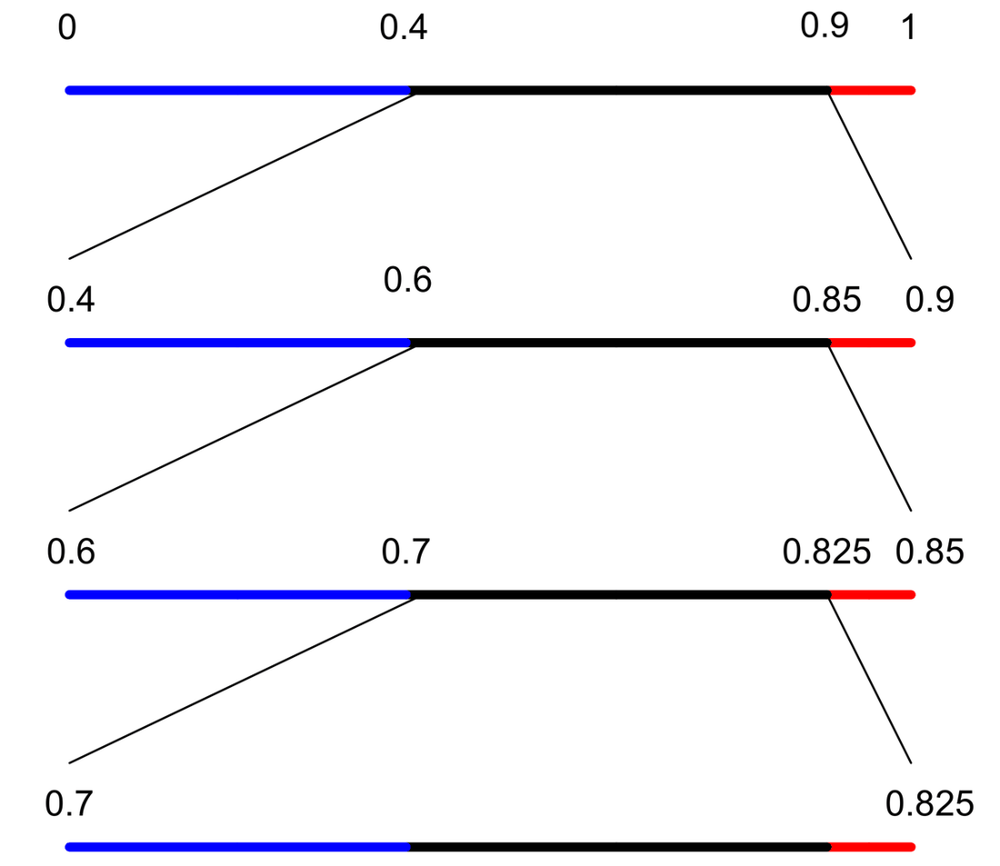
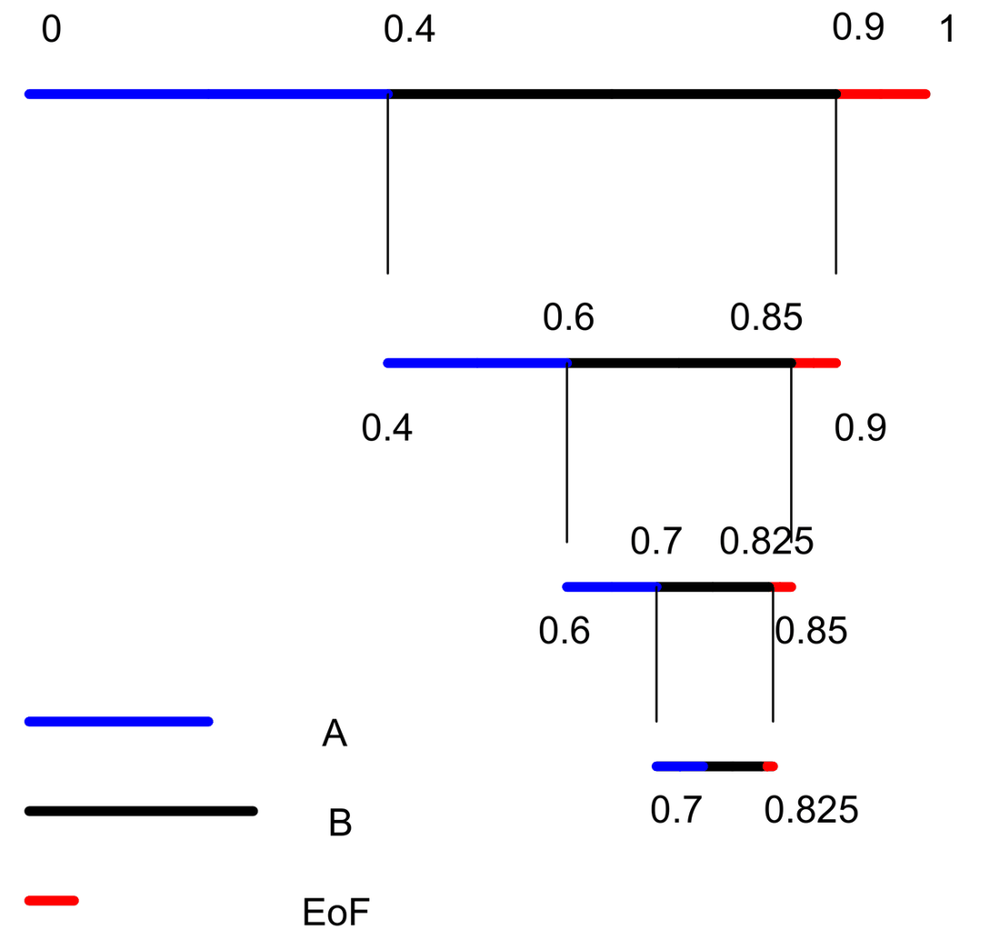

# Arithmetic Coding

## Introduction

The objective of any compression technique or source coding technique is to remove the redundant information. All the entropy-coding techniques try to remove this redundancy in different ways.

Redundancy: A strange word indeed. Let us say that you are interested in the sweetness of a solution. And if you can estimate the sweetness of the solution completely, it is referring to losslessness of an image representation. Now, one ounce of sugar is added in one liter of water. Then, to test the amount of sweetness, you take one ml of water, measure the sweetness and then say that the sweetness is "quantity/ml x 1000". It is the crux of the story. All other information is not required to estimate the sweetness. Yah.. I sensed your question. What happens if the solution is not homogeneous? Evaporate all the water by heating and sugar must be left as a residue. This is what we mean by transformation. Another real-life example is: In olden days, we weren't having cookers or microwave ovens. We cook rice in a vessel with heat supplied by conventional resources like wood etc. To test whether rice is boiled (or eatable), you just take few rice grains and based upon that sample you come to a conclusion. In terms of redundancy, the whole pot need not be tested to know whether rice is boiled or not. Here, the information is "boiledness". We have taken a few samples and conveyed this information. The redundancy is removed. Here is an interesting phenomenon which is related to "biasing of the result". In general we say that "experience makes man perfect". In terms of probability we say that, as the number of samples of a random process (or the source which we are trying to estimate) increases, the better the estimate or the less biased. In the similar way, if we remove the redundancy, any improper sample may lead to a different conclusion, say, rice is half-boiled. This can be thought of as robustness or error-resilience. Another informal definition might be:

Representing a source with fewer number of bits than required by the source such that the source can be generated without loss of information is another informal definition of less-redundant representation.

What are various ways of removing the redundancy?

Arithmetic coding is another kind of entropy coding. Essentially, it works on the principle that the most probable symbol must be given a lesser number of bits. But, directly it doesn't seem to do so. However, it works on the estimated probabilities of the source symbols. The idea is: repetitive partitioning of the real line [0 1] (closed) based on the probabilities of the source symbols [1].

There are two types of arithmetic coders, namely

1) Non-adaptive and
2) Adaptive.

The adaptive arithmetic coder, each time estimates the "first-order" conditional probabilities and updates them with the previously scanned ones, whereas the non-adaptive arithmetic coder estimates the probabilities of the symbols and then uses these probabilities always while partitioning the real line. It is time to think about the implementation aspects now. According to our discussion so far, we are talking about partitioning of the real line repetitively. It is obvious that we are dealing with intervals confined to that region and all our operations are floating point operations. As the number of symbols increases, the partitioned segments become smaller and smaller. It may lead to computational instability because of the high precision required to store these intervals efficiently. To circumvent the problem, many methods were proposed that use integer-based arithmetic. One such method was given in [1].

JPEG 2000 uses arithmetic coding [7]. It is binary-adaptive arithmetic coding with integer arithmetic. Here, it is adaptive in the sense that contexts are formulated using the eight neighboring bits and these contexts are used in coding the bit-planes. Let us say that we have only two symbols "0" and "1". Irrespective of the associated probabilities, we may fix a rule that "0" represents the left partition (we talk left and right because there are only two symbols) and "1" represents the right partition. The decoder also follows the same convention. In the case of JPEG2000, due to the implementation of the coder, the partitions are known as MPS (most probable symbol) and LPS (less probable symbol) but not "1" for right or so. The convention is used to facilitate the implementation of the coder but nothing else.

Earlier we have just said what arithmetic coding is. Now we will look at its advantages.

The most important advantage of arithmetic coding is its flexibility: it can be used in conjunction with any model that can provide a sequence of event probabilities. This advantage is significant because large compression gains can be obtained only through the use of sophisticated models of the input data.

Models used for arithmetic coding may be adaptive, and in fact a number of independent models may be used in succession in coding a file. This great flexibility results from sharp separation of the coder from the modeling process. There is a cost associated with this flexibility: the interface between the model and the coder, while simple, places considerable time and space demands on the model's structures, especially in the case of a multi-symbol input alphabet. Now, we try to define a model and a symbol.

Symbol: It is one of the possible outcomes of an experiment, e.g., the set of symbols might be integers from 0 to 255 if the source of the symbols is an 8-bit depth gray valued image.

Model: It represents the probabilities of the symbols that occur in that particular symbol set.

Eg. Let us say that we have two coins with us. One of them is unbiased and the other is biased towards head. Then if you repeat the tossing experiment with these two coins, then the unbiased coin produces 1/2 and 1/2 probabilities for head and tail and the other coin may produce 3/4 and 1/4 for head and tail respectively. If we don't look at the source (model) of these experiments that have resulted in different probability mass functions (pmfs), we may wrongly conclude that the probabilities are 5/8 and 3/8 for head and tail respectively. In the two cases, we will get different entropies because the assumptions we made on the underlying distribution are different. Naturally the actual source should produce less entropy.

### First advantage: clean separation of model and coding

To understand this "model" business, we need not actually know arithmetic coding. We assume that you know entropy.

Let there be a sequence like this "0000000011111111", eight zeros followed by eight ones.

(1) Non-adaptive coder. In the first pass, it computes the probabilities of zero and one and they are 1/2 and 1/2 respectively. Hence, the entropy is 1 and the resulting bit stream is actually the source of the symbols itself. Let us parse it as eight ones and eight zeros. It is as though the first source is always producing zeros and the second source is always producing ones. Hence, the entropy is zero. Have we done some magic? No, we did not. In fact, here, we are so sure that the first model produced eight symbols and the second eight. We have used our knowledge of the source and arithmetic coding can give great results if we were able to do this efficiently.

### Second advantage: Optimality

In general, arithmetic coding is optimal in theory and very nearly optimal in practice, in the sense of encoding using minimum average code length. However, this optimality is often less important because Huffman coding is also very nearly optimal in most cases. When the probability of some symbol is close to one, then arithmetic coding does give considerably better compression than other methods.

The main disadvantage is that it tends to be slow. We shall see that the full precision form of arithmetic coding requires at least one multiplication.

## Basic Algorithm

The algorithm for encoding a file using arithmetic coding works conceptually as follows [5]:

We illustrate with an example using a non-adaptive code, encoding the file containing the symbols BBB using arbitrary fixed probability estimates $p_a = 0.4$, $p_a = 0.5$ and $p_{EoF} = 0.1$ where EoF stands for End-of-File. Since we need some mechanism to indicate the end of the file. It is essential since a real line can be divided till you get a point that requires infinite subdivisions. In the above example, we have considered the end of file also as a symbol, which means that we need not explicitly send the information to the decoder on when to stop decoding.

### Encoding process as follows

(1) We begin with the "current interval" [L,H) initialized to [0,1). This notation [ , ) is called a half-open interval to denote that the interval does not contain the boundary specified in the open bracket.

(2) For each symbol of the file, we perform two steps:

(a) We subdivide the current interval into two subintervals, one for each possible alphabet symbol. The size of a symbol's subinterval is proportional to the estimated probability that the symbol will be the next symbol in the file, according to the model of the input.

(b) We select the subinterval corresponding to the symbol that actually occurs next in the file, and make it the new current interval.

(3) We select the subinterval corresponding to the symbol that actually occurs next in the file, and make it the new current interval.

The length of the subinterval is clearly equal to the product of the probabilities of the individual symbols, which is the probability P of the particular sequence of symbols in the file. The final step uses almost exactly $-\log P$ bits to distinguish the file from all other possible files. The graphical representation of the above procedure is shown below.

### Tabular form of the division process

| Current interval | Action | A | B | EOF | Input |
|---|---|---|---|---|---|
| [0.000, 1.000) | subdivide | [0.000, 0.400) | [0.400, 0.900) | [0.900, 1.000) | B |
| [0.400, 0.900) | subdivide | [0.400, 0.600) | [0.600, 0.850) | [0.850, 0.900) | B |
| [0.600, 0.850) | subdivide | [0.600, 0.700) | [0.700, 0.825) | [0.825, 0.850) | B |
| [0.700, 0.825) | subdivide | [0.700, 0.750) | [0.750, 0.812) | [0.812, 0.825) | EOF |
| [0.812, 0.825) | subdivide |  |  |  |  |

### Graphical representation of the division process

The decoder also works in the same way as that of the encoder. The decoder must have some information of how to extract the message. After the real-line partitioning is done during encoding, what information is sufficient to perform the segmentation exactly at the decoder? Suppose we send the midpoint of the final interval to the decoder. Then, the decoder can determine at each step uniquely which interval to partition subsequently. Do we have to precisely send the midpoint or some information that can uniquely tell the decoder how to extract the message? If we observe the above figure, the really discriminating factor is the final interval. Once this information is known together with the interval lengths, the decoder can arrive at the final interval. Hence, we must, in a unique way, identify the final interval. Suppose we send a point that lies in the interval; it is sufficient to represent the interval, if the number of symbols to be decoded is known. Otherwise, with the information about only the final interval may lead to an infinite number of divisions that is not desirable. Now we have concluded that the decoder has the information about the final interval, the number of symbols to be decoded, and the intervals (proportional to the probabilities of the symbols). Then, how does the decoder work?

Given the midpoint of the final interval,

(1) We begin with the "current interval" [L,H) initialized to [0,1).

(2) We compare the midpoint with the interval boundaries and segment that interval in which the midpoint falls. The interval that has been divided corresponds to the symbol whose probability is proportional to it. In other words, we just have a mapping mechanism to identify the symbol based on the interval chosen for further division. If the fifth interval is chosen, it corresponds to the 5th symbol etc.

(3) The process is repeated until the specified number of symbols is decoded. The decoding operation is very similar to the encoding process except that to further divide the interval, we compare it with the midpoint of the final interval, as our goal is to reach the final interval.

A graphical representation of the decoding process is shown below.

Theoretically, we can divide this real line any number of times. When it comes to practicality, what about the precision?

There are certainly some issues regarding the implementation that have driven a lot of research. The ones to be addressed are:

(1) How to work with low-precision arithmetic? This is essential, as the shrinking current interval requires the use of high precision arithmetic; and no output is produced until the entire file has been read.

In the 1987 paper [2], Witten et al. have addressed the problem and presented tricky ways of working with low-precision arithmetic with very little degradation in compression efficiency. The idea is presented here:

The most straightforward solution to both of these problems is to output each leading bit as soon as it is known, and then to double the length of the current interval so that it reflects only the unknown part of the final interval. This process takes place immediately after the selection of the subinterval corresponding to an input symbol.

We repeat the following steps as many times as possible:

(a) If the new subinterval is not entirely within one of the intervals [0, 1/2), [1/4, 3/4), or [1/2, 1), we stop iterating and return.

(b) If the new subinterval lies entirely within [0, 1/2), we output 0 and any 1's left over from previous symbols; then double the size of the interval [0, 1/2), expanding toward the right.

(c) If the new subinterval lies entirely within [1/2, 1), we output 1 and any 0's left over from previous symbols; then double the size of the interval [1/2, 1), expanding toward the left.

(d) If the new subinterval lies entirely within [1/4, 3/4), we keep track of this fact for future output; then double the size of the interval [1/4, 3/4), expanding in both directions away from the midpoint.

The earlier example is now taken for illustration of the integer-based implementation.

| Current interval | Action | A | B | EOF | Input |
|---|---|---|---|---|---|
| [0.00, 1.00) | subdivide | [0.00, 0.40) | [0.40, 0.90) | [0.90, 1.00) | B |
| [0.40, 0.90) | subdivide | [0.40, 0.60) | [0.60, 0.85) | [0.85, 0.90) | B |
| [0.60, 0.85) | Output 1, Expand [1/2, 1) |  |  |  |  |
| [0.20, 0.70) | subdivide | [0.20, 0.40) | [0.40, 0.65) | [0.65, 0.70) | B |
| [0.40, 0.65) | Follow, Expand [1/4, 3/4) |  |  |  |  |
| [0.30, 0.80) | subdivide | [0.30, 0.50) | [0.50, 0.75) | [0.75, 0.80) | EOF |
| [0.75, 0.80) | Output 10, Expand [1/2, 1) |  |  |  |  |
| [0.50, 0.60) | Output 1, Expand [1/2, 1) |  |  |  |  |
| [0.0, 0.20) | Output 0, Expand [0, 1/2) |  |  |  |  |
| [0.0, 0.40) | Output 0, Expand [0, 1/2) |  |  |  |  |
| [0.0, 0.80) | Output 0 |  |  |  |  |

Finally the output sequence appears as: 1 10 1 0 0 0

The table entries are represented graphically below.

![Integer-arithmetic table entries plotted on the [0,1] axis: each of the 11 successive current intervals (rows 1-11) is drawn as an A (blue) / B (black) / EoF (red) colored bar, with dashed gridlines at 0.25, 0.5 and 0.75 marking the rescaling boundaries.](images/arithmetic-coding/arithmetic-coding-fig3.png)

## Use of integer arithmetic

In practice, the arithmetic coding can be done by storing the current interval in sufficiently long integers rather than storing them in floating point or exact rational numbers [2, 3]. We also use integers for frequency counts used to estimate symbol probabilities. The subdivision process involves selecting non-overlapped intervals with lengths approximately proportional to the counts.

We can now move to adaptive models:

The simplest adaptive models do not rely on contexts for conditioning probabilities; a symbol's probability is just its relative frequency in the part of the file already coded. The average code length per input symbol of a file encoded using such a 0-order adaptive model is very close to the 0-order entropy of the file.

### Zero-frequency problem

As we have mentioned, the adaptive models do not rely on prior information. When we start encoding a file using these models, we first assume that all symbols are equi-probable. As and when data is accumulated, the corresponding symbol counts are incremented. The question now is, what if we don't know the number of symbols exactly. To prevent this problem, we will include the symbol in the model and while initializing the cumulative probabilities or frequency tables, this symbol count is set as one. This is done for all the symbols. This avoids the difficulty associated with the lack of knowledge of the occurrences of the frequency counts.

### Certain initializations

After you understand the fixed or low-precision arithmetic version of the implementation of the arithmetic coding, we need to define the following [2-4].

(1) Maximum number of symbols that are there in each of the models.
(2) Maximum frequency of the occurrence of the symbols in the model.

The answer is, both are unknown to us. So, how to select them and what are the effects of our selection process.

(1) Maximum number of symbols. In the arithmetic coder explained above, there is no provision to incorporate new symbols that are encountered during the encoding time. The total number of symbols in the model has to be preset. However, we can set the number slightly larger than what is expected to avoid new symbols being encountered. This puts a constraint on the complexity of the coding process; we have to maintain that large a frequency table and updating them becomes a real problem. There exist some methods to avoid this problem. They call it installing a new symbol. While encoding, whenever a new symbol occurs that is not there in the model, it considers it as the new symbol and associates it with the model from now onwards. They call it the escape symbol. The details are not understood and require some more exploration.

(2) Maximum frequency count: We are not maintaining the exact probability estimates, but we are keeping the counts of the symbols that actually occur. Even now, the precision of the machine may not let us put the number to be very great. Hence, based on the precision of the machine, this number is preset. We will go back for a while to the implementation details.

The cumulative counts must be represented in integers. We should not underflow while doing the scaling operation and must avoid overflow while updating the intervals [2]. They are expressed as

$$
\text{Max\_frequency} \le (\text{Top\_value} + 1)/4 + 1
$$

And

$$
\text{Range} \times \text{Max\_frequency} < \text{precision of the data}
$$

where range is the difference between low and high of the interval.

If we are working with a P bit machine, then

$$
\text{Max\_frequency} \le C - 2 \quad \text{and} \quad \text{Max\_frequency} + C \le P
$$

where C is the number of bits used to represent the range that can be as large as the Top_value, where Top_value is the integer representing the right boundary of the interval. For example, on a 32-bit precision machine, P = 31 and safer values for C and Max_frequency are 16 and 14 respectively.

Now, we will go back to the discussion on choosing the Max_frequency variable. Choosing a very large value does not let the model consider the recent symbols prominently [4]. That means the learning process becomes quite slow. Consider a document of ten pages. Then, the symbols that occur in page 1 may not occur so rapidly in the next pages. It means that there is a certain locality of the events. It is something like a moving average system. You forget about the samples that occurred long back and give importance to those that are recent. Having the Max_frequency large causes the converse effect known as aging. However, if we put the Max_frequency too low, then we are assuming high locality. In the document case, we are looking into paragraphs instead of the page. This, in some sense, acts like a window whose mean lies in the recent past and dies down towards the absolute past. Setting too low a value causes scaling many times, which need not be the case. So a compromise has to be made using the knowledge of the source we are trying to compress. We will illustrate this recency or forgetting effect below.

Let us say that S1, S2, S3... and S7 are occurring in groups, each time one of them having the largest occurring once, followed by the successive symbols, i.e., at the end of the T1th instant, S1 has occurred 25 times and at the end of T2, S1 occurred 75 times and S2 25 times. Similarly, the rest of the symbols are processed. If we had a Max_frequency symbol of 100, we would never scale the cumulative frequency array as shown in the table below. Just watch around the rows of the table and the corresponding time label in the figure shown on the next page also. In Table 2, shown is the cumulative array, each time scaled whenever the cumulative sum exceeds 50.

|  | T1 | T2 | T3 | T4 | T5 | T6 | T7 | Total |
|---|---|---|---|---|---|---|---|---|
| S1 | 50 | 25 | 0 | 0 | 0 | 0 | 0 | 75 |
| S2 | 25 | 50 | 25 | 0 | 0 | 0 | 0 | 100 |
| S3 | 0 | 25 | 50 | 25 | 0 | 0 | 0 | 100 |
| S4 | 0 | 0 | 25 | 50 | 25 | 0 | 0 | 100 |
| S5 | 0 | 0 | 0 | 25 | 50 | 25 | 0 | 100 |
| S6 | 0 | 0 | 0 | 0 | 25 | 50 | 25 | 100 |

Table 1. Max_frequency sufficiently large (no scaling).

|  | T1 | /5 | T2 | /5 | T3 | /5 | T4 | /5 | T5 | /5 | T6 | /5 | T7 |
|---|---|---|---|---|---|---|---|---|---|---|---|---|---|
| S1 | 50 | 10 | 35 | 7 | 7 | 1.4 | 1.4 | 0.28 | 0.28 | 0.04 | 0 | 0 | 0 |
| S2 | 25 | 5 | 55 | 11 | 36 | 7.2 | 7.2 | 1.44 | 1.44 | 0.28 | 0.04 | 0 | 0 |
| S3 | 0 | 0 | 25 | 5 | 55 | 11 | 36 | 7.2 | 7.2 | 1.44 | 0.28 | 0.28 | 0 |
| S4 | 0 | 0 | 0 | 0 | 25 | 5 | 55 | 11 | 36 | 7.2 | 1.44 | 1.44 | 1.44 |
| S5 | 0 | 0 | 0 | 0 | 0 | 0 | 25 | 5 | 55 | 11 | 36 | 7.2 | 7.2 |
| S6 | 0 | 0 | 0 | 0 | 0 | 0 | 0 | 0 | 25 | 5 | 55 | 11 | 36 |

Table 2. Max_frequency is 50-55 and scaling occurs whenever one of the entries exceeds 50-55.

If we watch the rows of Tables 1 and 2, for example S1 in Table 1 started with 25 and ended at 75, whereas in Table 2 it started at 25 and ended at almost zero. The columns indicate the time stamp. So as we proceed across the columns the value is progressively decreasing, i.e., we are forgetting about S1 as we move away from T1 in time.

## Contexts

As we have been mentioning, the major factor that decides the compression is not arithmetic coding itself but the model that we choose. It is this clean separation that makes arithmetic coding nearly optimal in theory. What are contexts... please look at the models we described earlier. Definitely, contexts are related to models. A context is nothing but a particular model. In other words, once you define a model or models, you must have a mechanism to choose one of them based on the data that you are encoding. A simple context might be the difference between the preceding sample and the current sample. Instead of going for complex algorithms for image compression, many researchers have tried linear or non-linear predictors with adaptive arithmetic coding. The errors are classified into various groups and that many models are initialized. The restriction imposed in such data-driven context selection is that the decoder must also know the switching information. We further explain this in the context of CALIC [6] and JPEG2000 [7].

### Context-based Adaptive Lossless Image Coder

The prerequisite is that you must have studied this paper [6]. If not, read the paper here, else please continue...

Context in CALIC.

After the application of "some" prediction algorithm, the error due to the prediction is considered for knowing about the nature of the error. However, the authors say that the errors are not white and still have a lot of correlation among them. The prediction is improved by performing some operations on the errors. First, based on the neighboring pixels, some information is extracted that will be used in post-prediction operations. For example, some contexts are strong horizontal edge, weak horizontal edge, strong vertical edge, weak vertical edge, strong diagonal edge etc. If we have eight such parametric descriptions of the pixel's behavior in its vicinity, then we have 256 possible combinations. Hence, that many contexts can occur. It is not just sufficient to know about pixels but we should know about the errors also. To model the error, they defined another parameter called energy estimator that uses information given by the edge information and this energy estimator is quantized into eight bins. Thus, totally we have 8*256 contexts. This is true in the case of continuous tone images. Using this many number of contexts may lead to context dilution and there may not be enough samples to estimate the context information in the entropy coder. Hence, only the quantized energy estimator is used for contexts in the entropy (specifically arithmetic) coder. The problems we discussed earlier in arithmetic coding are Max_frequency and Max number of symbols in each context. The number of symbols used in each of the eight energy estimator contexts is:

18, 26, 34, 50, 66, 82, 114 and 256 for delta = 1, 2, 3, 4, 5, 6, 7 and 8 respectively.

They have given an empirical solution for this based on trial and error.

CALIC has two modes of operation. One is bi-level and the other is continuous mode. The one that we have discussed is the continuous tone mode. In the bi-level mode, it uses 32 contexts, each model having three symbols (0, 1 and EoF might be the three symbols). The Max_frequency is set to $2^{14}$. Thus CALIC uses an arithmetic coder to achieve good performance.

### JPEG2000

If you don't know JPEG2000, please read the paper in [7]. Else please continue.

The hierarchy of the data segmentation in JPEG2K looks like this:

- Image
- Components
- Tiles
- Subbands
- Code blocks
- Layers (bit-planes)

Each operation in any of the hierarchy can be independent of the others. So if we look at the structure as a means to allow independent coding of the images, we have 1) component 2) tile 3) subband 4) code block. These four classifications may be used in the context formation. Once these four are fixed we are left with bit-planes. Within that, we can form contexts based on the patterns in the neighborhood. Essentially we have a look-up table to find the context of the current bit that is to be encoded. While coding the bit-plane, some portion of the look-up table is frozen because the whole process is being done in a particular segment defined by the 1st, 2nd, 3rd and 4th level of the hierarchy.

Hence, our arithmetic coder is an adaptive (different contexts) binary (bit-plane coding) coder.

The other information that the encoder uses in choosing a context, besides component-tile-subband-codeblock-texture, is the kind of coding we are doing on the bit-plane. The coding is divided into three parts: 1) significance propagation 2) magnitude refinement and 3) clean-up pass. This is due to the coefficient bit-plane modeling. The clean-up pass of the coding, however, does not use an arithmetic coder but uses run-length coding.

The texture pattern used in JPEG2000 which forms the contexts in the bit-planes is:

| D0 | V0 | D1 |
|---|---|---|
| H0 | X | H1 |
| D2 | V1 | D3 |

Here, X is the bit under consideration. D0, D1, D2 and D3 provide the diagonal information, H0 and H1 horizontal information, and V0 and V1 provide vertical information.

The other parameters that one must consider for choosing a context are based on the geography of the bit-plane we are in, namely the component, tile, subband, and code block.

A typical look-up table is given here for a "feel of context". For clarifications please refer to the JPEG2000 documentation [7].

| LL and LH: Sum(H) | Sum(V) | Sum(D) | HL subband: Sum(H) | Sum(V) | Sum(D) | HH subband: Sum(H+V) | Sum(D) | Context label |
|---|---|---|---|---|---|---|---|---|
| 2 | - | - | - | 2 | - | - | >=3 | 8 |
| 1 | >=1 | - | >=1 | 1 | - | >=1 | 2 | 7 |
| 1 | 0 | >=1 | 0 | 1 | >=1 | 0 | 2 | 6 |
| 1 | 0 | 0 | 0 | 1 | 0 | >=2 | 1 | 5 |

## References

[1] John C. Kieffer, "Arithmetic codes" (a tutorial / course material), Department of Electrical & Computer Engineering, University of Minnesota. Available at: ftp://oz.ee.umn.edu/users/kieffer/seminar/notes6.pdf

[2] I.H. Witten, R. Neal and J.G. Cleary, "Arithmetic coding for data compression," Communications of the ACM, 30: 520-541, June 1987.

[3] I.H. Witten, R. Neal and J.G. Cleary, "Arithmetic coding revisited," ACM Transactions on Information Systems. Preliminary version in Proc. IEEE Data Compression Conference, Snowbird, Utah, March 1995, pp. 202-211. Source available at: ftp://munnari.oz.au/pub/arith_coder

[4] P.G. Howard and J.S. Vitter, "Design and analysis of fast text compression based on quasi-arithmetic coding," Proc. Data Compression Conference, Snowbird, Utah, March 1993, pp. 98-107.

[5] P.G. Howard and J.S. Vitter, "Practical implementations of arithmetic coding," in Image and Text Compression, J. A. Storer, ed., Kluwer Academic Publishers, Norwell, MA, 1992, pp. 85-112.

[6] Xiaolin Wu and Nasir Memon, "Context-Based, Adaptive, Lossless Image Coding," IEEE Transactions on Communications, pp. 437-444, Vol. 45, No. 4, April 1997.

[7] "Coding of Still Pictures" (JPEG2000), JPEG2000 Part I Final Committee Draft Version 1.0, ISO/IEC JTC1/SC29 WG1, JPEG2000. Editor: Martin Boliek; Co-editors: Charilaos Christopoulos and Eric Majani.
