# Introduction to Time-Frequency Analysis

*Most of the content is adapted from O'Neill (1997).*

## Introduction

The distribution of signal energy in either time or frequency alone is straightforward. Energy in time is given by the squared magnitude of the signal, $|s(t)|^2$, while energy in frequency is given by the magnitude of the Fourier transform, $|S(f)|^2$. Because the Fourier transform is unitary, it provides a different but equivalent representation of the signal.

Neither representation, however, tells us how energy is distributed jointly in time and frequency. Figure 1 shows two synthetic signals that look identical if we inspect only their time marginal or frequency marginal. Their time-frequency distributions reveal that the signals are different. A joint time-frequency representation is therefore necessary when the timing of frequency content matters.

Time-frequency distributions (TFDs) are two-dimensional functions that describe the joint time-frequency energy content of a signal. They are used in speech, music and acoustics, biological signals, radar and sonar, and geophysical signals. Many important TFDs belong to Cohen's class, while newer adaptive representations provide additional flexibility. This note reviews Cohen's class, the affine class, and adaptive signal representations as background for later chapters.

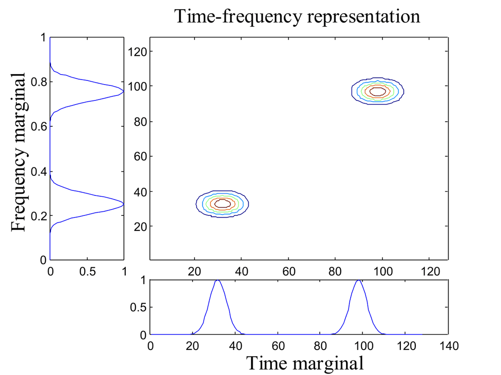

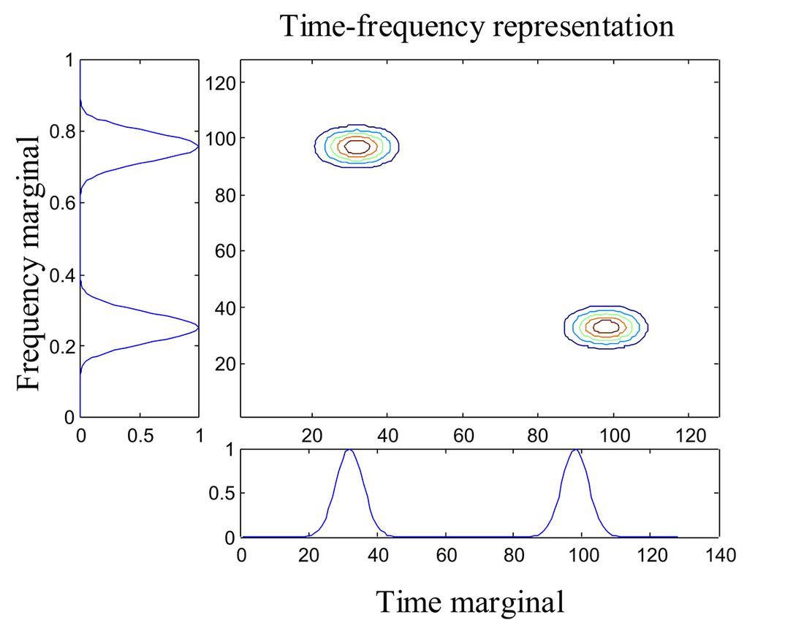

### Brief historical perspective

The origin of time-frequency analysis goes back to the 1940s when Gabor's instrumental work on signal representation based on elementary Gaussian elements for a proper description of the signal in combined time and frequency domains took place. Later, the work done by Wigner in the field of quantum mechanics had been applied to signal processing by Ville. Page had developed the concept of instantaneous power spectrum as the rate of change of energy spectrum in the range $-\infty$ to $t$. Levin used the same definition for the segment $t$ and $\infty$, and defined a new function as the average of both the types of instantaneous power spectra (Cohen, 1989). TFDs for the nonstationary process were considered by (Flandrin et al, 1985). In 1968, a fundamental result was published by Rihaczek that stemmed from physical observations, now known as the Rihaczek distribution (Rihaczek, 1968). The existing results were given a mathematical treatment and an insight had been provided into their properties by Claasen and Mecklenbrauker in their series of papers (Claasen et al, 1980a) and in particular, the Wigner-Ville distribution (WVD) was investigated. Cohen had generalized the concept of time-frequency analysis by unifying the definition of TFDs having different properties. Adaptive signal representations have been given a lot of attention to overcome some of the difficulties associated with TFDs. These representations were mainly investigated by Jones and Baraniuk (Jones et al, 1993b), Choi and Williams (Choi et al, 1989) and Jones and Parks (Jones et al, 1992a). The recent focus is towards extending the analysis domain beyond time and frequency to obtain more redundant representations (Mann, 1995). We will discuss some of these methods in the subsequent Chapters.

### Objectives of time-frequency distributions

Before we present what the TFDs should reflect, it would be appropriate to define the instantaneous frequency (IF) and the group delay, as:

$$
f_i(t) = \frac{1}{2\pi}\frac{d}{dt}\arg s(t)
\quad\text{and}\quad
t_g(f) = -\frac{1}{2\pi}\frac{d}{df}\arg S(f),
\quad\text{respectively.} \tag{1}
$$

The IF, which represents the energy concentration in the frequency domain as a function of time, describes the signal's true characteristics. However, the concept of IF is meaningless for multicomponent and nonanalytic signals, where IF is an ambiguous representation. Hence the TFDs are expected to represent the true energy along the path of the instantaneous frequency even when the constraints are lifted. Thus the TFDs are required to attain the following goals:

- Discriminate multicomponent signals from monocomponent signals.
- Facilitate the separation of multicomponent signals from monocomponent signals.
- Track the IF as accurately as possible.
- Existence of an inversion method to uniquely reconstruct the signal.

## General Classes of TFDs

The TFDs can be classified according to their properties. Two types of time-frequency distributions are those that are linear or quadratic functions of the signal. Examples of linear time-frequency distributions are short-time Fourier transform (STFT) and wavelet transform (WT). Examples of quadratic time-frequency distributions are the spectrogram, scalogram, WVD, etc. A general classification is shown in Fig. 2 (O'Neill, 1997). They are also classified according to their behavior when an operator is applied to a signal.

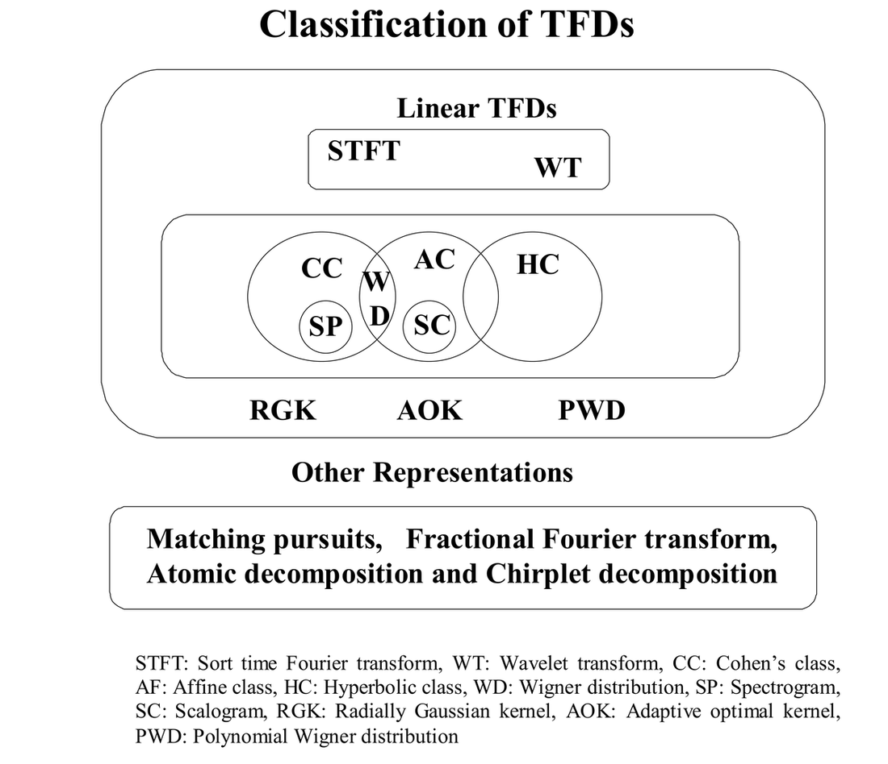

Three prominent examples of operators are the time-shift operator, the frequency shift operator and the scale operator. We review some general classes of quadratic distributions, the Affine class and the shift-covariant class. Finally, we present the adaptive signal representations that give flexibility in analyzing the signal by depicting them in domains other than time and frequency.

### Cohen's Class

To distribute the energy of the signal over time and frequency, several authors have proposed different methods with each of them having unique properties. A unified approach proposed by Cohen can be expressed as:

$$
C_s(t,f) = \iint \phi(\theta,\tau)\, A_s(\theta,\tau)\, e^{j2\pi(t\theta - f\tau)}\, d\tau\, d\theta \tag{2}
$$

where $\phi(\theta,\tau)$ is an arbitrary function called the kernel by Claasen and Mecklenbrauker (Claasen et al, 1980a). The kernel can be a function of time and frequency. In general it is preferred to be of low pass in nature because it acts as a filtering means in the ambiguity function (AF) domain. The kernel determines the properties of the TFDs built upon it. Stated otherwise, the desired properties get reflected as constraints on the kernel. We have mentioned some desired properties of the kernel at a later stage. The kernels can be time and frequency dependent but they are not considered to be of Cohen's class (Cohen, 1995). Some adaptive representations vary the kernel in a time and/or frequency dependent fashion to match the signal's characteristics. We will now briefly review some of the TFDs belonging to Cohen's class.

### Wigner-Ville Distribution

The Wigner distribution is the prototype of a distribution that is qualitatively different from the spectrogram (magnitude squared of the STFT). The WVD has been successfully used in analyzing nonstationary signals, i.e., signals whose frequency behavior varies with time. The WVD of a signal $s(t)$ is given by

$$
W(t,\omega) = \frac{1}{2\pi}\int s\!\left(t+\frac{\tau}{2}\right) s^*\!\left(t-\frac{\tau}{2}\right) e^{-j\omega\tau}\, d\tau. \tag{3}
$$

This equation can be obtained by setting the kernel equal to one in Eqn. (2). Most of the properties of WVD can be obtained with this interpretation. Perhaps the most remarkable property of the WVD is that for a Gaussian windowed linear chirp signal, defined as:

$$
s(t) = e^{-\alpha t^2}\, e^{j(a_0 + a_1 t + a_2 t^2)} \tag{4}
$$

the WVD concentrates the energy of the signal along the instantaneous frequency of the signal, given by:

$$
W_s(t,\omega) = e^{-(\omega - a_1 - 2a_2 t)^2}\, e^{-2\alpha t^2}. \tag{5}
$$

The distribution and the instantaneous frequency are shown in Fig. 3. The WVD of the sum of two signals is not the sum of individual WVDs. Instead, it will be the sum of their WVDs plus another component that is the cross WVD of the two signals:

$$
W_{s_1+s_2}(t,f) = W_{s_1}(t,f) + W_{s_2}(t,f) + 2\,\mathrm{Re}\{W_{s_1,s_2}(t,f)\}, \tag{2.6}
$$

where the cross Wigner distribution of the two signals is defined as:

$$
W_{s_1,s_2}(t,f) = \int s_1\!\left(t+\frac{\tau}{2}\right) s_2^*\!\left(t-\frac{\tau}{2}\right) e^{-j2\pi f\tau}\, d\tau. \tag{2.7}
$$

The cross Wigner distribution of the two signals is commonly called a cross term. All quadratic time-frequency distributions, including the spectrogram, will contain cross terms.

::: {layout-ncol=2}
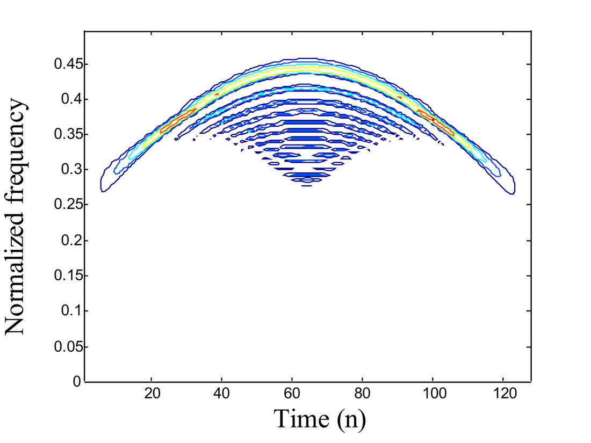

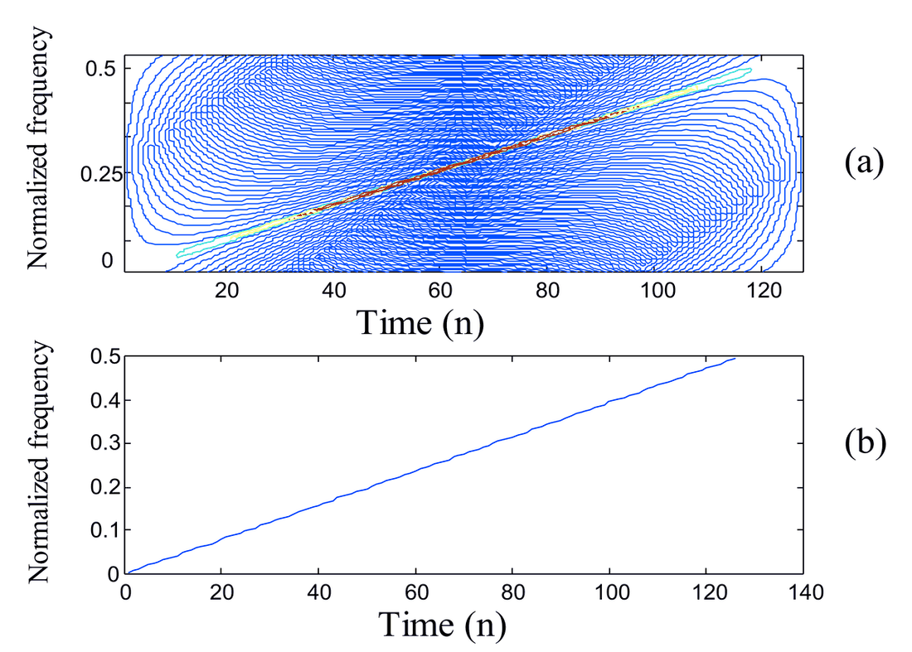
:::

Fig. 3. (a) Wigner distribution and (b) Instantaneous frequency of a linear FM signal

Cross terms can also occur within a single component signal, e.g., non-linear frequency modulated signals. An example of cross terms within a signal is shown in Fig. 4. An auto term is defined, rather vaguely, as parts of the Wigner distribution that correspond to the true spectrum of the signal.

The cross terms do not actually represent the signal's energy and are hence undesirable. The structure of cross terms has been investigated and well understood by many researchers (Bikdash et al, 1993). Suppose the two auto terms are separated in time by $\Delta t$ and in frequency by $\Delta f$, as shown in Fig. 5; there will be a cross term centered between the two auto terms in the time-frequency plane and it oscillates in the time direction with a rate $\Delta f$ and in the frequency direction with a $\Delta t$ rate.

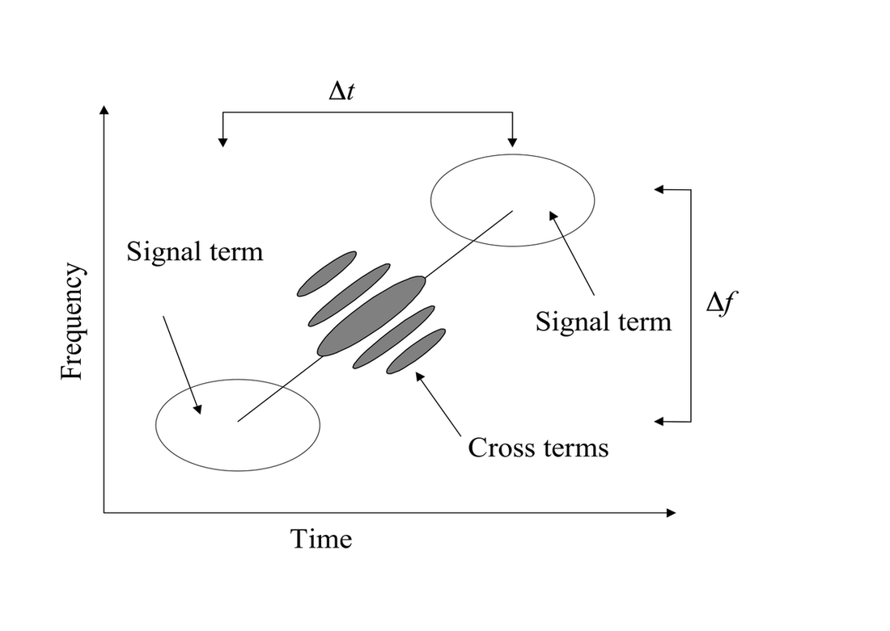

Later, we will see how we can employ the kernel as a filtering means to suppress these cross terms at the expense of the degradation in auto term resolution. In spite of these spurious cross terms, the Wigner distribution has been often employed because of its capability to resolve multicomponent signals that are time-frequency disjoint. Of all the quadratic representations, the Wigner distribution alone attains simultaneous resolution in time and frequency. Besides, it satisfies most of the properties that a TFD has to satisfy. Some distributions belonging to Cohen's class are tabulated in Table 1. A more detailed discussion can be found in (Hlawatsch et al, 1992a).

Table 1: Different time-frequency distributions belonging to Cohen's class

| S. No. | Time-Frequency Distribution | $\phi(\theta,\tau)$ | $C_s(t,f)$ |
|---|---|---|---|
| 1 | Page distribution | $e^{-j\pi\lvert\tau\rvert\,\theta}$ | $2\,\mathrm{Re}\left\{ s^*(t)\, e^{j2\pi ft} \displaystyle\int_{t}^{\infty} s(t')\, e^{-j2\pi ft'}\, dt' \right\}$ |
| 2 | Levin distribution | $e^{-j\pi\lvert\tau\rvert\,\theta}$ | $2\,\mathrm{Re}\left\{ s^*(t)\, e^{j2\pi ft} \displaystyle\int_{t}^{\infty} s(t')\, e^{-j2\pi ft'}\, dt' \right\}$ |
| 3 | Wigner distribution | $1$ | $\displaystyle\int_{\tau} s\!\left(t+\frac{\tau}{2}\right) s^*\!\left(t-\frac{\tau}{2}\right) e^{-j2\pi f\tau}\, d\tau$ |
| 4 | Choi-Williams distribution | $\exp(-\tau^2\theta^2/\sigma)$ | $\displaystyle\iint \phi(\theta,\tau)\, A_s(\theta,\tau)\, e^{j2\pi(t\nu - f\tau)}\, d\tau\, d\theta$; here $A_s(\theta,\tau)$ is the ambiguity function. |
| 5 | Spectrogram | $\displaystyle\int h^*\!\left(v-\frac{\tau}{2}\right) h\!\left(v+\frac{\tau}{2}\right) \exp(-j\theta v)\, dv$, where $h$ is the window function | $\left\lvert \displaystyle\int e^{-j2\pi f}\, s(\tau)\, h(\tau - t)\, d\tau \right\rvert^2$ |
| 6 | Rihaczek distribution | $e^{-j\pi\tau\theta}$ | $\displaystyle\int_{\tau} x(t+\tau)\, x^*(t)\, e^{-j2\pi f\tau}\, d\tau$ |
| 7 | Generalized exponential distribution | $\exp\!\left[ -\left(\dfrac{\tau}{\tau_0}\right)^{2M}\!\left(\dfrac{\theta}{\theta_0}\right)^{2N} \right]$ | $\displaystyle\iint \phi(\theta,\tau)\, A_s(\theta,\tau)\, e^{j2\pi(t\theta - f\tau)}\, d\tau\, d\theta$; here $A_s(\theta,\tau)$ is the ambiguity function. |
| 8 | Butterworth distribution | $\dfrac{1}{\,1 + \left(\dfrac{\tau}{\tau_0}\right)^{2M}\!\left(\dfrac{\theta}{\theta_0}\right)^{2N}}$ | $\displaystyle\iint \phi(\theta,\tau)\, A_s(\theta,\tau)\, e^{j2\pi(t\theta - f\tau)}\, d\tau\, d\theta$; here $A_s(\theta,\tau)$ is the ambiguity function. |

### Choi-Williams Distribution

The inherently associated cross terms in all bilinear distributions are of major concern in spectral estimation and in multicomponent signal separation. By looking at the kernel as a filtering function in the ambiguity function (AF) domain, there have been many kernels which reduce these cross terms. However, kernels constrained to construct distributions of desired properties are of utmost importance. In the AF domain, the locus of the auto terms falls around the origin while those of cross terms lie away from the origin. Choi and Williams have identified this property of the AF and have chosen a kernel that has larger weights in the vicinity of the auto terms and smaller weights farther away from the origin in the AF domain, given as:

$$
\phi(\theta,\tau) = e^{-\dfrac{\theta^2\tau^2}{\sigma}}.
$$

The CWD can be expressed as (Choi et al, 1989):

$$
\mathrm{CWD}(t,f) = \int e^{-j2\pi f\tau} \int \frac{1}{\sqrt{4\pi\tau^2/\sigma}}\, s\!\left(u+\frac{\tau}{2}\right) s^*\!\left(u-\frac{\tau}{2}\right) e^{-\dfrac{(u-t)^2}{4\tau^2/\sigma}}\, du\, d\tau \tag{8}
$$

The capability of the CWD in suppressing the cross terms without much degradation in auto terms can be controlled by a proper choice of the kernel spread (i.e., $\sigma$). A resolution comparison of several distributions and a detailed discussion of CWD can be found in (Jones et al, 1992a).

### Spectrogram

The classical definition of the spectrogram can be considered as the squared magnitude of the short-time Fourier transform (Nawab et al, 1988). However, the spectrogram can be considered as a member of Cohen's class with the kernel being the ambiguity function of the analysis window, and it is given by:

$$
S(t,\omega; h) = \left\lvert \int s(\tau)\, h(t-\tau)\, e^{-j\omega\tau}\, d\tau \right\rvert^2. \tag{9}
$$

The properties of the spectrogram obviously change with a change in the window function. The interesting property of the spectrogram is that, unlike other bilinear TFDs, it is always nonnegative. Apparently it seems that the spectrogram does not suffer from cross terms, but strictly speaking the cross terms in this representation exactly fall in the auto term region and interfere with them. Hence, the spectrogram can be considered as a smoothed version of the WVD to suppress cross terms and, as a natural consequence, the auto term resolution reduces. A comparison of CWD, WVD and spectrogram for a synthetic signal in their cross term suppression and auto term resolution is shown in Fig. 6.

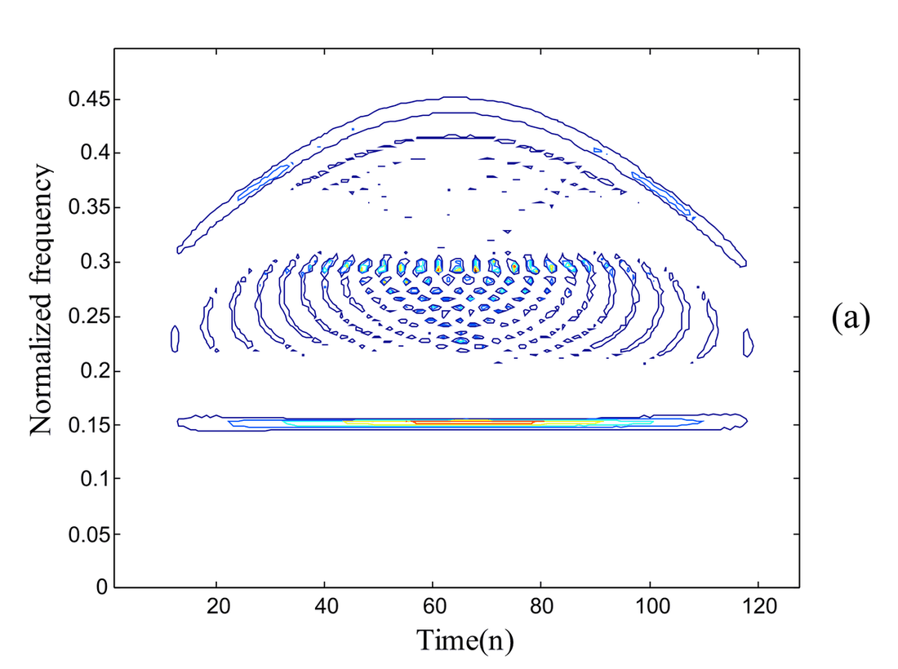

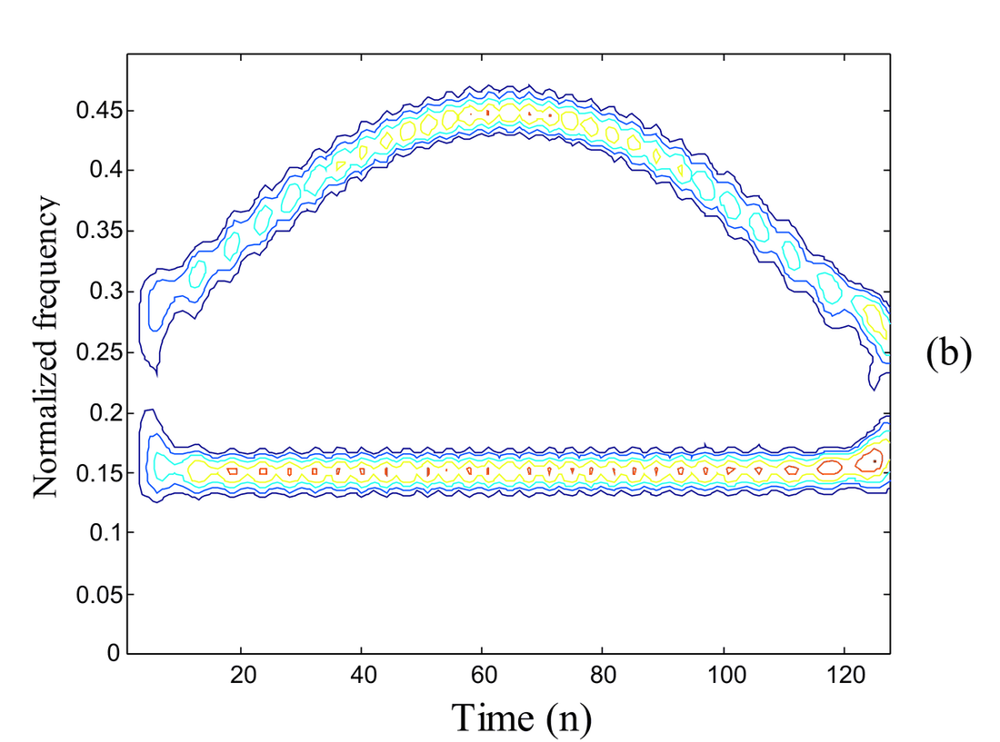

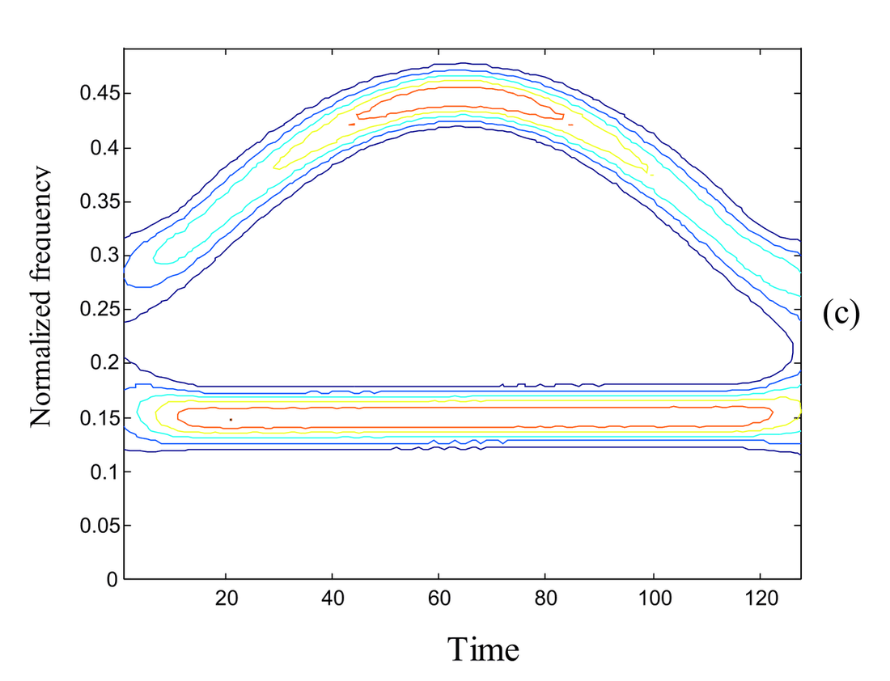

Fig. 6. Resolution and cross terms comparison of (a) Wigner distribution, (b) Choi-Williams distribution and (c) Spectrogram of a multicomponent signal

### Properties of TFDs in Cohen's Class

As indicated earlier, the properties of the distributions constructed in Cohen's class reflect as constraints on the kernel. We look at the kernel's behavior to get the desired property. We briefly mention some properties now. Many other properties like finite time support, strong time support, inversion and realizability have been discussed with proofs in (Giridhar, 1998).

**a) Marginals: Instantaneous Energy and Energy Density Spectrum.** Integrating the distribution along one axis gives the energy density in the other domain. For the time marginal to give instantaneous energy the kernel must be constrained as $\phi(\theta,0)=1$, and for the frequency marginal to give the energy density spectrum $\phi(0,\tau)=1$.

**b) Total Energy.** If the marginals are given, then the total energy will be the energy of the signal. Evaluating the integral in the expression for the distribution with respect to time and frequency shows that for the total energy to be preserved, the kernel should satisfy $\phi(0,0)=1$.

**c) Uncertainty Principle.** Any joint distribution that satisfies the marginals will yield the uncertainty principle. Thus the condition for the uncertainty principle is that both marginals must be correctly given.

**d) Reality.** Since time-frequency distributions are usually considered to be energy distributions, they should be real and positive. For the distribution to be real, the kernel has to satisfy the constraint $\phi(\theta,\tau) = \phi^*(-\theta,-\tau)$.

**e) Positivity.** The constraint on the kernel is difficult to evaluate and the characteristic function approach is used to check for positivity. In general, we are interested in distributions satisfying marginals. Wigner had shown that distributions which simultaneously satisfy marginals and positivity cannot exist. Loughlin-Pitton-Atlas have devised a scheme to construct positive distributions. Even though one is interested in a distribution with marginals, it would be more appealing for an energy function to be positive-valued. Unfortunately such is not the case.

**f) Time and Frequency Shifts.** If we translate a signal shifted in time by $t_0$, we expect the distribution to be translated in time by the same amount. This can happen only if the kernel is time independent. Similarly, if the kernel is frequency independent the distribution would be shift invariant in frequency. That is, the kernel must be of the form $\phi(\theta,\tau)$ independent of $t$ and $f$.

**g) Scale Invariance.** If a signal is linearly scaled, then the spectrum is inversely scaled. Hence, when a signal $s(t)$ is scaled by a factor of $a$, the requirement on the distribution is that:

$$
C_{s_a}(t,f) = C_s(at, f/a) \quad\text{for}\quad s_a(t) = \sqrt{a}\, s(at). \tag{10}
$$

The above equation holds well for $\phi(\theta,\tau) = \phi(\theta\tau)$. The kernel of this type is also known as the product kernel.

### Limitations

The unified approach has been presented to construct new distributions with desired properties by varying the properties of the kernel. However, the kernel is not varied in a time and frequency dependent fashion and hence the distribution is independent of the signal characteristics and does not reflect the true characteristics because of the inherently associated cross terms in bilinear distributions, and signal dependent kernels have to be investigated.

## Affine Class

Cohen's class includes all the quadratic distributions that are invariant to shifts in time and frequency. We can define an operator (e.g., shift in time, shift in frequency, shear in frequency, etc.) and construct distributions that are covariant to shifts on these operators. When we choose scale and time shifts as the operators, we obtain the Affine class (O'Neill, 1997). Time-frequency distributions in the Affine class can be computed through smoothing of the Wigner distribution, as the WVD is covariant to both shift in frequency and scale. For example, the Affine class can be written as:

$$
\Omega_s(t,a) = \iint \Pi\!\left(\frac{s-t}{a}, a\nu\right) W_s(s,\nu)\, ds\, d\nu. \tag{11}
$$

The relationship between the Affine class and the wavelet transform is similar to the relationship between Cohen's class and the short-time Fourier transform. The scalogram is defined as the squared magnitude of the wavelet transform. We can construct innumerable distributions that fundamentally differ from Cohen's class, but can be constructed using the same general structure by defining a new set of operators on which the class would be covariant. Recently, Papandreou et al. have defined another class of quadratic distributions called the "hyperbolic class". This class consists of all quadratic time-frequency distributions that are covariant to hyperbolic shifts in time (Papandreou et al, 1993). The hyperbolic time shift operator is defined as:

$$
(H_c\, s)(t) = s(t)\, e^{-j2\pi c \ln t}. \tag{12}
$$

More information on the existence and construction of arbitrary operators can be found in (Baraniuk et al, 1996). Higher order distributions were proposed to match very specific signals that have nonlinear frequency modulation or polynomial instantaneous frequency, e.g., Wigner-bispectrum, polynomial Wigner distribution and L-Wigner distribution (Stankovic, 1994).

## Adaptive TFDs

The TFDs in Cohen's class can be obtained by convolving the Wigner distribution with the kernel function. As mentioned earlier, the purpose of this kernel is to filter out cross terms and maintain the resolution of the auto terms. Since the structure of the auto terms in the Wigner distribution changes with signals, the kernels that work well for one signal may not work well for other signals. A fixed kernel results in good performance for only certain configurations of ambiguity function auto terms and cross terms. Since the locations of the auto components and cross components depend on the signals to be analyzed, we expect to obtain good performance for a broad class of signals by using only the signal dependent kernel. Jones et al. have proposed methods for creating signal adaptive kernels (Jones et al, 1993a). The optimal kernel design is formulated in the ambiguity plane because of its property to distinguish the auto components and cross components, and can be formulated as:

$$
\max_{\phi} \int_{-\infty}^{\infty}\int_{-\infty}^{\infty} \lvert A(\theta,\tau)\, \phi(\theta,\tau) \rvert^2\, d\theta\, d\tau,
$$

which is subject to the constraints $\phi(0,0)=1$ and $\phi$ is radially non-increasing. The TFD of a bat signal using the adaptive optimal kernel design is shown in Fig. 7. A fast algorithm to compute the above representation is proposed in (Jones et al, 1994b). Further, constraining the kernel to be a radially Gaussian kernel is proposed in (Jones et al, 1993c). Jeong et al. have investigated the kernel design for reduced interference (Jeong et al, 1992a). Jones et al. have considered the problem of finding a best estimate using the short-time Fourier transform (STFT) by choosing a concentration measure and then adapting the window parameter in each time and frequency bin using this measure (Jones et al, 1992b). They claim that it outperforms all representations in terms of concentration, but it is computationally very expensive.

::: {layout-ncol=2}
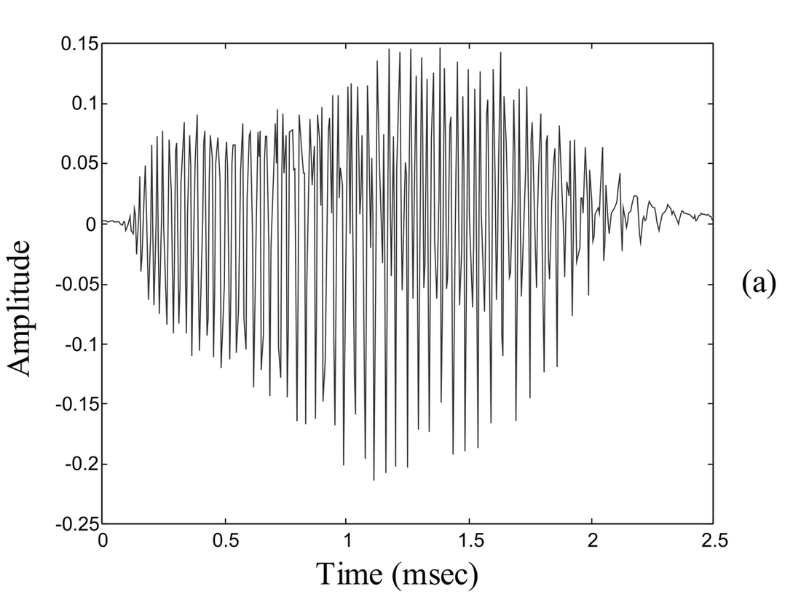

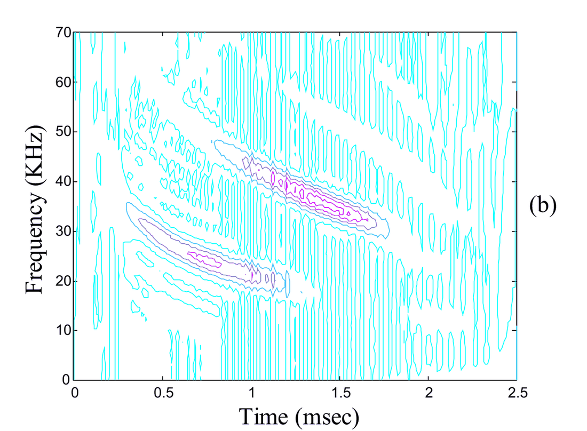
:::

Fig. 7. (a) A bat signal and (b) Adaptive optimal kernel time-frequency representation of the signal

## Other Representations

Flexible decompositions are particularly important for representing signal components whose localizations in time and frequency vary. Hence, a multidimensional parameter space is considered to reveal the signal's inner structure more effectively. Extending the analysis domain beyond time and frequency is gaining momentum. However, the existing methods have their limitations from the computational point of view (Baraniuk et al, 1996b). We now review some decomposition algorithms.

### Matching Pursuits

The matching pursuits algorithm decomposes any signal into a linear expansion of waveforms that are selected from a redundant dictionary of functions (Mallat et al, 1993). These waveforms are chosen in order to best match the signal's structures. These are general procedures to compute adaptive signal representations. Decompositions of signals over the family of functions that are well localized in time and frequency have found many applications in signal processing. Such functions are called time-frequency atoms. A general family of time-frequency atoms can be generated by scaling, translating and modulating the window signal. In general, we can represent a signal expanded in terms of these atoms, as:

$$
f = \sum_{n} \langle f, g_{\gamma_n}\rangle\, g_{\gamma_n}. \tag{13}
$$

This algorithm finds its expansion set $\{g_{\gamma_n}\}$ by successive approximations of $f$ with orthogonal projections on elements of the dictionary. The vector $f$ can be decomposed into:

$$
f = \langle f, g_{\gamma_0}\rangle\, g_{\gamma_0} + Rf, \tag{14}
$$

where $Rf$ is the residue vector after approximating $f$ in the direction of $g_{\gamma_0}$. The above equation is computed iteratively until the residue vector approaches a threshold, assuring that the signal can be reconstructed from the expansion set $\{g_{\gamma_n}\}$ with a tolerable error. Adaptive time-frequency representations can be constructed using these expansion coefficients. Some of its applications in spectral estimation, denoising, multicomponent separation, etc., can be found in (Mallat et al, 1993).

### Atomic Decomposition

Atomic decomposition expands any signal in terms of four-parameter time-frequency atoms that are localized in the time-frequency plane. The Gaussian function is chosen as the basic atom because of its minimum area property in the time-frequency plane. The four-parameter atom is obtained by successive applications of scaling, rotation, time and frequency-shift operators to the Gaussian elements, giving:

$$
g_{\gamma}(t) = \big(S_a R_\beta T_{t_0} F_{f_0}\, g\big)(t), \tag{15}
$$

where $\gamma$ is the index of the atom. The scaled and rotated atom is found as:

$$
g_{a,\beta}(t) = \frac{1}{\sqrt{a}}\, e^{-\pi (t/a)^2}\, e^{j\pi\beta t^2}, \tag{16}
$$

where $\gamma = (a, \beta, t_0, f_0)$.

The decomposition is done via matching pursuits in which the dictionary is constituted by the four-parameter space. A similar kind of approach in representing the signal as a sum of chirped Gaussians can be found in (Bultan, 1999). Adjustment of rectangular shell shapes adapted to the local structure will permit a clearer representation of the signal. The oblique cells are obtained by chirping the Gaussian. Its applications in finding the drift rate and separation of multicomponents are also presented.

### Fractional Fourier Transform

The fractional Fourier transform (FRFT) rotates the time-frequency plane with a specified angle. This can cause the analysis grid to shear in the time-frequency plane and can represent signals of a dispersive nature. It is defined for any function $f(t)$, as:

$$
f_{-\alpha}(t) \triangleq (\Gamma_{-\alpha} f)(t)
\triangleq \sqrt{\frac{1 - j\cot\alpha}{2\pi}}\;
e^{\,j\frac{\cot\alpha}{2} t^2}
\int f(\tau)\, e^{\,j\frac{\cot\alpha}{2}\tau^2}\, e^{-j\,\csc\alpha\,\tau t}\, d\tau \tag{17}
$$

where $\Gamma_{-\alpha}$ is the rotation operator corresponding to the counter-clockwise rotation of $\alpha$ radians. The FRFT is equal to the Fourier transform at $\alpha = \pi/2$. The discretization of FRFT is considered in (Bultan et al, 1998). An example depicting the rotation of the time-frequency plane at an angle of $\pi/2$ is shown in Fig. 8.

Fig. 8. (a) A rectangular pulse and (b) Its Fractional Fourier transform at $\alpha = \pi/2$

### Short-Time Fourier Transform

The STFT analysis and synthesis are fundamental for describing any quasi-stationary signals such as speech. As mentioned in our earlier discussion, the Fourier transform does not explicitly show the time localization of the frequency components. So the time localization can be obtained by suitably pre-windowing the signal $s(t)$ (Nawab et al, 1988). The STFT can be defined as:

$$
S_x(u,\zeta) = \langle x, g_{u,\zeta}\rangle = \int x(t)\, g(t-u)\, e^{-j\zeta u}\, dt. \tag{18}
$$

It uses an atom which is the product of a sinusoidal wave with a symmetric finite energy window function $g$. These atoms are obtained by time translations and frequency modulations of the original window function:

$$
g_{u,\zeta}(t) = g(t-u)\, e^{j\zeta t}. \tag{19}
$$

The atom is time centered at $u$ and frequency centered at $\zeta$. Multiplication by a relatively short window effectively suppresses the signal outside the neighborhood around the "analysis time" $u$. The effect of varying the length of the window is shown in Fig. 9.

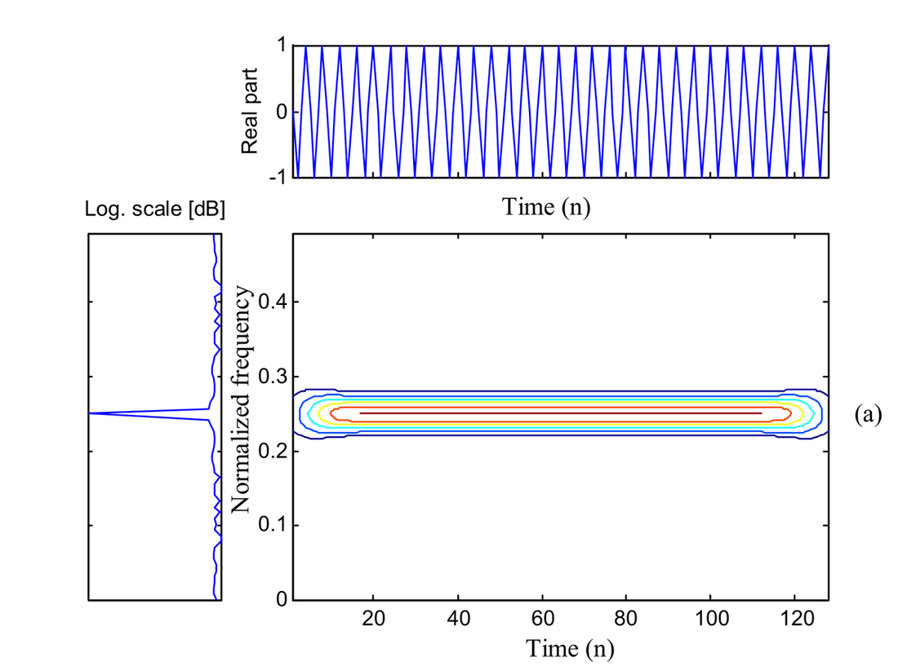

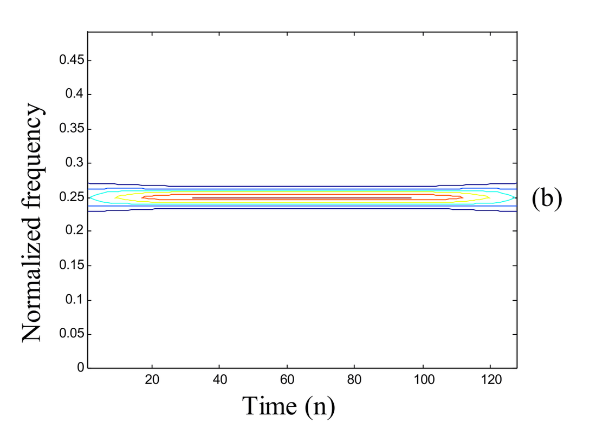

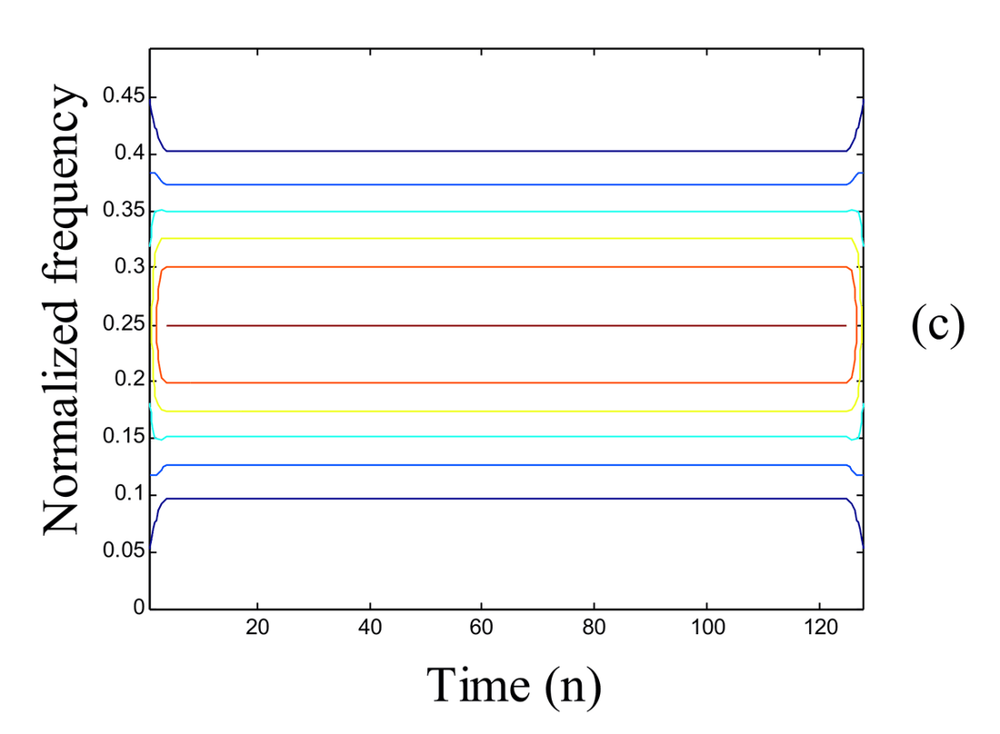

Fig. 9. (a) Energy spectral density, real part and STFT of a 128 point truncated sinusoid, (b) STFT with 64 point Hamming window and (c) STFT with 7 point Hamming window

The localization and energy concentration of the STFT depends only on the window and does not vary unless the window is changed, i.e., the time and frequency spread are constant throughout. This can be considered as a bank of filters having constant bandwidth as exemplified in Fig. 10.

Fig. 10. Time-frequency tilings in STFT analysis

### Wavelet Transform

The wavelet transform (WT) provides an alternative to the classical STFT or Gabor transform for the analysis of nonstationary signals. It also provides a unified framework for a number of techniques such as multiresolution analysis, subband coding, and wavelet series expansions that have been developed for various signal processing applications. In contrast to the STFT, the WT uses short windows at high frequencies and long windows at low frequencies. The continuous wavelet transform can be defined as:

$$
WT_x(u,s) = \langle x, \psi_{u,s}\rangle = \int_{-\infty}^{\infty} x(t)\, \frac{1}{\sqrt{s}}\, \psi^*\!\left(\frac{t-u}{s}\right) dt, \tag{20}
$$

where the mother wavelet is a zero-averaging function centered around zero with finite energy. The db4 mother wavelet and the scaling function are shown in Fig. 11. The atoms are obtained by translations and dilations of the mother wavelet.

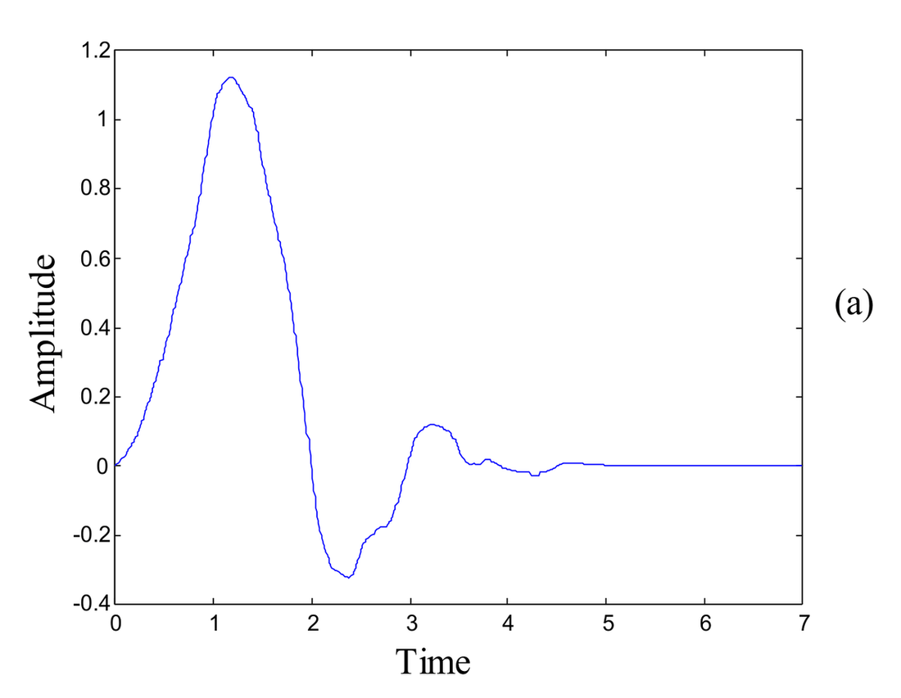

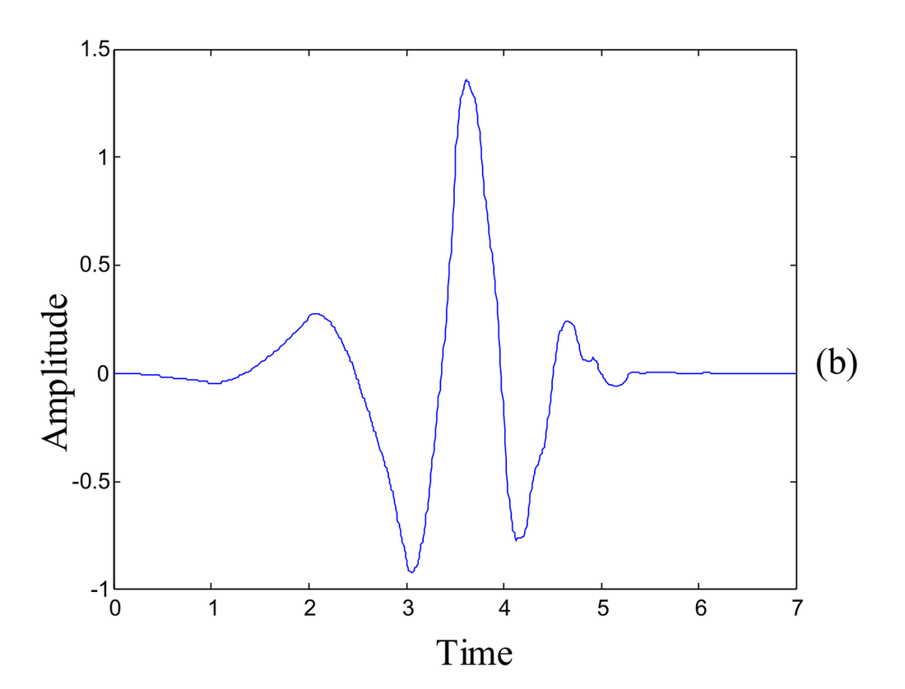

Fig. 11. (a) The db4 scaling function and (b) The db4 mother wavelet

The atom $\psi_{u,s}$ is centered around $u$. If the frequency centering of $\psi$ is $\eta$, then the frequency centering of the dilated function is $\eta/s$. The time spread of the above function is proportional to $s$ and the frequency spread is inversely proportional to $s$. It is as though the filters have a constant $Q$, the bandwidth being proportional to the frequency. The time-frequency support of the WT is shown in Fig. 12. The WT applied to a narrow rectangular pulse demonstrates the time localization properties shown in Fig. 13. It can be observed from the figure that at lower scales or in high frequency regions, the WT is localized in time. However, at higher scales the frequency resolution is better. Wavelet analysis is capable of revealing aspects of data that other signal analysis techniques miss, for example aspects like trends, breakdown points, discontinuities in higher derivatives and self-similarity. Further, because it affords a different view of data than those presented by traditional techniques, wavelet analysis can often compress or de-noise a signal without appreciable degradation. A good review on the wavelet transform, its applications, the filter bank interpretation and fast computations can be found in (Rao et al, 1998).

Fig. 12. Time-frequency tilings in the wavelet analysis

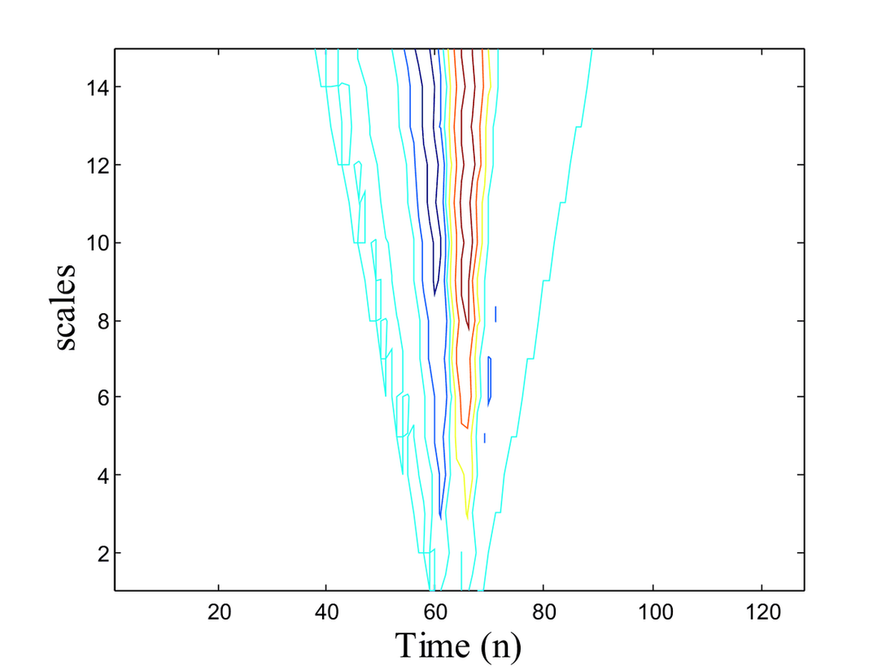

## References

1. Abeysekara, S. S. (1990) Computation of Wigner-Ville Distribution for Complex Data. *Electronics Letters*, 26, 1315-1317.
2. Allen, J. B. and Rabiner, L. R. (1977) A Unified Approach to Short-Time Fourier Analysis and Synthesis. *Proc. of IEEE*, 65, 1558-1564.
3. Baraniuk, R. G. (1996a) Joint Distributions of Arbitrary Variables Made Easy. *Proceedings of the IEEE DSP Workshop*, Leon, Norway, 394-397.
4. Baraniuk, R. G. and Jones, D. L. (1996b) Wigner Based Formulation of the Chirplet Transform. *IEEE Trans. on Signal Processing*, 44, 3129-3535.
5. Barry, D. T. (1992) Fast Calculation of the Choi-Williams Time-Frequency Distribution. *IEEE Trans. on Signal Processing*, 44, 450-455.
6. Bergmann, N. (1991) New Formulation of Discrete Wigner-Ville Distribution. *Electronics Letters*, 26, 111-112.
7. Bikdash, U. M. and Yu, K. B. (1993) Analysis and Filtering using Optimally Smoothed Wigner Distribution. *IEEE Trans. on Signal Processing*, 41, 1603-1617.
8. Boashash, B. and Black, P. J. (1987) An Efficient Real-Time Implementation of the Wigner-Ville Distribution. *IEEE Trans. on Acoust., Speech and Signal Processing*, ASSP-35, 1611-1619.
9. Boudreaux-Bartles, G. F. and Parks, T. W. (1986) Time-Varying Filtering and Signal Estimation using Wigner Distribution Synthesis Techniques. *IEEE Trans. on Acoust., Speech and Signal Processing*, ASSP-34, 442-451.
10. Bracewell, R. N. and Mihovilovic, D. (1991) Adaptive Chirplet Representation of Signals on Time-Frequency Plane. *Electronics Letters*, 27, 1159-1161.
11. Bultan, A. (1999) A Four-Parameter Atomic Decomposition of Chirplets. *IEEE Trans. on Signal Processing*, 41, 731-745.
12. Bultan, A. and Akansu, A. N. (1998) A Novel Time-Frequency Exciser in Spread Spectrum Communications for Chirp-Like Interference. *Proc. of ICASSP*, Seattle, U.S.A., 3265-3268.
13. Choi, H. I. and Williams, W. J. (1989) Improved Time-Frequency Representation of Multicomponent Signals using Exponential Kernels. *IEEE Trans. on Acoust., Speech and Signal Processing*, ASSP-37, 861-871.
14. Claasen, T. A. C. M. and Mecklenbrauker, W. F. G. (1980a) The Wigner Distribution - A Tool for Time-Frequency Signal Analysis, Part II: Discrete Time Signals. *Philips J. Res.*, 35, 276-300.
15. Claasen, T. A. C. M. and Mecklenbrauker, W. F. G. (1980b) The Aliasing Problem in Discrete-Time Wigner Distribution. *IEEE Trans. on Acoust., Speech and Signal Processing*, ASSP-31, 1067-1072.
16. Coates, M. J., Fitzgerald, W. J. and Molina, C. (1998) Regionally Optimised Kernels for Time-Frequency Distributions. *Proc. of ICASSP*, Seattle, U.S.A., 1553-1556.
17. Cohen, L. (1989) Time-Frequency Distributions: A Review. *Proc. of IEEE*, 77, 941-981.
18. Cohen, L. *Time-Frequency Analysis*. Prentice-Hall, Englewood Cliffs, New Jersey (1995).
19. Crochiere, R. E. (1980) A Weighted Overlap-Add Method of Short-Time Fourier Analysis/Synthesis. *IEEE Trans. on Acoust., Speech and Signal Processing*, ASSP-28, 99-102.
20. Cunningham, G. S. and Williams, W. J. (1994a) Kernel Decomposition of Time-Frequency Distributions. *IEEE Trans. on Signal Processing*, 42, 1425-1442.
21. Cunningham, G. S. and Williams, W. J. (1994b) Fast Implementation of Generalized Discrete Time-Frequency Distributions. *IEEE Trans. on Signal Processing*, 42, 1496-1508.
22. Dembo, A. and Malah, D. (1988) Signal Synthesis from Modified Discrete Short-Time Transform. *IEEE Trans. on Acoust., Speech and Signal Processing*, ASSP-36, 168-181.
23. Dempster, A. P., Laird, N. M. and Rubin, D. B. (1977) Maximum Likelihood from Incomplete Data via the EM Algorithm. *J. R. Stat. Soc. B.*, 39, 1-37.
24. Devroye, L. *Non-Uniform Random Variate Generation*. Springer-Verlag 1986.
25. Fessler, A. and Hero, A. O. (1994) Space Alternating Generalized Expectation Maximization Algorithm. *IEEE Trans. on Signal Processing*, 42, 2664-2667.
26. Flandrin, P. and Martin, W. (1985) Wigner-Ville Spectral Analysis of Nonstationary Process. *IEEE Trans. on Acoust., Speech and Signal Processing*, ASSP-33, 1461-1470.
27. Giridhar, J. (1998) Time-Frequency Distributions and Their Applications in Radar Signal Processing. M. S. Thesis. Indian Institute of Technology, Madras, May 1998.
28. Hlawatsch, F. and Boudreaux-Bartles, G. F. (1992a) Linear and Quadratic Time-Frequency Signal Representations. *IEEE Signal Processing Magazine*, 21-67.
29. Hlawatsch, F. and Kozek, W. (1993) The Wigner Distribution of a Linear Signal Space. *IEEE Trans. on Signal Processing*, 41, 1248-1258.
30. Hlawatsch, F. and Kozek, W. (1994) Time-Frequency Projection Filters and Time-Frequency Signal Expansions. *IEEE Trans. on Signal Processing*, 42, 3321-3334.
31. Hlawatsch, F. and Krattenthaler, W. (1992b) Bilinear Signal Synthesis. *IEEE Trans. on Signal Processing*, 40, 351-3363.
32. Jeong, J. and Williams, W. J. (1992a) Kernel Design for Reduced Interference Distributions. *IEEE Trans. on Signal Processing*, 40, 402-412.
33. Jeong, J. and Williams, W. J. (1992b) Alias-Free Generalized Discrete-Time Time-Frequency Distributions. *IEEE Trans. on Signal Processing*, 40, 2757-2765.
34. Johnson, M. E. *Multivariate Statistical Simulation*. John-Wiley & Sons, Inc 1987.
35. Jones, D. L. and Baraniuk, R. G. (1993a) Shear Madness: New Orthonormal Bases and Frames using Chirp Functions. *IEEE Trans. on Signal Processing, Special Issue on Wavelets in Signal Processing*, 41, 12, 3543-3548.
36. Jones, D. L. and Baraniuk, R. G. (1993b) A Signal-Dependent Time-Frequency Representation: Optimal Kernel Design. *IEEE Trans. on Signal Processing*, 41, 4, 1589-1602.
37. Jones, D. L. and Baraniuk, R. G. (1993c) Signal-Dependent Time-Frequency Analysis Using a Radially Gaussian Kernel. *IEEE Trans. on Signal Processing*, 32, 263-284.
38. Jones, D. L. and Baraniuk, R. G. (1994a) A Simple Scheme for Adapting Time-Frequency Representations. *IEEE Trans. on Signal Processing*, 42, 3530-3535.
39. Jones, D. L. and Baraniuk, R. G. (1994b) A Signal-Dependent Time-Frequency Representation: Fast Algorithm for Optimal Kernel Design. *IEEE Trans. on Signal Processing*, 42, 1, 134-146.
40. Jones, D. L. and Parks, T. W. (1992a) A Resolution Comparison of Several Time-Frequency Representations. *IEEE Trans. on Signal Processing*, 40, 413-420.
41. Jones, D. L. and Parks, T. W. (1992b) A High Resolution Data-Adaptive Time-Frequency Representation. *IEEE Trans. on Acoust., Speech and Signal Processing*, ASSP-38, 2127-2135.
42. Kay, S. M. *Fundamentals of Statistical Signal Processing, Estimation Theory*. Prentice-Hall, New Jersey, 1993.
43. Krattenthaler, W. and Hlawatsch, F. (1991) Improved Signal Synthesis from Pseudo-Wigner Distribution. *IEEE Trans. on Signal Processing*, 39, 506-509.
44. Lawrance, M. *Transformations in Optics*. John-Wiley & Sons, 1965.
45. Leon, S. *Linear Algebra with Applications*. McMillan, 1994.
46. Liu, K. J. R. (1993) Novel Parallel Architectures for Short-Time Fourier Transform. *IEEE Trans. on Circuits and Systems*, 40, 786-789.
47. Liu, K. J. R., Chui, C. T., Kolagata, R. K. and Jaja, J. F. (1994) Optimal Unified Architectures for Real-time Computation of Time-Recursive Discrete Sinusoidal Transforms. *IEEE Trans. on Circuits and Systems for Video Technology*, 4, 168-180.
48. Mallat, S. G. and Zhang, Z. (1993) Matching Pursuits with Time-Frequency Dictionaries. *IEEE Trans. on Signal Processing*, 41, 3397-3415.
49. Mann, S. and Haykin, S. (1995) The Chirplet Transform: Physical Considerations. *IEEE Trans. on Signal Processing*, 44, 2745-2761.
50. McLachlan, G. J. and Basford, K. E. *Mixture Models*. Marcel Dekker, 1987.
51. Mix, D. F. *Random Signal Processing*. Prentice-Hall, Englewood Cliffs, New Jersey, 1995.
52. Morris, J. M. and Wu, D. (1996) On Alias-Free Formulations of Discrete-Time Cohen's Class of Distributions. *IEEE Trans. on Signal Processing*, 44, 1335-1364.
53. Nawab, S. H. and Quatieri, T. F. Short-time Fourier Transform, In Lim, J. S. and Oppenheim, A. V. (eds.) *Advanced Topics in Signal Processing*, Prentice-Hall, Englewood Cliffs, New Jersey, 1988.
54. Nawab, S. H., Quatieri, T. F. and Lim, J. S. (1983) Signal Reconstruction from Short-Time Fourier Transform Magnitude. *IEEE Trans. on Acoust., Speech and Signal Processing*, ASSP-31, 986-998.
55. Neal, R. M. and Hinton, G. E. (1993) A New View of the EM Algorithm that Justifies the Incremental and Other Variants, submitted to Biometrika 1993.
56. O'Neill, J. C. (1997) Shift Covariant Time-Frequency Distributions of Discrete Signals. Ph. D. Thesis. University of Michigan, May 1997.
57. O'Neill, J. C. and Flandrin, P. (1998) Chirp Hunting. *Proc. of the IEEE-SP International Symposium on Time-Frequency and Time-Scale Analysis*, 425-428.
58. O'Neill, J. C. and Williams, W. J. (1999) A Function of Time, Frequency, Lag, and Doppler. *IEEE Trans. on Signal Processing*, 47, 789-799.
59. Papandreou, A., Hlawatsch, F. and Boudreaux-Bartles, G. F. (1993) The Hyperbolic Class of QTFRs - Part I: Constant-Q Warping, Hyperbolic Paradigm, Properties, and Members. *IEEE Trans. on Signal Processing*, 41, 3425-3444.
60. Papoulis, A. *Signal Analysis*. McGraw-Hill, 1984.
61. Pei, S. C. and Yang, I. I. (1992) Computing Pseudo-Wigner Distribution by the Fast Hartley Transform. *IEEE Trans. on Signal Processing*, 40, 2346-2349.
62. Prabhu, K. M. M. and Sundaram, R. S. (1996) Fast Algorithm for Pseudo-discrete Wigner-Ville Distribution using Moving Discrete Hartley Transform. *IEE Proc.-Vis. Image, Signal Processing*, 143, 383-386.
63. Qian, S. E. and Morris, J. M. (1990) Fast Algorithm for Real Joint Time-Frequency Transformations of Time-Varying Signals. *Electronics Letters*, 26, 537-539.
64. Rabiner, L. R. and Juang, B. H. *Fundamentals of Speech Recognition*. Prentice-Hall, New Jersey, 1993.
65. Rao, R. M. and Bopardikar, A. S. *Wavelet Transforms, Introduction to Theory and Applications*. Addison Wesley Longman, Inc, 1998.
66. Rau, J. G. *Optimization and Probability in Systems Engineering*. Van Nostrand Reinhold Company, 1970.
67. Rihaczek, A. (1968) Signal Energy Distribution in Time and Frequencies. *IEEE Trans. on Information Theory*, 42, 3241-3244.
68. Reily, A. and Boashash, B. (1994) Analytical Signal Generation - Tips and Traps. *IEEE Trans. on Signal Processing*, 42, 3241-3244.
69. Shalvi, O. and Weinstein, E. (1996) System Identification using Nonstationary Signals. *IEEE Trans. on Signal Processing*, 44, 2055-2063.
70. Smith, M. J. and Barnwell, T. P. (1987) A New Filter bank Theory for Time-Frequency Representation. *IEEE Trans. on Acoust., Speech and Signal Processing*, ASSP-35, 314-327.
71. Stankovic, L. (1994b) A Multitime Definition of the Wigner Higher Order Distribution: L-Wigner Distribution. *IEEE Letters in Signal Processing*, 1, 106-109.
72. Vaseghi, S. V. *Advanced Topics in Signal Processing and Digital Noise Reduction*. Wiley-Teubner, 1996.
73. Xia, X. G. (1997) System Identification using Chirp Signals and Time-Variant Filters in the Joint Time-Frequency Domain. *IEEE Trans. on Signal Processing*, 45, 2072-2085.
74. Yu, K. B. and Cheng, S. (1987) Signal Synthesis from Pseudo-Wigner Distribution and Its Applications. *IEEE Trans. on Acoust., Speech and Signal Processing*, ASSP-35, 1289-1302.
