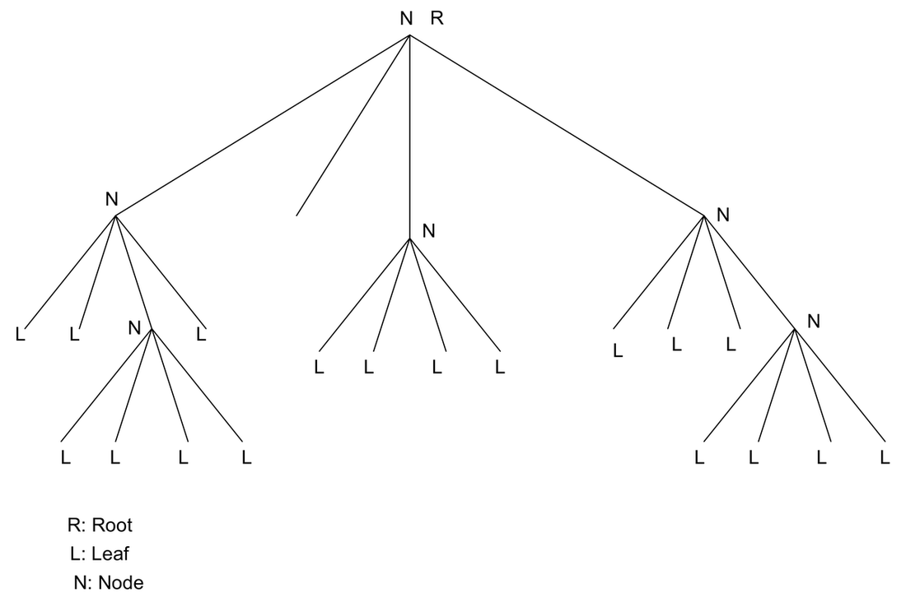
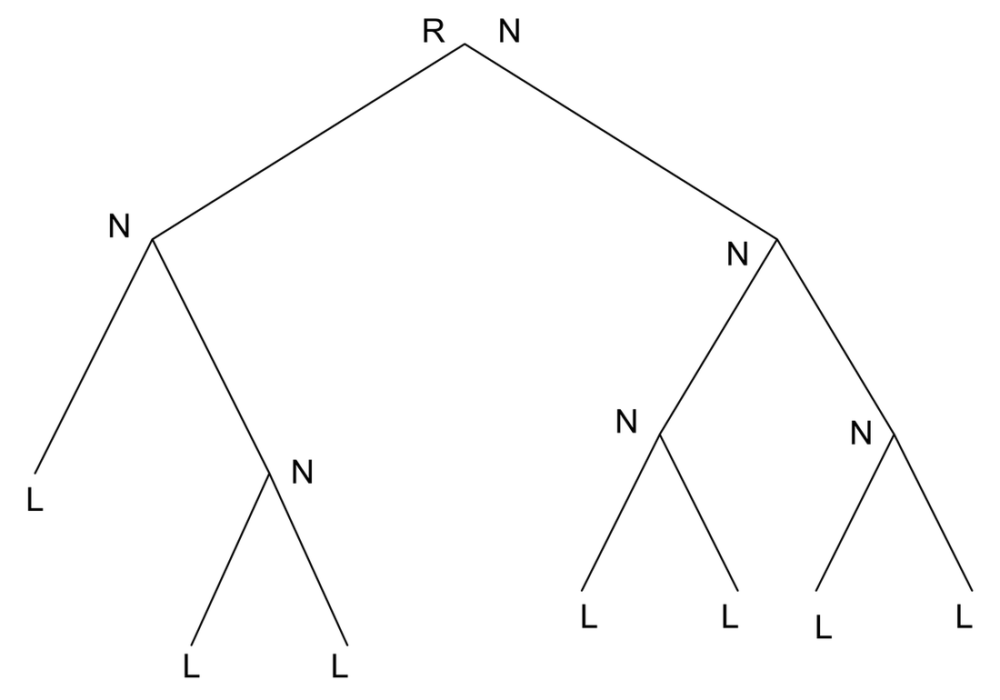
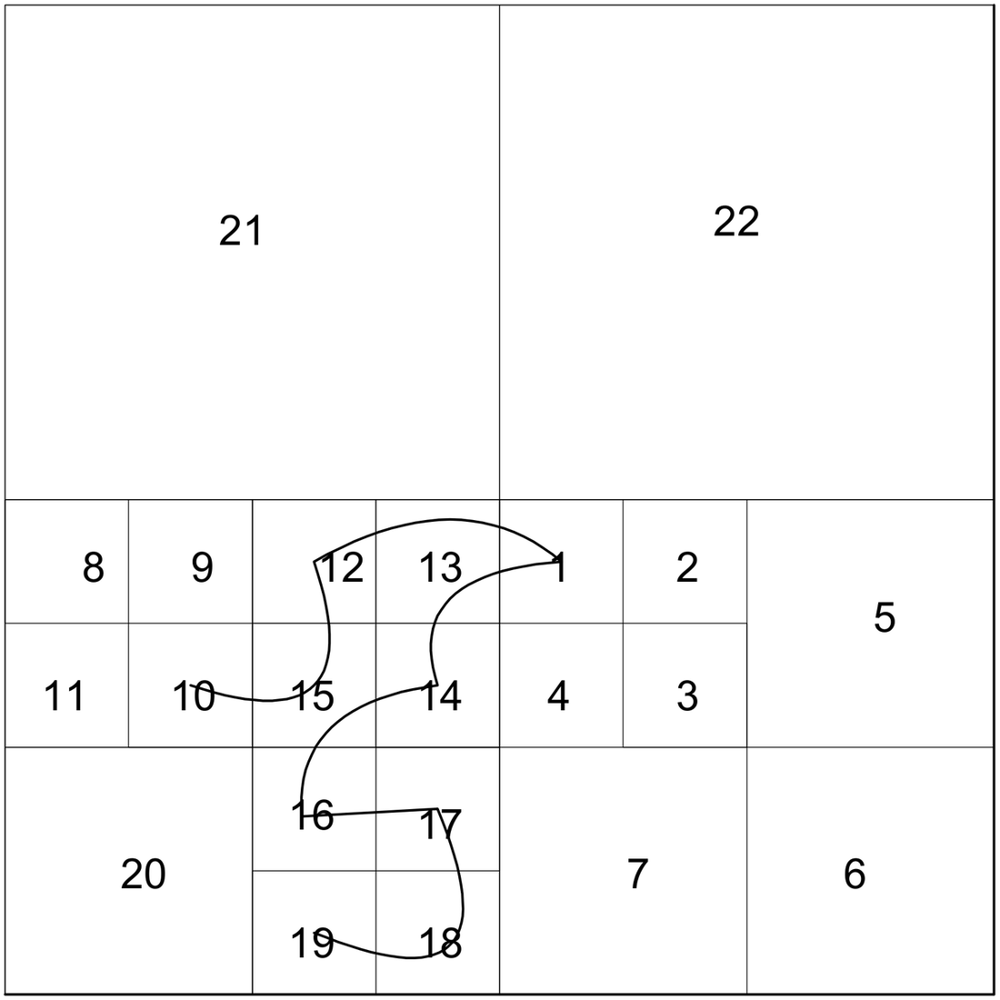
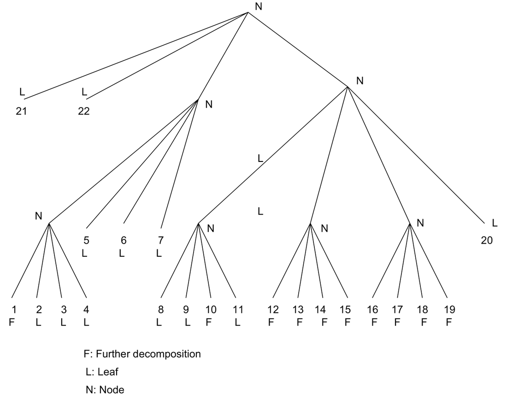

# A Study of Quad-Trees, EZW and SPIHT Codecs

## Section A

### Trees

A tree is a data structure that holds data in a hierarchical way. If you are familiar with Windows, the Windows Explorer shows the file structure in a tree structure.

Terminology:

- **Root:** The branch of the tree from which one can traverse to any branch in the downward direction.
- **Node:** It is the root of another subtree. A node holds another subtree. The root is the node of a tree.
- **Children (offsprings):** The elements that can reach others which are not nodes by visiting only one element, i.e., each child can visit the other children by traversing through the node only once.
- **Descendants:** All the children of a particular node.
- **Grand children:** Children of children.
- **Leaf (leaves):** An element that has no children or which is not a node.

### Quad-Tree (QT)

- If all nodes of a tree have four children it is a quad-tree (Fig. 1) and if it is two, the tree is a binary tree (Fig. 2).

To clarify the point (bullet), a node may have two children, but if all the nodes have no greater than two children it is a binary tree. Similarly the maximum number of children that a node can have in a quad-tree is restricted to four.

**Figure 1.** A Quad Tree.

**Figure 2.** A Binary Tree.

### Salient Points of QT Decomposition (QTD)

When QTs are used for representing images, the following can be observed:

- Linear indexing
- Simpler representation
- Multi-resolution
- Progressiveness
- Region-of-Interest
- Worst R-D performance

Can also be used for:

- Image segmentation
- Edge enhancement

There can be two ways of constructing the QTs. One is the top-down approach where a decision is made to divide a branch or make it a leaf. In the bottom-up approach a decision is made whether to merge branches of the tree to make it a node. For the image shown in Fig. 3, the corresponding depth-three QT decomposition is shown in Fig. 4.

**Fig. 3.** An Image.

**Fig. 4.** Depth-three QT decomposition of the image shown in Fig. 3.

### Improvements to QTD

The following can be done to improve the performance:

- Thresholding in the homogeneity test
- Bit-allocation for leaves coding

### Comparable To

- Modified QTD outperforms DCT with scalar quantization
- Competitive with DCT+VQ

### Mapping Technology to CTQs

Quad-tree offers the following with respect to our CTQs:

| Quad-tree representation of images | Compression Ratio | Loss Less | Computational Complexity | Parallelism in codec | Multiresolution | Arbitrary shaped coding | ROI | Data adaptive model |
|---|---|---|---|---|---|---|---|---|
| Feasibility | Y | Y | YY | X | Y | N | Y | Y |

Y: Feeble yes... says that it is possible.

YY: A strong correlation exists... this is the advantage of this method.

N: Not possible.

X: Don't care or Don't know (most likely).

### QT Representation of Wavelet Coefficients (Being Very Specific to Dyadic Wavelet Transforms)

In general, the wavelet decomposition is performed on the LL band and thus it forms a dyadic tree, a complete asymmetric QT. After the application of the transform comes the coding part of the coefficients. It is necessary to have an efficient data-structure to represent these coefficients. For example, in the case of EZW or SPIHT the whole coding scheme works on magnitude comparison tests and magnitude refinement passes on the sets of data that are either nodes, children or descendants of a QT where QT represents the wavelet coefficients. In this context, QT doesn't do anything extra but is only a means of performing the coding on a data-structure. Hence I feel, it doesn't map to any CTQs. All the mappings of WT are propagated with QT. It is not an obstacle to any of the mappings of WT but it "may" offer computation-wise performance. QT is a natural data representation and hence the searching and sorting operations may be done in an efficient way.

### QT Representation of Wavelet Decomposition Structure

We extend the boundaries put by the dyadic wavelet transform. The most interesting part of the dyadic wavelet transform is very regular. Hence, we cannot believe it all the time. There must be something wrong. Yes... it is not data adaptive. No, I am not saying it with respect to the type of wavelet you use or the type of coding you use... I am talking with respect to the levels of decomposition and the decomposition structure. In general there exist two kinds of decompositions, namely, wavelet-tree and wavelet-packet. Before we go further, we will ask a question. Where are the QTs? Wavelet-transform of a two-dimensional signal results in four frequency bands, better known in the literature as LL, LH, HL and HH bands. In a wavelet-tree every LL is sub-decomposed into another four bands and in a wavelet-packet every band is split into another four bands. It exactly looks like a QT and it is where QT is playing a role. In adaptive QT wavelet decomposition, the objective becomes whether to split the tree further or not. Essentially QT here represents the WT decomposition structure. An analogy -> we have studied just now, QT representation of images. It is exactly the same with image replaced by wavelet coefficients, i.e., splitting a branch into four leaves leads to splitting a band into another four bands. Here the splitting of the branch may take place anywhere in the wavelet-packet. The tree structure can be passed to the decoder to let it know about the decomposition structure and perform the inverse WT accordingly. This has relevance in signal-adapted wavelet-packet where the wavelet-packet structure is not decomposed a priori. Based on a condition or cost function a decision is made whether to split (decompose) or not to split the branch. The cost function might be R-D performance or entropy-driven. In the present case each node represents a set of coefficients that has a relation to the level of decomposition. For example, let us take a 512 x 512 image. Then

$$
512 \;-\; 256 \;-\; 128 \;-\; 64 \;-\; 32 \;-\; 16 \;-\; 8 \;-\; 4 \;-\; 2
$$

$$
1 \quad\;\; 2 \qquad 3 \qquad 4 \qquad 5 \qquad 6 \quad\; 7 \quad\; 8
$$

The number of WT coefficients a node or leaf at level $l$ represents is $N/2^l$. However, we should not be misled that not-splitting a branch may lead to lossyness like we get in QT of images. Here, the viewpoint is different. We are only looking at the structure but not the WT coefficients themselves. The effect of the decision whether to split or not to split has a bearing on compression ratio but not on the lossless / lossyness of the image. The lossyness depends only on whether the wavelet you have chosen is "reversible or irreversible".

| Quad-tree representation of WT decomposition (adapted bases) | Compression Ratio | Loss Less | Computational Complexity | Parallelism in codec | Multiresolution | Arbitrary shaped coding | ROI | Data adaptive model |
|---|---|---|---|---|---|---|---|---|
| Feasibility | Y | Y | YY | X | Y | Y | YY | YY |

Here the complexity of the encoder is much greater than that of the decoder because some branching operations are involved.

Maximum decompositions are (most unlikely)

$$
4^N
$$

and minimum decompositions (dyadic transform) are (most likely)

$$
3N + 1
$$

where $N$ is the total number of levels of decomposition.

So far there does not exist a coding technique that works on these adapted bases (QT of WT) and exploits the wavelet tree properties. For the wavelet-tree case SPIHT is the superior choice. Now the question remains... what happens if the adaptive-QT wavelet decomposition transform is used. We try to answer this positively. Our objective is:

$$
B_1 \ge B_2
$$

where $B_1$ is the bit budget given by SPIHT and $B_2$ is the bit budget given by the generalized SPIHT that we are currently investigating.

## Section B

### Embedded Zero-Tree Coding

E (embedded) means what?

The output of the encoder can be stopped at any point of time and the so-far decoded stream can be used to reconstruct the image back, or the full stream contains the embedded bit-stream required to reconstruct the image, not at full resolution. A single image at a given code rate can be truncated at various points and decoded to give a series of reconstructed images at lower rates.

Z (zero-tree) means what? This question is answered in the following questions.

(A zero-tree is a spatial orientation tree. The coefficients in a spatial orientation tree refer to the same spatial location in the original image, but in different frequency bands.)

An inefficient coder and an efficient coder differ in what way?

After quantization or thresholding is done, the locations or positions of the pixels which are found significant in the test have to be coded. Even though quantization looks very good, a large bit-budget is spent in the sorting pass. Intelligence must be here?

What it captures?

I am working with wavelets. So what do they do for "generally" low-pass images?

I have QT representation of the wavelet coefficients. What can I do with them? How can I manipulate them? (throw into a brown color shredder).

Is there any dependency of the magnitudes of nodes on the children... this is what was called a spatial-orientation tree.

EZW technique is based on three concepts:

i) Partial ordering of the transformed image elements by magnitude, with transmission of order by a subset partitioning algorithm that is duplicated at the decoder.

ii) Ordered bit-plane transmission of refinement bits, and

iii) Exploitation of the self-similarity of the image wavelet transform across different scales.

The partial ordering is a result of comparison of transform element (coefficient) magnitudes to a set of octavely decreasing thresholds. An element becomes significant or insignificant with respect to a given threshold, depending on whether or not it exceeds that threshold.

## Section C

### SPIHT

How are EZW and SPIHT different?

EZW does an explicit "breadth first search" whereas SPIHT does an "implicit" one. Partitioning is done in SPIHT in a different way.

In SPIHT the crucial parts of the coding process — the way subsets of coefficients are partitioned and how the significance information is conveyed — are fundamentally different.

Parent-descendant relationship in EZW:

- Tree starts from HL, LH or HH in the highest band.

Parent-descendant relationship in SPIHT:

- Tree starts from LL in the highest band.

Any advantages? Yes... even without an arithmetic coder, it gives comparable results.

What is so crucial here?

It does the sorting pass in an efficient way.

The encoder and decoder follow the same sequence of sorting. Essentially they work on the correctly decoded data and then decide what to do next. SPIHT maintains three lists, namely:

- **LIP:** List of insignificant pixels.
- **LSP:** List of significant pixels.
- **LIS:** List of insignificant sets.

By defining:

- Offsprings set: $O$
- Descendants set: $D$
- Grand descendants set: $L = D - O$

A magnitude comparison is done with a particular threshold and the significant test results are sent. Afterwards this threshold is reduced and the tests are carried out again.
